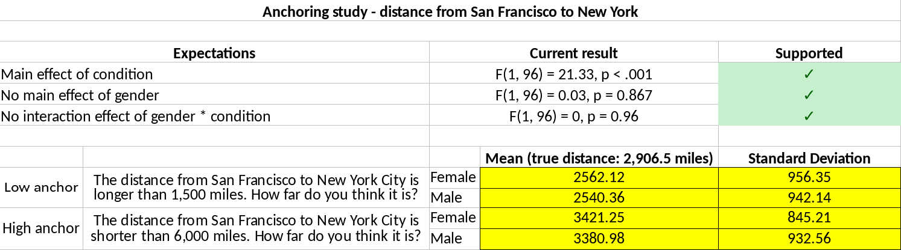

# Detection of data fabrication using statistical tools

```{r echo = FALSE}
# also requires dplyr
library(ggplot2)
library(plyr)
suppressPackageStartupMessages(library(viridis))
library(magrittr)
library(kableExtra)
library(knitr)
# devtools::install_github('chartgerink/ddfab')
library(ddfab)

options(digits = 3)

file <- './assets/data/study_01/raw_summary_results_fabrication_qualtrics.csv'
res_file <- './assets/data/study_01/qualtrics_processed.csv'
ml_dat_file <- './assets/data/study_01/anchoring_ml/chjh ml1_anchoring cleaned.sav'
summary_stat_file <- './assets/data/study_01/ml_summary_stats.csv'
ml3_dat_file <- './assets/data/study_02/study_02-ml3_stroop/StroopCleanSet.csv'

# Set the number of iterations to use in calculations
iter <- 100000

m <- 50
sd <- 10
n <- 100

set.seed(1234)
x1_1 <- replicate(n = 10, expr = rnorm(n, m, sd))
x1_2 <- replicate(n = 10, expr = rnorm(n, m, sd))

ex1_1em <- apply(x1_1, 2, mean)
ex1_1esd <- apply(x1_1, 2, sd)
ex1_1cm <- apply(x1_2, 2, mean)
ex1_1csd <- apply(x1_2, 2, sd)
ex1_1tp <- NULL
for (i in 1:dim(x1_1)[2]) ex1_1tp[i] <- t.test(x = x1_1[,i], y = x1_2[,i], var.equal=TRUE)$p.value
ex1_1tp <- unlist(ex1_1tp)

x2_1 <- replicate(n = 1000, expr = rnorm(n, m, sd))
x2_2 <- replicate(n = 1000, expr = rnorm(n, m, sd))

ex2_1em <- apply(x2_1, 2, mean)
ex2_1esd <- apply(x2_1, 2, sd)
ex2_1cm <- apply(x2_2, 2, mean)
ex2_1csd <- apply(x2_2, 2, sd)
ex2_1tp <- NULL
for (i in 1:dim(x2_1)[2]) ex2_1tp[i] <- t.test(x = x2_1[,i], y = x2_2[,i], var.equal=TRUE)$p.value
ex2_1tp <- unlist(ex2_1tp)
tmp <- data.frame(ex2_1em, ex2_1esd, ex2_1cm, ex2_1csd, ex2_1tp)
set2_df <- tail(tmp[order(tmp$ex2_1tp),], 10)
set2_df <- set2_df[sample(nrow(set2_df)),]


set.seed(1234)
x2_1em <- replicate(n = 10, expr = m + runif(1, 0, 20))
x2_2cm <- replicate(n = 10, expr = m + runif(1, 0, 20))
x2_1esd <- replicate(n = 10, expr = sd + runif(1, 0, 1.5))
x2_2csd <- replicate(n = 10, expr = sd + runif(1, 0, 1.5))

sdpooled <- ((n - 1) * x2_1esd^2 + (n - 1) * x2_2csd^2)/(n * 2 - 2)
tval <- (x2_1em - x2_2cm) / sdpooled
ex2_1tp <- pt(abs(tval), n * 2 - 2, lower.tail = FALSE) * 2

# Just saving for later use in theory section
# set.seed(1234)
# std_var(n = rep(100, length(x2_1esd) * 2), sds = c(x2_1esd, x2_2csd), iter = 10000)

df <- data.frame(study = sprintf("Study %s", 1:10),
         sprintf("%s (%s)", round(ex1_1em, 3), round(ex1_1esd, 3)),
         sprintf("%s (%s)", round(ex1_1cm, 3), round(ex1_1csd, 3)),
         ex1_1tp,
         sprintf("%s (%s)", round(set2_df$ex2_1em, 3), round(set2_df$ex2_1esd, 3)),
         sprintf("%s (%s)", round(set2_df$ex2_1cm, 3), round(set2_df$ex2_1csd, 3)),
         set2_df$ex2_1tp)
names(df) <- c("",
        "M (SD)",
        "M (SD)",
        "P-value",
        "M (SD)",
        "M (SD)",
        "P-value")
```

Any field of empirical inquiry is faced with cases of scientific misconduct at some point, either in the form of fabrication, falsification, or plagiarism (FFP). 
Psychology faced Stapel; medical sciences faced Poldermans and Macchiarini; life sciences faced Voignet; physical sciences faced Sch&ouml;n --- these are just a few examples of research misconduct cases in the last decade. 
Overall, an estimated 2% of all scholars admit to having falsified or fabricated research results at least once during their career [@doi:10.1371/journal.pone.0005738], which due to its self-report nature is likely to be an underestimate of the true rate of misconduct. 
The detection rate of data fabrication is likely to be even lower; for example, among several hundreds of thousands of researchers working in the United States and the Netherlands, only around a dozen cases become public each year. 
At best, this suggests a detection rate below 1% among those 2% who admit to fabricating or falsifying data --- the tip of a seemingly much larger iceberg.

The ability to detect fabricated data may help deter researchers from fabricating data in their work. Deterrence theory [e.g., @leviathan] states that improved detection of undesirable behaviors decreases the expected utility of said behaviors, ultimately leading to fewer people to engage in it. 
Detection techniques have developed differently for fabrication, falsification, and plagiarism.
Plagiarism scanners have been around the longest [e.g., @doi:10.1109/13.28038] and are widely implemented in practice, not only at journals but also in the evaluation of student theses (e.g., with commercial services such as Turnitin). 
Various tools have been developed to detect image manipulation and some of these tools have been implemented at biomedical journals to screen for fabricated or falsified images. 
For example, the Journal of Cell Biology and the EMBO journal scan each submitted image for potential image manipulation [@The_Journal_of_Cell_Biology2015-vh;@doi:10.1038/546575a], which supposedly increases the risk of detecting (blatant) image manipulation. 
Recently developed algorithms even allow automated scanning of images for such manipulations [@doi:10.1007/s11948-016-9841-7]. 
The application of such tools can also help researchers systematically evaluate research articles in order to estimate the extent to which image manipulation occurs in the literature [4% of all papers are estimated to contain manipulated images; @doi:10.1128/mBio.00809-16] and to study factors that predict image manipulation [@doi:10.1007/s11948-018-0023-7]. 

Methods to detect fabrication of quantitative data are often based on a mix of psychology theory and statistics theory. 
Because humans are notoriously bad at understanding and estimating randomness [@Haldane1948-nm;@doi:10.1126/science.185.4157.1124;@doi:10.1037/h0031322;@doi:10.1037/1082-989X.5.2.241;@doi:10.1037/h0032060], they might create fabricated data that fail to follow the fundamentally probabilistic nature of genuine data. 
Data and outcomes of analyses based on these data that fail to align with the (at least partly probabilistic) processes that are assumed to underlie genuine data may indicate deviations from the reported data collecting protocol, potentially even data fabrication or falsification.

Statistical methods have proven to be of importance in initiating data fabrication investigations or in assessing the scope of potential data fabrication. 
For example, Kranke, Apfel, and Roewer skeptically perceived Fujii's data [@doi:10.1213/00000539-200004000-00053] and used statistical methods to contextualize their skepticism.
At the time, a reviewer perceived them to be on a "crusade  against Fujii and his colleagues" [@doi:10.1111/j.1365-2044.2012.07318.x] and further investigation remained absent. 
Only when Carlisle extended the systematic investigation to 168 of Fujii's papers for misconduct [@doi:10.1111/j.1365-2044.2012.07128.x;@doi:10.1111/anae.13650;@doi:10.1111/anae.13126] did events cumulate into an investigation- and ultimately retraction of 183 of Fujii's peer-reviewed papers [@oransky2015;@doi:10.1016/j.ijoa.2012.10.001]. 
In another example, the Stapel case, statistical evaluation of his oeuvre occurred after he had already confessed to fabricating data, which ultimately resulted in 58 retractions of papers (co-)authored by Stapel [@Levelt2012;@oransky2015].

In order to determine whether the application of statistical methods to detect data fabrication is responsible and valuable, we need to study their diagnostic value. 
Specifically, many of the developed statistical methods to detect data fabrication are quantifications of case specific suspicions by researchers, but these applications do not inform us on their diagnostic value (i.e., sensitivity and specificity) outside of those specific cases. 
Side-by-side comparisons of different statistical methods to detect data fabrication have also been difficult through the in-casu origin of these methods.
Moreover, the efficacy of these methods based on known cases is likely to be biased, considering that an unknown amount of undetected cases is not included. 
Using different statistical methods to detect fabricated data using genuine versus fabricated data yields information on the sensitivity and specificity of the detection tools. This is important because of the severe professional- and personal consequences of accusations of potential research misconduct [as illustrated by the STAP case; @doi:10.1038/520600a].
These methods might have utility in misconduct investigations where the prior chances of misconduct are high, but their diagnostic value in large-scale applications to screen the literature are unclear.

In this article, we investigate the diagnostic performance of various statistical methods to detect data fabrication. 
These statistical methods (detailed next) have not previously been validated systematically in research using both genuine and fabricated data.
We present two studies where we try to distinguish (arguably) genuine data from known fabricated data based on these statistical methods.
These studies investigate methods to detect data fabrication in summary statistics (Study 1) or in individual level (raw) data (Study 2) in psychology. 
In Study 1, we invited researchers to fabricate summary statistics for a set of four anchoring studies, for which we also had genuine data from the Many Labs 1 initiative [[https://osf.io/pqf9r](https://osf.io/pqf9r); @doi:10.1027/1864-9335/a000178].
In Study 2, we invited researchers to fabricate individual level data for a classic Stroop experiment, for which we also had genuine data from the Many Labs 3 initiative [[https://osf.io/n8xa7/](https://osf.io/n8xa7/); @doi:10.1016/j.jesp.2015.10.012]. 
Before presenting these studies, we discuss the theoretical framework of the investigated statistical methods to detect data fabrication.

## Theoretical framework

Statistical methods to detect potential data fabrication can be based either on reported summary statistics that can often be retrieved from articles or on the raw (underlying) data if these are available. Below we detail $p$-value analysis, variance analysis, and effect size analysis as potential ways to detect data fabrication using summary statistics.
$P$-value analyses can be applied whenever a set of nonsignificant $p$-values are reported; variance analysis can be applied whenever a set of variances and accompanying sample sizes are reported for independent, randomly assigned groups; effect size analysis can be used whenever the effect size is reported or calculated [e.g., an APA reported $t$- or $F$-statistic; @doi:10.1525/collabra.71]. 
Among the methods that can be applied to uncover potential fabrication using raw data, we consider digit analyses (i.e., the Newcomb-Benford law and terminal digit analysis) and multivariate associations between variables. The Newcomb-Benford law can be applied on ratio- or count scale measures that have sufficient digits and that are not truncated [@doi:10.1016/j.spa.2005.05.003]; terminal digit analysis can also be applied whenever measures have sufficient digits [see also @doi:10.1080/08989629508573866]. 
Multivariate associations can be investigated whenever there are two or more numerical variables available and data on that same relation is available from (arguably) genuine data sources.

### Detecting data fabrication in summary statistics

#### $P$-value analysis

The distribution of a single or a set of independent $p$-values is uniform if the null hypothesis is true, while it is right-skewed if the alternative hypothesis is true [@Fisher1925-jl]. 
If the model assumptions of the underlying process hold, the probability density function of one $p$-value is the result of the population effect size, the precision of the estimate, and the observed effect size, whose properties carry over to a set of $p$-values if those $p$-values are independent.

When assumptions underlying the model used to compute a $p$-value are violated, $p$-value distributions can take on a variety of shapes. 
For example, when optional stopping (i.e., adding batches of participants until you have a statistically significant result) occurs and the null hypothesis is true, $p$-values just below .05 become more frequent [@doi:10.1080/17470218.2014.982664;@doi:10.7717/peerj.1935]. 
However, when optional stopping occurs under the alternative hypothesis or when other researcher degrees of freedom are used in an effort to obtain significance [@doi:10.1177/0956797611417632;@doi:10.3389/fpsyg.2016.01832], a right-skewed distribution for significant $p$-values can and will likely still occur [@doi:10.1037/xge0000086;@doi:10.7717/peerj.1935].

A failure of independent $p$-values to be right-skewed or uniformly distributed (as would be theoretically expected) can indicate potential data fabrication. 
For example, in the Fujii case, baseline measurements of supposed randomly assigned groups later turned out to be fabricated.
When participants are randomly assigned to conditions, measures at baseline are expected to statistically equivalent between the groups (i.e., equivalent distributions), hence, produce uniformly distributed $p$-values.
However, in the Fujii case, Carlisle observed many large $p$-values, which ultimately led to the identification of potential data fabrication [@doi:10.1111/j.1365-2044.2012.07128.x]. 
The cause of such large $p$-values may be that the effect of randomness is underappreciated when fabricating statistically nonsignificant data due to (for example) widespread misunderstanding of what a $p$-value means [@doi:10.1007/s11336-015-9444-2;@doi:10.1053/j.seminhematol.2008.04.003], which results in groups of data that are too similar conditional on the null hypothesis of no differences between the groups.
As an illustration, we simulated normal distributed measurements for studies and their $t$-test comparisons in Table \@ref(tab:ddfab-tab1), under statistically equivalent populations (Set 1). 
We also fabricated independent data for equivalent groups, where we fixed the mean and standard deviation for all studies and subsequently added (too) little uniform noise to these parameters (Set 2). 
The expected value of a uniform $p$-value distribution is .5, but the fabricated data from our illustration have a mean $p$-value of `r round(mean(ex2_1tp), 3)`.

```{r ddfab-tab1, echo = FALSE}
if (!knitr::is_html_output()) {
knitr::kable(df, format = 'latex', digits = 3, caption = "Examples of means and standard deviations for a continuous outcome in genuine and fabricated randomized clinical trials. Set 1 is randomly generated data under the null hypothesis of random assignment (assumed to be the genuine process), whereas Set 2 is generated under excessive consistency with equal groups. Each trial condition contains 100 participants. The $p$-values are the result of independent $t$-tests comparing the experimental and control conditions within each respective set of a study.", booktabs = TRUE) %>%
  kable_styling(latex_options = c('striped', 'scale_down', 'hold_position'), position = 'center') %>%
  add_header_above(c('', rep(c('Experimental', 'Control', ''), 2))) %>%
  add_header_above(c('', 'Set 1' = 3, 'Set 2' = 3))
} else {
  knitr::kable(df, digits = 3, caption = "Examples of means and standard deviations for a continuous outcome in genuine and fabricated randomized clinical trials. Set 1 is randomly generated data under the null hypothesis of random assignment (assumed to be the genuine process), whereas Set 2 is generated under excessive consistency with equal groups. Each trial condition contains 100 participants. The $p$-values are the result of independent $t$-tests comparing the experimental and control conditions within each respective set of a study.", booktabs = TRUE) %>%
  kable_styling(bootstrap_options = c("striped", "hover", "condensed", "responsive", full_width = F), position = 'center') %>%
  add_header_above(c('', rep(c('Experimental', 'Control', ''), 2))) %>%
    add_header_above(c('', 'Set 1' = 3, 'Set 2' = 3))
  }
```

In order to test whether a distribution of independent $p$-values might be fabricated, we propose using the Fisher method [@Fisher1925-jl;@doi:10.1186/s41073-016-0012-9]. 
The Fisher method originally was intended as a meta-analytic tool, which tests whether there is sufficient evidence for an effect (i.e., right-skewed $p$-value distribution). 
The original Fisher method is computed over the individual $p$-values ($p_i$) as
\begin{equation}
\chi^2_{2k}=-2\sum\limits^k_{i=1}\ln(p_i)
(\#eq:fisher)
\end{equation}
where the null hypothesis of a zero true effect size underlying all $k$ results is tested and is rejected for values of the test statistic that are larger than a certain value, typically the 95th percentile of $\chi^2_{2k}$, to conclude that true effect size differs from zero for at least one of $k$ results. The Fisher method can be adapted to test the same null hypothesis against the alternative that the results are closer to their expected values than expected under the null. The adapted test statistic of this so-called 'reversed Fisher method' is
\begin{equation}
\chi^2_{2k}=-2\sum\limits^k_{i=1}\ln(1-\frac{p_i-t}{1-t})
(\#eq:revfisher)
\end{equation}
where $t$ determines the range of $p$-values that are selected in the method. For instance, if $t=0$, all $p$-values are selected, whereas if $t=0.05$ only statistically nonsignificant results are selected in the method. Note that each result's contribution (between the brackets) is in the interval (0,1), as for the original Fisher method. The reversed Fisher method is similar (but not equivalent) to Carlisle's method testing for excessive homogeneity across baseline measurements in Randomized Controlled Trials [@doi:10.1111/anae.13938;@doi:10.1111/j.1365-2044.2012.07128.x;@doi:10.1111/anae.13126].

```{r, echo = FALSE}
threshold <- .05
genuine_p <- ex1_1tp[ex1_1tp > threshold]
fab_p <- ex2_1tp[ex2_1tp > threshold]
genuine_chi <- -2 * sum(log(1 - ((genuine_p - threshold) / (1 - threshold))))
fab_chi <- -2 * sum(log(1 - ((fab_p - threshold) / (1 - threshold))))
genuine_chi_p <- pchisq(q = genuine_chi, df = 2 * length(genuine_p), lower.tail = FALSE)
fab_chi_p <- pchisq(q = fab_chi, df = 2 * length(fab_p), lower.tail = FALSE)
x <- c(.21, -.08, -.37, -.08, .32)
pval <- pnorm(abs(x), 0, 1, lower.tail = FALSE) * 2
pval <- pval[pval > threshold]
chi <- -2 * sum(log(1 - ((pval - threshold) / (1 - threshold))))
p_chi <- pchisq(q = chi, df = 2 * length(pval), lower.tail = FALSE)
```

As an example, we apply the reversed Fisher method to both the genuine and fabricated results from Table \@ref(tab:ddfab-tab1). 
Using the threshold $t=`r threshold`$ to select only the nonsignificant results from Table \@ref(tab:ddfab-tab1), we retain $k=`r length(genuine_p)`$ genuine $p$-values and $k=`r length(fab_p)`$ fabricated $p$-values. This results in $\chi^2_{2\times`r length(genuine_p)`}=`r round(genuine_chi, 3)`,p=`r round(genuine_chi_p, 3)`$ for the genuine data (Set 1), and $\chi^2_{2\times`r length(fab_p)`}=`r round(fab_chi, 3)`,p=`r round(fab_chi_p, 7)`$ for the fabricated data (Set 2). 
Another example, from the Fujii case [@doi:10.1111/j.1365-2044.2012.07128.x], also illustrates that the reversed Fisher method may detect fabricated data; the $p$-values related to fentanyl dose [as presented in Table 3 of @doi:10.1111/j.1365-2044.2012.07128.x] for five independent comparisons also show excessively high $p$-values, $\chi^2_{2\times`r length(pval)`}=`r round(chi, 3)`, p=`r round(p_chi, 3)`$.
However, based on this anecdotal evidence little can be said about the sensitivity, specificity, and utility of the reversed Fisher method.

We note that incorrectly specified one-tailed tests can also result in excessive amounts of large $p$-values.
For correctly specified one-tailed tests, the $p$-value distribution is right-skewed if the alternative hypothesis were true. 
When the alternative hypothesis is true, but the effect is in the opposite direction of the hypothesized effect (e.g., a negative effect when a one-tailed test for a positive effect is conducted), this results in a left-skewed $p$-value distribution.
As such, any potential data fabrication detected with this method would need to be inspected for misspecified one-tailed hypotheses to preclude false conclusions. 
In the studies we present in this paper, misspecification of one-tailed hypothesis testing is not an issue because we prespecified the effect and its direction to the participants who were requested to fabricate data.

#### Variance analysis

In most empirical research papers, sample variance or standard deviation estimates are typically reported alongside means to indicate dispersion in the data. For example, if a sample has a reported age of $M(SD)=21.05(2.11)$ we know this sample is both younger and more homogeneous than another sample with reported $M(SD)=42.78(17.83)$ [see also @klaassen2014evidential for another approach].

Similar to the estimate of the mean in the data, there is sampling error in the estimated variance in the data (i.e., dispersion of the variance). 
The sampling error of the estimated variance is inversely related to the sample size.
For example, under the assumption of normality the sampling error of a given standard deviation can be estimated as $\sigma/\sqrt{2n}$ [p. 351,@yule1922], where $n$ is the sample size of the group. 
Additionally, if an observed random variable $x$ is normally distributed, the standardized variance of $x$ in sample $j$ is $\chi^2$-distributed [p. 445; @hogg-tanis]; that is
\begin{equation}
var(x)\sim\frac{\chi^2_{n_j-1}}{n_j-1}
(\#eq:varx)
\end{equation}
where $n$ is the sample size of the $j$th group. Assuming equal variances of the $J$ populations, this population variance is estimated by the Mean Squares within ($MS_w$) as
\begin{equation}
MS_w=\frac{\sum\limits^k_{j=1}(n_j-1)s^2_j}{\sum\limits^k_{j=1}(n_j-1)}
(\#eq:msw)
\end{equation}
where $s^2_j$ is the sample variance and $n_j$ the sample size in group $j$.
As such, under normality and equality of variances, the sampling distribution of standardized^[By dividing all variances by $MS_w$ their weighted average equals 1. This is what we call standardization for this scenario.] variances in group $j$ (i.e., $z^2_j$) is
\begin{equation}
z^2_j\sim\left(\frac{\chi^2_{n_j-1}}{n_j-1}\right)/MS_w
(\#eq:z2j)
\end{equation}

Using the theoretical sampling distribution of the standardized variances, we bootstrap the expected distribution of the dispersion of variances. In other words, we use the theoretical sampling distribution of the standard deviations to formulate a null model of the dispersion of variances that is in line with the probabilistic sampling processes for groups of equal population variances. First, we randomly draw standard deviations for all $j$ groups according to Equation \@ref(eq:varx). Second, we calculate $MS_w$ using those previously drawn values (Equation \@ref(eq:msw)). Third, we standardize the standard deviations using Equation \@ref(eq:z2j). Fourth, we compute the measure of dispersion across the $j$ groups as the standard deviation of the standardized variances [denoted $SD_z$, @doi:10.1177/0956797613480366] or as the range of the standardized variances (denoted $max_z-min_z$).
This process is repeated for $i$ iterations to generate a parametric bootstrap distribution of the dispersion of variances according to the null model of equal variances across populations.

The observed dispersion of the variances, when compared to its expected distribution, allows a test for potential data fabrication. To this end we compute the proportion of iterations that show equally- or more extreme consistency in the dispersion of the variances to compute a bootstrapped $p$-value (e.g., $P(X\leq SD_{obs})$), with $SD_{obs}$ the standard deviation of standardized variances and $X$ the random variable corresponding to the standard deviation of standardized variances under the null model.
In other words, we compute how many samples of $j$ groups under the null show the observed consistency of the dispersion in the variances (or more consistent), to test whether the data are plausible given a genuine probabilistic sampling process [@doi:10.1177/0956797613480366].
Similar to the Fisher method, this could be the result of the fabricator underappreciating the higher level sampling fluctuations, resulting in generating too little randomness (i.e., error) in the standard deviations across groups [@doi:10.1080/08989629508573866].

```{r, echo = FALSE}
sd1 <- c(ex1_1esd, ex1_1csd)
sd2 <- c(x2_1esd, x2_2csd)

iterate <- 100000
res1 <- std_var(n = rep(100, length(sd1)), sds = sd1, iter = iterate, subgroups = rep(1, length(sd1)))
res2 <- std_var(n = rep(100, length(sd2)), sds = sd2, iter = iterate, subgroups = rep(1, length(sd2)))
```

As an example, we apply the variance analysis to the illustration from Table \@ref(tab:ddfab-tab1) and the Smeesters case [@doi:10.1177/0956797613480366]. 
We apply the variance analysis across the standard deviations from each set in Table \@ref(tab:ddfab-tab1). 
For the genuinely probabilistic data (Set 1), we find that the reported mean standard deviation is `r mean(sd1)` with a standard deviation equal to `r sd(sd1)`. For the fabricated data (Set 2), we find that the reported mean standard deviation is `r mean(sd2)` with a standard deviation equal to `r sd(sd2)`. Such means illustrate the differences, but are insufficient to test them.
Using the standard deviation of variances as the dispersion of variances measure, we can quantify how extreme this difference is using the previously outlined procedure. Results indicate that Set 1 has no excessive consistency in the dispersion of the standard deviations ($p=`r round(res1, 3)`$), whereas Set 2 does show excessive consistency in the dispersion of the standard deviations ($p=`r round(res2, 3)`$). 
In words, out of 100,000 randomly selected samples under the null model of independent groups with equal variances on a normally distributed measure, $`r res1 * iterate`$ showed less dispersion in standard deviations for Set 1, whereas only $`r res2 * iterate`$ showed less dispersion in standard deviations for Set 2.
As a non-fictional example, three independent conditions from a study in the Smeesters case ($n_j=15$) were reported to have standard deviations 25.09, 24.58, and 25.65 [@doi:10.1177/0956797613480366].
Here too, we can use the outlined procedure to see whether these reported standard deviations are too consistent according to sampling fluctuations of the second moment of the data according to theory.
The standard deviation of these standard deviations is $`r round(sd(c(25.09, 24.58, 25.65)), 2)`$. 
Comparing this to 100,000 randomly selected replications under the theoretical null model, such consistency in standard deviations (or even more) would only be observed in `r round(std_var(n = rep(15, 3), sds = c(25.09, 24.58, 25.65), iter = iterate, subgroups = rep(1, 3)) * 100, 2)`% of those [@doi:10.1177/0956797613480366].

#### Extreme effect sizes

There is sufficient evidence that data fabrication can result in (too) large effects. 
For example, in the misconduct investigations in the Stapel case, large effect sizes were used as an indicator of data fabrication [@Levelt2012] with some papers showing incredibly large effect sizes that translate to explained variances of up to 95% or these effect sizes were larger than the product of the reliabilities of the related measures.
Moreover, @doi:10.1186/1471-2288-3-18 asked faculty members from three universities to fabricate data sets and found that the fabricated data generally showed much larger effect sizes than the genuine data. 
From our own anecdotal experience, we have found that large effect sizes raised initial suspicions of data fabrication (e.g., $d>20$). 
In clinical trials, extreme effect sizes are also used to identify potentially fabricated data in multisite trials while the study is still being conducted [@doi:10.1016/0197-24569190037-M].

```{r, echo = FALSE}
tval <- 3.55
df <- 59
```

Effect sizes can be reported in research reports in various ways. 
For example, effect sizes in psychology papers are often reported as a standardized mean difference (e.g., $d$) or as an explained variance (e.g., $R^2$). 
A test statistic can be transformed into a measure of effect size. 
A test result such as $t(
`r df`)=`r tval`$ in a between-subjects design corresponds to $d=`r round(2*tval / sqrt(df), 3)`$ and $r=`r round(sqrt((tval^2 / df) / ((tval^2 / df) + 1)), 3)`$ [@doi:10.1525/collabra.71]. 
These effect sizes can readily be recomputed based on data extracted with `statcheck` across thousands of results [@doi:10.3758/s13428-015-0664-2;@doi:10.3390/data1030014].

Observed effect sizes can subsequently be compared with the effect distribution of other studies investigating the same effect. 
For example, if a study on the 'foot-in-the-door' technique [@doi:10.1146/annurev.psych.55.090902.142015] yields an effect size of $r=.8$, we can collect other studies that investigate the 'foot-in-the-door' effect and compare how extreme that $r=.8$ is in comparison to the other studies. 
If the largest observed effect size in the distribution is $r=.2$ and a reasonable number of studies on the 'foot-in-the-door' effect have been conducted, an extremely large effect might be considered a flag for potential data fabrication. 
This method specifically looks at situations where fabricators would want to fabricate the existence of an effect (not the absence of one).

### Detecting data fabrication in raw data

#### Digit analysis

The properties of leading (first) digits (e.g., the 1 in 123.45) or terminal (last) digits (e.g., the 5 in 123.45) may be examined in raw data. Here we focus on testing the distribution of leading digits based on the Newcomb-Benford Law (NBL) and testing the distribution of terminal digits based on the uniform distribution in order to detect potentially fabricated data.

For leading digits, the Newcomb-Benford Law or NBL  [@doi:10.2307/2369148;@doi:10.2307/984802] states that these digits do not have an equal probability of occuring under certain conditions, but rather a monotonically decreasing probability. A leading digit is the left-most digit of a numeric value, where a digit is any of the nine natural numbers ($1,2,3,...,9$). The distribution of the leading digit is, according to the NBL:
\begin{equation}
P(d)=log_{10}\frac{1+d}{d}
(\#eq:nbl)
\end{equation}
where $d$ is the natural number of the leading digit and $P(d)$ is the probability of $d$ occurring. Table \@ref(tab:nbl) indicates the expected leading digit distribution based on the NBL. This expected distribution is typically compared to the observed distribution using a $\chi^2$-test ($df=9-1$). In order to make such a comparison feasible, it requires a minimum of 45 observations based on the rule of thumb outlined by @isbn:0471360937 ($n=I\times J\times 5$, with $I$ rows and $J$ columns). The NBL has been applied to detect financial fraud [e.g., @doi:10.2307/27643897], voting fraud [e.g., @durtschi2004effective], and also problems in scientific data [@doi:10.1007/s00101-017-0333-1;@doi:10.1515/9783110508420-010]. 

```{r nbl, echo=FALSE}
tab <- data.frame(digit = 1:9, prop = log10((1+1:9)/1:9))
names(tab) <- c('Digit', 'Proportion')

if (!knitr::is_html_output()) {
knitr::kable(tab, format = 'latex', digits = 3, caption = 'The expected first digit distribution, based on the Newcomb-Benford Law.', booktabs = TRUE) %>%
  kableExtra::kable_styling(latex_options = c('striped', 'hold_position'), position = 'center')
} else {
  knitr::kable(tab, digits = 3, caption = 'The expected first digit distribution, based on the Newcomb-Benford Law.', booktabs = TRUE) %>%
  kableExtra::kable_styling(position = 'center',
                            bootstrap_options = c("striped", "hover", "condensed", "responsive", full_width = F))
}
```

However, the NBL only applies under specific conditions that are rarely fulfilled in the social sciences. Hence, its applicability for detecting data fabrication in science can be questioned. First, the NBL only applies for true ratio scale measures [@doi:10.2307/2246134;@doi:10.1214/11-ps175]. Second, sufficient range on the measure is required for the NBL to apply [i.e., range from at least $1-1000000$ or $1-10^6$;@doi:10.1198/tast.2009.0005]. Third, these measures should not be subject to digit preferences, for example due to psychological preferences for rounded numbers. Fourth, any form of truncation undermines the NBL [@doi:10.1515/9781400866595-011]. Moreover, some research has even indicated that humans might be able to fabricate data that are in line with the NBL [@doi:10.1080/02664760601004940;@Burns2009], immediately undermining the applicability of the NBL in context of detecting data fabrication.

For terminal digits, analysis is based on the principle that the rightmost digit is the most random digit of a number, hence, is expected to be uniformly distributed under specific conditions [@doi:10.1080/08989629508573866;@doi:10.1080/03610919608813325]. Terminal digit analysis is also conducted using a $\chi^2$-test ($df=10-1$) on the digit occurrence counts (including zero), where the observed frequencies are compared with the expected uniform frequencies. The rule of thumb outlined by @isbn:0471360937 indicates at least 50 observations are required to provide a meaningful test of the terminal digit distribution ($n=I\times J \times 5$, with $I$ rows and $J$ columns). Terminal digit analysis was developed during the Imanishi-Kari case by @doi:10.1080/03610919608813325 [for a history of this decade long case, see @isbn:9780393319705]. 

```{r, echo=FALSE}
if(!file.exists('./assets/data/study_02/p5')) {
    p1 <- NULL
    p2 <- NULL
    p3 <- NULL
    p4 <- NULL
    p5 <- NULL

    for(i in 1:1000) {
        set.seed(1234 + i)
        tmp1 <- 0
        tmp2 <- 1
        n <- 500
        y <- data.frame(value = rnorm(n, tmp1, tmp2))
        x <- abs(y$value)
        splitted <- strsplit(as.character(x), "")
        df1 <- data.frame(digit = as.numeric(unlist(lapply(splitted, function(x) return(x[1])))))
        df1 <- data.frame(digit = df1[!df1$digit == 0,])
        df2 <- data.frame(digit = as.numeric(unlist(lapply(splitted, function(x) return(x[3])))))
        df3 <- data.frame(digit = as.numeric(unlist(lapply(splitted, function(x) return(x[4])))))
        df4 <- data.frame(digit = as.numeric(unlist(lapply(splitted, function(x) return(x[5])))))
        df5 <- data.frame(digit = as.numeric(unlist(lapply(splitted, function(x) return(x[6])))))    

        p1[i] <- digit_analysis(df1[,1], type = "terminal")$pval
        p2[i] <- digit_analysis(df2[,1], type = "terminal")$pval
        p3[i] <- digit_analysis(df3[,1], type = "terminal")$pval
        p4[i] <- digit_analysis(df4[,1], type = "terminal")$pval
        p5[i] <- digit_analysis(df5[,1], type = "terminal")$pval
    }

    save(p1, file = './assets/data/study_02/p1')
    save(p2, file = './assets/data/study_02/p2')
    save(p3, file = './assets/data/study_02/p3')
    save(p4, file = './assets/data/study_02/p4')
    save(p5, file = './assets/data/study_02/p5')
}

load('./assets/data/study_02/p1')
load('./assets/data/study_02/p2')
load('./assets/data/study_02/p3')
load('./assets/data/study_02/p4')
load('./assets/data/study_02/p5')
```

Figure \@ref(fig:digit-dist) depicts simulated digit counts for the first- through fifth digit of a random, standard normally distributed variable (i.e., $N\sim(0,1)$). The first- and second digit distributions are clearly non-uniform, whereas the third digit distribution seems only slightly non-uniform. As such, the rightmost digit can be expected to be uniformly distributed if sufficient precision is provided [@doi:10.1080/08989629508573866]. What sufficient precision is, depends on the process generating the data. In our example with $N\sim(0,1)$, the distribution of the third and later digits seem well-approximated by the uniform distribution. <!-- we investigated by running a small simulation study, drawing 500 random values from a normal distribution ($N\sim(0,1)$) thousand times and conducting a terminal digit test for each of the first five digits. For the third-, fourth-, and fifth- digits, tests operated on nominal $\alpha$ levels (i.e., under $\alpha=.05$, false positives were $`r round(sum(p3 > .05) / 1000, 3)`$, $`r round(sum(p4 > .05) / 1000, 3)`$, $`r round(sum(p5 > .05) / 1000, 3)`$, respectively). Hence, sufficient precision for our purposes is determined as the terminal digit being conducted on at least the third leading digit (i.e., minimally 1.23 or 12.3 or 123). -->

```{r digit-dist, echo = FALSE, fig.cap="Frequency distributions of the first-, second-, and third digits. We sampled 100,000 values from a standard normal distribution to create these digit distributions.",  fig.align = 'center', fig.asp=.625}
set.seed(1234)
tmp1 <- 0
tmp2 <- 1
y <- data.frame(value = rnorm(100000, tmp1, tmp2))
x <- abs(y$value)
splitted <- strsplit(as.character(x), "")
df1 <- data.frame(digit = as.numeric(unlist(lapply(splitted, function(x) return(x[1])))))
df1 <- data.frame(digit = df1[!df1$digit == 0,])
df2 <- data.frame(digit = as.numeric(unlist(lapply(splitted, function(x) return(x[3])))))
df3 <- data.frame(digit = as.numeric(unlist(lapply(splitted, function(x) return(x[4])))))
df4 <- data.frame(digit = as.numeric(unlist(lapply(splitted, function(x) return(x[5])))))
df5 <- data.frame(digit = as.numeric(unlist(lapply(splitted, function(x) return(x[6])))))

overall <- ggplot(y, aes(x = value)) +
 geom_density(alpha = .3, fill = 'red') + 
 xlab(sprintf("Value from N~(%s,%s)", tmp1, tmp2)) +
 ylab("Density") +
 theme(axis.title=element_text(size=10)) +
 scale_x_continuous(breaks = seq(0, .4, .1), labels = seq(0, .4, .1))

p1 <- ggplot(df1, aes(x = digit)) +
 geom_bar(alpha = .3, fill = 'blue') +
 xlab("First digit") + 
 ylab("Frequency") + 
 theme(axis.title=element_text(size=10)) + 
 scale_x_discrete(breaks = 0:10, limits = 0:9)

p2 <- ggplot(df2, aes(x = digit)) +
 geom_bar(alpha = .3, fill = 'blue') +
 xlab("Second digit") + 
 ylab("") +
 theme(axis.title=element_text(size=10)) + 
 scale_x_discrete(breaks = 0:10, limits = 0:9)

p3 <- ggplot(df3, aes(x = digit)) +
 geom_bar(alpha = .3, fill = 'blue') +
 xlab("Third digit") + 
 ylab("") +
 theme(axis.title=element_text(size=10)) + 
 scale_x_discrete(breaks = 0:10, limits = 0:9)

p4 <- ggplot(df4, aes(x = digit)) +
 geom_bar(alpha = .3, fill = 'blue') +
 xlab("Fourth digit") + 
 ylab("") +
 theme(axis.title=element_text(size=10)) + 
 scale_x_discrete(breaks = 0:10, limits = 0:9)
#  theme(aspect.ratio = .625)

p5 <- ggplot(df5, aes(x = digit)) +
 geom_bar(alpha = .3, fill = 'blue') +
 xlab("Fifth digit") + 
 ylab("") +
 theme(axis.title=element_text(size=10)) + 
 scale_x_discrete(breaks = 0:10, limits = 0:9)
#  theme(aspect.ratio = .625)

# Plot
empty <- ggplot() + theme(panel.background = element_rect(fill = 'white'))
gridExtra::grid.arrange(p1, p2, p3,
       ncol = 3)
```

#### Multivariate associations

Variables or measurements included in one study can have multivariate associations that might be non-obvious to researchers. Hence, such relations between variables or measurements might be overlooked by people who fabricate data. Fabricators might also simply be practically unable to fabricate data that reflect these multivariate associations, even if they are aware of these associations. For example, in response time latencies, there typically is a positive relation between mean response time and the variance of the response time. Given that the genuine multivariate relations between different variables arise from stochastic processes and are not readily known in either their form or size, these might be difficult to take into account for someone who wants to fabricate data. As such, using multivariate associations to discern fabricated data from genuine data might prove worthwhile.

The multivariate associations between different variables can be estimated from control data that are (arguably) genuine. For example, if the multivariate association between means ($M$s) and standard deviations ($SD$s) is of interest, control data for that same measure can be collected from the literature. With these control data, a meta-analysis provides an overall estimate of the multivariate relation that can subsequently be used to verify the credibility of a set of statistics. 

```{r, echo=FALSE}
cortmp <- NULL
set.seed(1234)
for(i in 1:100) {
 n   <- 100          # length of vector
 rho  <- rnorm(1, .123, .1)          # desired correlation = cos(angle)
 theta <- acos(rho)       # corresponding angle
 x1  <- rnorm(n, 75, 10)    # fixed given data
 x2  <- rnorm(n, 25, 4)   # new random data
 X   <- cbind(x1, x2)     # matrix
 Xctr <- scale(X, center=TRUE, scale=FALSE)  # centered columns (mean 0)
 
 Id  <- diag(n)                # identity matrix
 Q  <- qr.Q(qr(Xctr[ , 1, drop=FALSE]))   # QR-decomposition, just matrix Q
 P  <- tcrossprod(Q)     # = Q Q'    # projection onto space defined by x1
 x2o <- (Id-P) %*% Xctr[ , 2]         # x2ctr made orthogonal to x1ctr
 Xc2 <- cbind(Xctr[ , 1], x2o)        # bind to matrix
 Y  <- Xc2 %*% diag(1/sqrt(colSums(Xc2^2))) # scale columns to length 1
 
 x <- Y[ , 2] + (1 / tan(theta)) * Y[ , 1]   # final new vector
 x <- x+25
 cortmp[i] <- cor(x1, x)                  #
}
cortmp <- data.frame(cortmp)
corfabno <- data.frame(cor = .2)
corfab <- data.frame(cor = .5)

# x <- metafor::rma(atanh(cortmp$cortmp), sei = 1 / sqrt(n - 3), method = 'REML')
# atanh(corfab$cor)
```

Specifically, the multivariate associations from the genuine data are subsequently used to estimate the extremity of an observed multivariate relation in investigated data. Consider the following fictitious example, regarding the multivariate association between $M$s and $SD$s for a response latency task mentioned earlier. Figure \@ref(fig:multivariate-association) depicts a (simulated) population distribution of the association (e.g., a correlation) between $M$s and $SD$s from the literature ($N\sim(.123, .1)$). Assume we have two papers, each coming from a pool of direct replications providing an equal number of $M$s and corresponding $SD$s. Associations between these statistics are $`r corfab$cor`$ for Paper 1 and $`r corfabno$cor`$ for Paper 2. From Figure \@ref(fig:multivariate-association) we see that the association in Paper 1 has a much higher percentile score in the distribution (i.e., $`r pnorm(corfab$cor, mean(cortmp$cortmp), sd(cortmp$cortmp), lower.tail = TRUE) * 100`$th percentile) than that of Paper 2 (i.e., $`r pnorm(corfabno$cor, mean(cortmp$cortmp), sd(cortmp$cortmp), lower.tail = TRUE) * 100`$th percentile).

```{r multivariate-association, echo=FALSE, out.width='100%', fig.cap="Distribution of 100 simulated observed associations between $M$s and $SD$s for a response latency task; simulated under $N(.123,.1)$. The red- and blue dots indicate observed multivariate associations from fictitious papers. Paper 1 may be considered relatively extreme and of interest for further inspection; Paper 2 may be considered relatively normal.", fig.align = 'center'}
ggplot(cortmp, aes(x = cortmp)) +
 geom_density() +
 xlim(-1, 1) + 
 xlab("Association between M and SD") + 
 ylab("Density") +
 geom_point(data = corfabno, aes(x = cor, y = 0, col="Paper 2", size = 2)) +
 geom_point(data = corfab, aes(x = cor, y = 0, col="Paper 1", size = 2)) + 
 scale_size('', guide = 'none') +
 scale_fill_discrete('', guide = FALSE)
```

## Study 1 - detecting fabricated summary statistics

We tested the performance of statistical methods to detect data fabrication in summary statistics with genuine and fabricated summary statistics with psychological data. We asked participants to fabricate data that were supposedly drawn from a study on the anchoring effect  [@doi:10.1126/science.185.4157.1124;@doi:10.1037/e722982011-058]. 
The anchoring effect is a well-known psychological heuristic that uses the information in the question as the starting point for the answer, which is then adjusted to yield a final estimate of a quantity. 
For example:

> *Do you think the percentage of African countries in the UN is above or below  [10\% or 65\%]?  What do you think is the percentage of African countries in the UN?*

In their classic study, @doi:10.1126/science.185.4157.1124 varied the anchor in this question between 10% and 65% and found that they yielded mean responses of 25\% and 45\%, respectively [@doi:10.1126/science.185.4157.1124]. 
We chose the anchoring effect because it is well known and because a considerable amount of (arguably) genuine data sets on the anchoring  heuristic are freely available [[https://osf.io/pqf9r](https://osf.io/pqf9r); @doi:10.1027/1864-9335/a000178].
This allowed us to compare data knowingly and openly fabricated by our participants (researchers in psychology) to actual data that can be assumed to be genuine because they were drawn from a large-scale international project involving many contributing labs (a so-called Many Labs study). 
Our data fabrication study was approved by Tilburg University's Ethics Review Board (EC-2015.50; [https://osf.io/7tg8g/](https://osf.io/7tg8g/)).

### Methods

```{r prep study 1, echo=FALSE}
# Compute the summary statistics for Many Labs
suppressWarnings(suppressMessages(source('./assets/functions/compute_summary_anch_ml.R')))
# Process the collected, fabricated data
suppressMessages(source('./assets/functions/process_qualtrics_anch_01.R'))
# Concatenate, analyze, and write out all ML and qualtrics data
if(!file.exists('./assets/data/study_01/study1_res.csv'))
{
 set.seed(123);suppressMessages(source('./assets/functions/concatenate_analyze_01.R')) 
}

dat_summary <- read.csv('./assets/data/study_01/study1_res.csv', stringsAsFactors = FALSE)

# r2 => r
## First set a negative effect size to zero for study 4 of R_6opw4qQURhqxT3D
dat_summary[dat_summary$id == 'R_6opw4qQURhqxT3D' & dat_summary$study == 'Study 4' & dat_summary$test == 'Effect size (r2) interaction',]$result <- 0

dat_summary$result[grepl(dat_summary$test, pattern = 'Effect size (r2)*')] <- sqrt(dat_summary$result[grepl(dat_summary$test, pattern = 'Effect size (r2)*')])
dat_summary$test <- sub(pattern = '(r2)', replacement = 'r', dat_summary$test) 

# add grouping
dat_summary$fabricated <- as.factor(ifelse(grepl(dat_summary$id, pattern = 'R_*'), 'Fabricated', 'Genuine'))

# ROC
AUC <- plyr::ddply(dat_summary, .(test, study), .fun = function(x) {
  if (grepl(x$test[1], pattern = 'Effect size')) {
    tmp <- pROC::roc(response = x$fabricate, x$result, direction = ">", ci = TRUE)
  } else {
    tmp <- pROC::roc(response = x$fabricate, x$result, direction = "<", ci = TRUE)
  }

  return(data.frame(auc = tmp$auc, ci_lb = tmp$ci[1], ci_ub = tmp$ci[3]))
})

# add CIs?

AUC <- AUC[!grepl(AUC$test, pattern = 'P-value*'),]

dat_summary$rng_plot <- sprintf('%s, RNG: %s', dat_summary$fabricated, dat_summary$rng)
```

We collected genuine summary statistics from the Many Labs study and fabricated summary statistics from our participating fabricators for four anchoring studies: (i) distance from San Francisco to New York, (ii) human population of Chicago, (iii) height of the Mount Everest, and (iv) the number of babies born per day in the United States [@doi:10.1037/e722982011-058]. 
Each of the four (genuine or fabricated) studies provided us with summary statistics in a 2 (low/high anchoring) $\times$ 2 (male/female) factorial design. Our analysis of the data fabrication detection methods used the summary statistics (i.e., means, standard deviations, and test results) of the four anchoring studies fabricated by each participant or the four anchoring studies that had actually been conducted by each participating lab in the Many Labs project [@doi:10.1027/1864-9335/a000178]. 
The test results available are the main effect of the anchoring condition, the main effect of gender, and the interaction effect between the anchoring conditions and gender conditions.
For current purposes, a participant is defined as researcher/lab where the four anchoring studies' summary statistics originate from. 
All materials, data, and analyses scripts are freely available on the OSF ([https://osf.io/b24pq](https://osf.io/b24pq)) and a preregistration is available at [https://osf.io/tshx8/](https://osf.io/tshx8/). 
Throughout this report, we will indicate which facets were not preregistered or deviate from the preregistration (for example by denoting "(not preregistered)" or "(deviation from preregistration)") and explain the reason of the deviation.

#### Data collection

We downloaded thirty-six genuine data sets from the publicly available Many Labs (ML) project [[https://osf.io/pqf9r](https://osf.io/pqf9r); @doi:10.1027/1864-9335/a000178]. 
The ML project replicated several effects across thirty-six locations, including the anchoring effect in the four studies mentioned previously. 
Considering the size of the ML project, the transparency of research results, and minimal individual gain for fabricating data, we felt confident to assume  these data are genuine. 
For each of the thirty-six labs we computed three summary statistics (i.e., sample sizes, means, and standard deviations) for each of the four conditions in the four anchoring studies (i.e., $3\times4\times4$; data: [https://osf.io/5xgcp/](https://osf.io/5xgcp/)). 
We computed these summary statistics from the raw ML data, which were cleaned using the original analysis scripts from the ML project.

The sampling frame for the participants asked to fabricate data consisted of 2,038 psychology researchers who published a peer-reviewed paper in 2015, as indexed in Web of Science (WoS) with the filter set to the U.S. 
We sampled psychology researchers to improve familiarity with the anchoring effect [@doi:10.1126/science.185.4157.1124;@doi:10.1037/e722982011-058]. 
We filtered for U.S. researchers to ensure familiarity with the imperial measurement system, which is the scale of some of the anchoring studies and in order to reduce heterogeneity across fabricators.^[We discovered that we included several non-U.S. researchers against our initial aim. We filtered Web of Science on U.S. origin, but found out that this meant that one of the authors on the paper was U.S. based. As such, corresponding authors might still be non-U.S. Based on a search through the open ended comments of the participant's responses, there was no mention of issues in fabricating the data related to the metric or imperial system.] 
We searched WoS on October 13, 2015. In total, 2,038 unique corresponding emails were extracted from 2,014 papers (due to multiple corresponding authors).

From these 2,038 psychology researchers, we emailed a random sample of 1,000 researchers to participate in our study (April 25, 2016; [osf.io/s4w8r](https://osf.io/s4w8r)). 
We used Qualtrics and removed identifying information not essential to the study (e.g., no IP-addresses saved). 
We informed the participating researchers that the study would require them to fabricate data and explicitly mentioned that we would investigate these data with statistical methods to detect data fabrication. 
We also clarified to the participants that they could stop at any time without providing a reason. 
If they wanted, participants received a $30 Amazon gift card as compensation for their participation if they were willing to enter their email address. 
They could win an additional $50 Amazon gift card if they were one of three top fabricators (participants were not informed about how we planned to detect data fabrication; the procedure for this is explained in the Data Analysis section). 
The provided email addresses were unlinked from individual responses upon sending the bonus gift cards. 
The full Qualtrics survey is available at [osf.io/rg3qc](https://osf.io/rg3qc).

Each participant was instructed to fabricate 32 summary statistics (4 studies $\times$ 2 anchoring conditions $\times$ 2 sexes $\times$ 2 statistics [mean and $SD$]) that corresponded to three hypotheses. 
We instructed participants to fabricate results for the following hypotheses: there is (i) a positive main effect of the anchoring condition, (ii) no effect of sex, and (iii) no interaction effect between condition and sex. 
We fixed the sample sizes in the fabricated anchoring studies to 25 per cell so that participants did not need to fabricate sample sizes. 
These fabricated summary statistics and their accompanying test results for these three hypotheses serve as the data to examine the properties of statistical tools to detect data fabrication.

We provided participants with a template spreadsheet to fill out the fabricated data, in order to standardize the fabrication process without restraining the participant in how they chose to fabricate data. 
Figure \@ref(fig:spreadsheet-study1) depicts an example of this spreadsheet (original: [https://osf.io/w6v4u](https://osf.io/w6v4u)). 
We requested participants to fill out the yellow cells with fabricated data, which included means and standard deviations for the four conditions. 
Using these values, the spreadsheet automatically computed statistical tests and immediately showed them in the "Current result" column instantaneously. 
If these results supported the (fabrication) hypotheses, a checkmark appeared as depicted in Figure \@ref(fig:spreadsheet-study1). 
We required participants to copy-paste the yellow cells into Qualtrics. 
This provided a standardized response format that could be automatically processed in the analyses. 
Technically, participants could provide a response that did not correspond to the instructions but none of them did.

```{r spreadsheet-study1, fig.cap="Example of a filled out template spreadsheet used in the fabrication process of Study 1. Respondents fabricated data in the yellow cells, which were used to automatically compute the results of the hypothesis tests, shown in the column \"Current result\". If the fabricated data confirm the hypotheses, a checkmark appeared in a green cell (one of four template spreadsheets available at https://osf.io/w6v4u).", out.width='100%', echo=FALSE,  fig.align = 'center'}


tmp <- unique(cbind(dat_summary$id, dat_summary$bonus, as.numeric(as.character(dat_summary$rng))))
count1 <- sum(grepl(tmp[,1], pattern = 'R_'))
nobonus1 <- sum(grepl(tmp[,1], pattern = 'R_') & is.na(tmp[,2]))
rng1 <- sum(grepl(tmp[,1], pattern = 'R_') & tmp[,3] == 1)
```

Upon completion of the data fabrication, we debriefed respondents within Qualtrics (full survey: [osf.io/rg3qc/](https://osf.io/rg3qc/)). 
Respondents self-rated their statistical knowledge (1 = extremely poor, 10 = excellent), what statistical analysis programs they used frequently (i.e., at least once per week), whether they had ever conducted an anchoring study themselves, whether they used a random number generator to fabricate data in this study, whether they fabricated raw data to get summary statistics, how many combinations of means and standard deviations they created for each study (on average), and a free-text description of their fabrication procedures per study.
Lastly we reminded participants that data fabrication is widely condemned by professional organizations, institutions, and funding agencies alike. 
This reminder was intended to minimize potential carry-over effects of the unethical behavior into actual research practice [@doi:10.1509/jmkr.45.6.633].
 <!-- deze naar DOI updaten als tijdig gepubliceerd in AMPSS -->
Using quotum sampling, we collected as many responses as possible for the available 36 rewards, resulting in `r count1` fabricated data sets ([https://osf.io/e6zys](https://osf.io/e6zys); `r nobonus1` participants did not participate for a bonus).

#### Data analysis

We analyzed the genuine and fabricated data sets (36 and 39, respectively), with each data set consisting of summary statistics of four anchoring studies. The data set is the unit of analysis. Four types of analyses are conducted on each of the 75 data sets; (i) the reversed Fisher method, (ii) variance analyses, (iii) the Fisher method applied to the results of the former two, and (iv) analysis of the effect sizes of the  statistically significant anchoring effect of the four anchoring studies. Per type of analysis, we examine if we can distinguish the 36 genuine from the 39 fabricated data sets, mainly using Area Under Receiving Operator Characteristic (AUROC) curves. Below we first describe each of the four types of analyses, followed by a description of the AUROC curve analysis.

We conducted two analyses to detect data fabrication using the reversed Fisher method. More specifically, we conducted one reversed Fisher method analysis for the four statistically nonsignificant results of the gender effect (one per anchoring study) and one for the four statistically nonsignificant interaction effects (one per anchoring study). This results in two reversed Fisher method results (based on $k$=4) per data set.

For the variance analyses, we substantially deviated from the preregistration ([https://osf.io/tshx8/](https://osf.io/tshx8/)) and added multiple analyses. We analyzed the 16 sample variances (four anchoring studies $\times$ four conditions per anchoring study) per lab or participant in fourteen different ways. Each of the fourteen variance analyses was conducted using two dispersion of variance measures. One measure inspects the standard deviation of the sample variances (i.e., $SD_z$); one measure inspects the range of the sample variances (i.e., $max_z-min_z$); we ran all 28 analyses with 100,000 iterations from which we computed the bootstrapped $p$-value (see also the Theoretical Framework). Of these 28 variance analyses (14 for each dispersion of variances measure), only one was preregistered. This was the variance analysis combining all 16 sample variances of the four anchoring studies. Upon analyzing the results of this preregistered variance analysis, however, we realized that the variance analyses assume that the included variances are from the same population distribution. Assuming homogeneous populations of variances is unrealistic for the four very different anchoring conditions or studies (i.e., they have outcome measures on very different scales, such as distances in miles and babies born). Hence, we included variance analyses based on subgroups, where we analyzed each anchoring study separately (four variance analyses) or analyzed each anchoring condition of each study separately (i.e., the low/high anchoring condition collapsed across gender; eight variance analyses). We also conducted one variance analysis that combined all variances across studies but takes into account the subgroups per anchoring condition per study.

We also combined the reversed Fisher method results with the results from the variance analyses using the original Fisher method. More specifically, we combined the results from the two reversed Fisher method analyses (one analysis for the four gender effects and one analysis for the four interaction effects) with the preregistered variance analysis (the result of this analysis was used to determine the three most difficult to detect fabricated datasets and subsequently to reward the 'best fabricators'). We additionally applied the Fisher method to results of the reversed Fisher method (two results) with three different combinations of results of the variance analyses; based on variance analyses per anchoring study (four results), per anchoring study $\times$ condition combination (eight results), and across all  studies and conditions but taking into account heterogeneous variances per anchoring condition for each study (one result). Hence, the additional Fisher method analyses were based on six, ten, and three results, respectively. Throughout these combinations, we only use the $SD_z$ dispersion of variance measure for parsimony. Note that the performance of the Fisher method combining results of various analyses (the reversed Fisher method and the variance analyses) as we do here is naturally dependent on the performance of the individual results included in the combination; if all included results perform well the Fisher method is bound to perform well and vice versa.

Finally, we looked at statistically significant effect sizes. We expected fabricated statistically significant effects to be larger than genuine statistically significant effects. As such, we compared the 75 statistically significant anchoring effects for each of the four anchoring studies separately (not preregistered).

For each of the previously described statistical methods to detect data fabrication, we carried out AUROC curve analyses. 
AUROC analyses summarize the sensitivity (i.e., True Positive Rate [TPR]) and specificity (i.e., True Negative Rate [TNR]) for various decision criteria (e.g., $\alpha=0, .01, .02, ..., .99, 1$). 
For our purposes, AUROC values indicate the probability that a randomly drawn fabricated and genuine dataset can be correctly classified as fabricated or genuine based on the result of the analysis [@doi:10.1148/radiology.143.1.7063747]. 
In other words, if $AUROC=.5$, correctly classifying a randomly drawn dataset as fabricated (or genuine) is equal to 50% (assuming equal prevalences). 
For this setting, we follow the guidelines of @doi:10.1093/jpepsy/jst062 and regard any AUROC value $<.7$ as poor for detecting data fabrication, $.7\leq$ AUROC $<.8$ as fair, $.8\leq$ AUROC $<.9$ as good, and AUROC $\geq.9$ as excellent. 
We conducted all analyses using the `pROC` package [@doi:10.1186/1471-2105-12-77].

### Results

Figure \@ref(fig:ddfab-density1) shows a group-level comparison of the genuine- ($k=36$) and fabricated ($k=`r count1`$) datasets, which contain four $p$-values and relevant effect sizes ($r$) for each type of effect (gender, anchoring, interaction) per dataset (i.e., $75\times4$ data points for each plot). 
These group-level comparisons provide a general overview of the differences between the genuine and fabricated data. Figure \@ref(fig:ddfab-density1) (right and left column) already indicates that there are few systematic differences between fabricated and genuine summary statistics from the anchoring studies when statistically nonsignificant effects are inspected (i.e., gender and interaction hypotheses). 
However, there seem to be larger differences when we required participants to fabricate statistically significant summary statistics (i.e., anchoring hypothesis; middle column).
We discuss results bearing on the specific tests for data fabrication next. 

```{r ddfab-density1, fig.cap="Density distributions of genuine and fabricated summary statistics across four anchoring studies, per effect (gender, anchoring, or interaction across columns) and type of result ($p$-value or effect size across rows).", echo=FALSE}
plot_p_gender <- ggplot(dat_summary[dat_summary$test == 'P-value gender',], 
    aes(x = result, fill = fabricated)) + 
    geom_density(alpha = .3) + 
    xlab(latex2exp::TeX("$P$-value")) + 
    ylab("Density") + 
    ylim(0, 1.75) + 
    scale_fill_viridis(guide=FALSE, discrete = TRUE) + 
    ggtitle('Gender')

plot_es_gender <- ggplot(dat_summary[dat_summary$test == 'Effect size (r) gender',], 
    aes(x = result, fill = fabricated)) + 
    geom_density(alpha = .3) + 
    xlab(latex2exp::TeX("Effect size ($r$)")) + 
    ylab("Density") + 
    scale_fill_viridis(guide=FALSE, discrete = TRUE)

# Condition
dat_summary_tmp <- dat_summary
dat_summary_tmp$result <- log10(dat_summary_tmp$result)
plot_p_condition <- ggplot(dat_summary_tmp[dat_summary_tmp$test == 'P-value anchoring',], 
    aes(x = result, fill = fabricated)) +
    geom_density(alpha = .3) +
    xlab(latex2exp::TeX("log10 $P$-value")) +
    ylab("Density") +
    scale_fill_viridis(labels = c("Fabricated","Genuine"), discrete = TRUE) + 
    theme(legend.position="top", legend.text=element_text(size=6),legend.key.size =unit(.4, 'cm')) +
    ggtitle('Anchoring') + 
    scale_y_continuous(breaks = c(0, 0.02, .04), labels = seq(0, .04, .02))


plot_p_condition$labels$fill <- ""

plot_es_condition <- ggplot(dat_summary[dat_summary$test == 'Effect size (r) anchoring',], 
    aes(x = result, fill = fabricated)) + 
 geom_density(alpha = .3) + 
 xlim(0, 1) + 
 xlab(latex2exp::TeX("Effect size ($r$)")) + 
 ylab("Density") + 
 scale_fill_viridis(guide=FALSE, discrete = TRUE)


# Interaction
plot_p_interaction <- ggplot(dat_summary[dat_summary$test == 'P-value interaction',], 
    aes(x = result, fill = fabricated)) + 
 geom_density(alpha = .3) + 
 xlab(latex2exp::TeX("$P$-value")) + 
 ylab("Density") + 
 scale_fill_viridis(guide=FALSE, discrete = TRUE) +
 ylim(0, 1.5) +
 ggtitle('Interaction')

plot_es_interaction <- ggplot(dat_summary[dat_summary$test == 'Effect size (r) interaction',], 
    aes(x = result, fill = fabricated)) + 
 geom_density(alpha = .3) + 
 xlab(latex2exp::TeX("Effect size ($r$)")) + 
 ylab("Density") + 
 scale_fill_viridis(guide=FALSE, discrete = TRUE)

# Plot
suppressWarnings(gridExtra::grid.arrange(plot_p_gender,
       plot_p_condition,
       plot_p_interaction,
       plot_es_gender,
       plot_es_condition,
       plot_es_interaction,
       ncol = 3))
```

```{r echo = FALSE}
sel1 <- AUC[AUC$test == 'Fisher method gender p-values', ]
sel2 <- AUC[AUC$test == 'Fisher method interaction p-values', ]

```

#### $P$-value analysis

```{r echo = FALSE}
selGen <- dat_summary$test == 'Fisher method gender p-values'
selInt <- dat_summary$test == 'Fisher method interaction p-values'

dfGen <- unique(dat_summary[selGen, c(1, 7)])
write.csv(dfGen[with(dfGen, order(-result)), ], './assets/data/study_01/p-value-gender.csv', row.names = FALSE)

dfInt <- unique(dat_summary[selInt, c(1, 7)])
write.csv(dfInt[with(dfInt, order(-result)), ], './assets/data/study_01/p-value-int.csv', row.names = FALSE)

dfGenFabDet <- sum(grepl(x = dfGen$id, 'R_') & dfGen$result < .01)
dfGenGenDet <- sum(!grepl(x = dfGen$id, 'R_') & dfGen$result < .01)
dfIntFabDet <- sum(grepl(x = dfInt$id, 'R_') & dfInt$result < .01)
dfIntGenDet <- sum(!grepl(x = dfInt$id, 'R_') & dfInt$result < .01)
```

When we applied the reversed Fisher method to the statistically nonsignificant effects, results indicated its performance is approximately equal to chance classification. We found $AUROC=`r round(sel1$auc[1], 3)`$, 95% CI [$`r round(sel1$ci_lb[1], 3)`$-$`r round(sel1$ci_ub[1], 3)`$] for statistically nonsignificant gender effects and $AUROC=`r round(sel2$auc[1], 3)`$, 95% CI [$`r round(sel2$ci_lb[1], 3)`$-$`r round(sel2$ci_ub[1], 3)`$] for statistically nonsignificant interaction effects. For the gender effects, we classified `r dfGenFabDet` of the `r sum(grepl(x = dfGen$id, 'R_'))` fabricated summary statistics as fabricated ($\alpha=.01$) and `r dfGenGenDet` of the `r sum(!grepl(x = dfGen$id, 'R_'))` genuine summary statistics as fabricated (results per respondent available at [osf.io/a6jb4](https://osf.io/a6jb4)). For the interaction effects, we classified `r dfIntFabDet` of the `r sum(grepl(x = dfInt$id, 'R_'))` fabricated summary statistics ($\alpha=.01$) and `r dfIntGenDet` of the `r sum(!grepl(x = dfInt$id, 'R_'))` genuine summary statistics as fabricated (results per respondent available at [osf.io/jz57p](https://osf.io/jz57p)). In other words, results from this sample indicated that detection of fabricated data using the distribution of statistically nonsignificant $p$-values to detect excessive amounts of high $p$-values does not seem promising.

#### Variance analysis

```{r echo = FALSE}
df <- data.frame(popvar = c('Heterogeneity', rep('Homogeneity', 5), rep('Heterogeneity', 8)),
    study = c(rep('Overall', 2), paste('Study', 1:4),
        'Study 1, low anchoring', 'Study 1, high anchoring',
        'Study 2, low anchoring', 'Study 2, high anchoring',
        'Study 3, low anchoring', 'Study 3, high anchoring',
        'Study 4, low anchoring', 'Study 4, high anchoring'),
    SD_z = sprintf('%s [%s-%s]',
        round(AUC$auc[grepl(AUC$test, pattern = 'Variance analysis sd')], 3),
        round(AUC$ci_lb[grepl(AUC$test, pattern = 'Variance analysis sd')], 3),
        round(AUC$ci_ub[grepl(AUC$test, pattern = 'Variance analysis sd')], 3)),
    maxz_minz = sprintf('%s [%s-%s]',
        round(AUC$auc[grepl(AUC$test, pattern = 'Variance analysis maxmin')], 3),
        round(AUC$ci_lb[grepl(AUC$test, pattern = 'Variance analysis maxmin')], 3),
        round(AUC$ci_ub[grepl(AUC$test, pattern = 'Variance analysis maxmin')], 3))
)


tmp <- c(df$SD_z[-c(1,2)], df$maxz_minz[-c(1,2)])
tmp <- AUC$auc[grepl(AUC$study, pattern = 'Study') & grepl(AUC$test, pattern = 'Variance analysis')]


selSDHomoOverall <- dat_summary$test == 'Variance analysis sd [homogeneity]' & dat_summary$study == 'Overall'
dfSDHomoOverall <- unique(dat_summary[selSDHomoOverall, c(1, 7)])
write.csv(dfSDHomoOverall[with(dfSDHomoOverall, order(-result)), ], './assets/data/study_01/sd-homo-overall.csv', row.names = FALSE)
dfSDHomoOverallFabDet <- sum(grepl(x = dfSDHomoOverall$id, 'R_') & dfSDHomoOverall$result < .01)
dfSDHomoOverallGenDet <- sum(!grepl(x = dfSDHomoOverall$id, 'R_') & dfSDHomoOverall$result < .01)

selMAXMINHomoOverall <- dat_summary$test == 'Variance analysis maxmin [homogeneity]' & dat_summary$study == 'Overall'
dfMAXMINHomoOverall <- unique(dat_summary[selMAXMINHomoOverall, c(1, 7)])
write.csv(dfMAXMINHomoOverall[with(dfMAXMINHomoOverall, order(-result)), ], './assets/data/study_01/maxmin-homo-overall.csv', row.names = FALSE)
dfMAXMINHomoOverallFabDet <- sum(grepl(x = dfMAXMINHomoOverall$id, 'R_') & dfMAXMINHomoOverall$result < .01)
dfMAXMINHomoOverallGenDet <- sum(!grepl(x = dfMAXMINHomoOverall$id, 'R_') & dfMAXMINHomoOverall$result < .01)
```

We expected the dispersion of variances to be lower in fabricated data as opposed to genuine data. We computed the AUROC values for the variance analyses with the directional hypothesis that genuine data shows more variation than fabricated data, using either the dispersion of variance as captured by the standard deviation of the variances (i.e., $SD_z$) or the range of the variances (i.e., $max_z-min_z$). AUROC results of all `r dim(df)[1]` analyses (as described in the Data analysis section) are presented in Table \@ref(tab:auc-var1), one result for each dispersion of variance measure. Of these `r dim(df)[1]` results, we only preregistered the variance analysis inspecting the standardized variances across all studies under both the $SD_z$ and $max_z-min_z$ operationalizations, assuming unrealistically homogeneous population variances ([https://osf.io/tshx8/](https://osf.io/tshx8/); second row of Table \@ref(tab:auc-var1)). As we did not preregister the other variance analyses, these should be considered exploratory. 


```{r auc-var1, echo = FALSE}
names(df) <- c('Population variance assumption',
    'Study', '$SD_z$', '$max_{z}-min_{z}$')

if (!knitr::is_html_output()) {
knitr::kable(df, format = 'latex', digits = 3, caption = "Area Under Receiving Operator Characteristic (AUROC) values of each variance analysis and operationalization, including its 95 percent Confidence Interval. 'Heterogeneity' assumes unequal population variances for the low- and high anchoring conditions, whereas 'homogeneity' assumes equal population variances across anchoring conditions in the same study. We preregistered only the analyses in the second row.", booktabs = TRUE, escape = FALSE) %>%
  kableExtra::kable_styling(latex_options = c('striped', 'hold_position', 'scale_down'), position = 'center')
} else {
  knitr::kable(df, digits = 3, caption = "Area Under Receiving Operator Characteristic (AUROC) values of each variance analysis and operationalization, including its 95 percent Confidence Interval. 'Heterogeneity' assumes unequal population variances for the low- and high anchoring conditions, whereas 'homogeneity' assumes equal population variances across anchoring conditions in the same study. We preregistered only the analyses in the second row.", booktabs = TRUE, escape = FALSE) %>%
  kableExtra::kable_styling(position = 'center',
                            bootstrap_options = c("striped", "hover", "condensed", "responsive", full_width = F))
}

sel <- AUC[grepl(AUC$test, pattern = 'Variance analysis'), ]
```

Under the (in hindsight unrealistic) assumption of homogeneous population variances, our preregistered variance analyses did not perform above chance level.
Using the standard deviation of the variances (i.e., $SD_z$) as dispersion of variance measure, the results are: $AUROC=`r round(sel$auc[16], 3)`$, 95% CI [$`r round(sel$ci_lb[16], 3)`$-$`r round(sel$ci_ub[16], 3)`$]. With this statistic, we classified `r dfSDHomoOverallFabDet` of the `r sum(grepl(x = dfSDHomoOverall$id, 'R_'))` fabricated summary statistics ($\alpha=.01$) and `r dfSDHomoOverallGenDet` of the `r sum(!grepl(x = dfSDHomoOverall$id, 'R_'))` genuine summary statistics as fabricated (results per respondent available at [osf.io/9cjdh](https://osf.io/9cjdh)).
Using the range of the variances (i.e., $max_z-min_z$) as dispersion of variance, the results are: $AUROC=`r round(sel$auc[2], 3)`$, 95% CI [$`r round(sel$ci_lb[2], 3)`$-$`r round(sel$ci_ub[2], 3)`$].  
With this statistic, we detected `r dfMAXMINHomoOverallFabDet` of the `r sum(grepl(x = dfMAXMINHomoOverall$id, 'R_'))` fabricated summary statistics as fabricated ($\alpha=.01$) and `r dfMAXMINHomoOverallGenDet` of the `r sum(!grepl(x = dfMAXMINHomoOverall$id, 'R_'))` genuine summary statistics as fabricated (results per respondent available at [osf.io/2ts6b](https://osf.io/2ts6b)).
Comparing the results between $SD_z$ and $max_z-min_z$ indicates that the range of the variances measure seems more robust to the violations of the assumption of homogeneous variances than the standard deviation of the variances measure. Overall these results indicate that a violation of the homogeneity assumption may undermine analyses on heterogeneous variances. These assumptions should be made more explicit and checked whenever possible, to prevent improper use.

```{r, echo = FALSE}
selSDHeteroOverall <- dat_summary$test == 'Variance analysis sd [heterogeneity]' & dat_summary$study == 'Overall'
dfSDHeteroOverall <- unique(dat_summary[selSDHeteroOverall, c(1, 7)])
write.csv(dfSDHeteroOverall[with(dfSDHeteroOverall, order(-result)), ], './assets/data/study_01/sd-hetero-overall.csv', row.names = FALSE)
dfSDHeteroOverallFabDet <- sum(grepl(x = dfSDHeteroOverall$id, 'R_') & dfSDHeteroOverall$result < .01)
dfSDHeteroOverallGenDet <- sum(!grepl(x = dfSDHeteroOverall$id, 'R_') & dfSDHeteroOverall$result < .01)

selmaxminHeteroOverall <- dat_summary$test == 'Variance analysis sd [heterogeneity]' & dat_summary$study == 'Overall'
dfmaxminHeteroOverall <- unique(dat_summary[selmaxminHeteroOverall, c(1, 7)])
write.csv(dfmaxminHeteroOverall[with(dfmaxminHeteroOverall, order(-result)), ], './assets/data/study_01/maxmin-hetero-overall.csv', row.names = FALSE)
dfmaxminHeteroOverallFabDet <- sum(grepl(x = dfmaxminHeteroOverall$id, 'R_') & dfmaxminHeteroOverall$result < .01)
dfmaxminHeteroOverallGenDet <- sum(!grepl(x = dfmaxminHeteroOverall$id, 'R_') & dfmaxminHeteroOverall$result < .01)
```

We conducted exploratory analyses that take into account the heterogeneity of variances across conditions and studies, which sometimes also resulted in improved performance to detect data fabrication.
Analyses separated per study or anchoring condition show variable $AUROC$ results (ranging from `r round(min(tmp), 3)`-`r round(max(tmp), 3)`; rows 3-14 in Table \@ref(tab:auc-var1)). Using the standard deviation of variances (i.e., $SD_z$; row 1 in Table \@ref(tab:auc-var1)) in a heterogeneous manner across the conditions and studies, $AUROC=`r round(sel$auc[15], 3)`$, 95% CI [$`r round(sel$ci_lb[15], 3)`$-$`r round(sel$ci_ub[15], 3)`$].
With this statistic, we classified `r dfSDHeteroOverallFabDet` of the `r sum(grepl(x = dfSDHeteroOverall$id, 'R_'))` fabricated summary statistics as fabricated ($\alpha=.01$) and `r dfSDHeteroOverallGenDet` of the `r sum(!grepl(x = dfSDHeteroOverall$id, 'R_'))` genuine summary statistics (results per respondent available at [osf.io/srpg9](https://osf.io/srpg9)).
Using the range of variances (i.e., $max_z-min_z$) in a heterogeneous manner across the conditions and studies, $AUROC=`r round(sel$auc[1], 3)`$, 95% CI [$`r round(sel$ci_lb[1], 3)`$-$`r round(sel$ci_ub[1], 3)`$].
With this statistic, we classified the same `r dfmaxminHeteroOverallFabDet` of the `r sum(grepl(x = dfmaxminHeteroOverall$id, 'R_'))` fabricated summary statistics as fabricated ($\alpha=.01$) and `r dfmaxminHeteroOverallGenDet` of the `r sum(!grepl(x = dfmaxminHeteroOverall$id, 'R_'))` genuine summary statistics (results per respondent available at [osf.io/93rek](https://osf.io/93rek)).

#### Combining $p$-value and variance analyses

```{r, echo = FALSE}
selCombHomoComb <- dat_summary$test == 'Combination Fisher method (gender, interaction, variance sd [homogeneity, combined])' & dat_summary$study == 'Overall'
dfCombHomoComb <- unique(dat_summary[selCombHomoComb, c(1, 7)])
write.csv(dfCombHomoComb[with(dfCombHomoComb, order(-result)), ], './assets/data/study_01/combination-homo-combined.csv', row.names = FALSE)
dfCombHomoCombFabDet <- sum(grepl(x = dfCombHomoComb$id, 'R_') & dfCombHomoComb$result < .01)
dfCombHomoCombGenDet <- sum(!grepl(x = dfCombHomoComb$id, 'R_') & dfCombHomoComb$result < .01)
# https://osf.io/hq29t/

selCombHomoSplit <- dat_summary$test == 'Combination Fisher method (gender, interaction, variance sd [homogeneity, split])' & dat_summary$study == 'Overall'
dfCombHomoSplit <- unique(dat_summary[selCombHomoSplit, c(1, 7)])
write.csv(dfCombHomoSplit[with(dfCombHomoSplit, order(-result)), ], './assets/data/study_01/combination-homo-split.csv', row.names = FALSE)
dfCombHomoSplitFabDet <- sum(grepl(x = dfCombHomoSplit$id, 'R_') & dfCombHomoSplit$result < .01)
dfCombHomoSplitGenDet <- sum(!grepl(x = dfCombHomoSplit$id, 'R_') & dfCombHomoSplit$result < .01)
# https://osf.io/r8pf5/

selCombHeteroComb <- dat_summary$test == 'Combination Fisher method (gender, interaction, variance sd [heterogeneity, combined])' & dat_summary$study == 'Overall'
dfCombHeteroComb <- unique(dat_summary[selCombHeteroComb, c(1, 7)])
write.csv(dfCombHeteroComb[with(dfCombHeteroComb, order(-result)), ], './assets/data/study_01/combination-hetero-combined.csv', row.names = FALSE)
dfCombHeteroCombFabDet <- sum(grepl(x = dfCombHeteroComb$id, 'R_') & dfCombHeteroComb$result < .01)
dfCombHeteroCombGenDet <- sum(!grepl(x = dfCombHeteroComb$id, 'R_') & dfCombHeteroComb$result < .01)
# https://osf.io/zt3nk/

selCombHeteroSplit <- dat_summary$test == 'Combination Fisher method (gender, interaction, variance sd [heterogeneity, split])' & dat_summary$study == 'Overall'
dfCombHeteroSplit <- unique(dat_summary[selCombHeteroSplit, c(1, 7)])
write.csv(dfCombHeteroSplit[with(dfCombHeteroSplit, order(-result)), ], './assets/data/study_01/combination-hetero-split.csv', row.names = FALSE)
dfCombHeteroSplitFabDet <- sum(grepl(x = dfCombHeteroSplit$id, 'R_') & dfCombHeteroSplit$result < .01)
dfCombHeteroSplitGenDet <- sum(!grepl(x = dfCombHeteroSplit$id, 'R_') & dfCombHeteroSplit$result < .01)
# https://osf.io/sv35k/
```

Our preregistered analysis combined the homogeneous variance analysis across studies and conditions with the $p$-value analyses of the gender and interaction effects. This combined analysis yielded $AUROC=`r round(AUC$auc[3], 3)`$, 95% CI [`r round(AUC$ci_lb[3], 3)`-`r round(AUC$ci_ub[3], 3)`]. With this statistic, we classified `r dfCombHomoCombFabDet` of the `r sum(grepl(x = dfCombHomoComb$id, 'R_'))` fabricated summary statistics as fabricated ($\alpha=.01$) and `r dfCombHomoCombGenDet` of the `r sum(!grepl(x = dfCombHomoComb$id, 'R_'))` genuine summary statistics  (results per respondent available at [osf.io/hq29t](https://osf.io/hq29t)). Given that the combination method would be expected to perform not much better than its constituent results it logically follows that the combination of $p$-values and variance analyses performs poorly. 

The poor performance is in part is due to the unrealistic assumption of
homogeneous variances in the variance analysis; we explored the
efficacy of other combinations that loosen this assumption.  First, we
split the variance analyses per study and included four variance
analysis results instead of one when we analyzed them overall;
$AUROC=`r round(AUC$auc[4], 3)`$, 95% CI [`r round(AUC$ci_lb[4],
3)`-`r round(AUC$ci_ub[4], 3)`]. With this statistic, we classified `r dfCombHomoSplitFabDet` of the `r sum(grepl(x = dfCombHomoSplit$id, 'R_'))` fabricated summary statistics as fabricated ($\alpha=.01$) and `r dfCombHomoSplitGenDet` of the `r sum(!grepl(x = dfCombHomoSplit$id, 'R_'))` genuine summary statistics (results per respondent available at [osf.io/r8pf5](https://osf.io/r8pf5)).
Second, we split the variance analyses further, splitting across
conditions within studies. This adds another four variance analyses (a
total of eight); $AUROC=`r round(AUC$auc[2], 3)`$, 95% CI [`r round(AUC$ci_lb[2], 3)`-`r round(AUC$ci_ub[2], 3)`]. With this
statistic, we classified `r dfCombHeteroSplitFabDet` of the `r sum(grepl(x = dfCombHeteroSplit$id, 'R_'))` fabricated summary
statistics as fabricated ($\alpha=.01$) and `r dfCombHeteroSplitGenDet` of the `r sum(!grepl(x = dfCombHeteroSplit$id, 'R_'))` genuine summary statistics (results per respondent available at [osf.io/sv35k](https://osf.io/sv35k)).  Finally, we replaced the original homogeneous variance analysis (row 2 in Table \@ref(tab:auc-var1)) with the overall
and heterogeneous variance analysis (row 1 in Table \@ref(tab:auc-var1)); $AUROC=`r round(AUC$auc[1], 3)`$,
95% CI [`r round(AUC$ci_lb[1], 3)`-`r round(AUC$ci_ub[1], 3)`]. With
this statistic, we classified `r dfCombHeteroCombFabDet` of the `r sum(grepl(x = dfCombHeteroComb$id, 'R_'))` fabricated summary
statistics as fabricated ($\alpha=.01$) and `r dfCombHeteroCombGenDet`
of the `r sum(!grepl(x = dfCombHeteroComb$id, 'R_'))` genuine summary
statistics (results per respondent available at
[osf.io/zt3nk](https://osf.io/zt3nk)). As the $AUROC$s of the combination method did not exceed that of the variance analyses alone, we conclude that the combination method failed to outperform the variance analyses.

```{r auc-std-var, echo = FALSE}
df <- data.frame(comb = c('Gender, interaction, variance $SD_z$ (heterogeneity, overall, k = 1)',
    'Gender, interaction, variance $SD_z$ (heterogeneity, split, k = 8)',
    'Gender, interaction, variance $SD_z$ (homogeneity, overall, k = 1)',
    'Gender, interaction, variance $SD_z$ (homogeneity, split, k = 4)'),
    AUROC = sprintf('%s [%s-%s]', 
        round(AUC$auc[1:4], 3), 
        round(AUC$ci_lb[1:4], 3), 
        round(AUC$ci_ub[1:4], 3))
)

names(df) <- c('', 'AUROC')

# knitr::kable(df, digits = 3, caption = "Area Under Receiving Operator Characteristic (AUROC) values for the various combined p-value and variance analyses, with corresponding 95 percent confidence intervals. Heterogeneity assumes population variances differ for the low- and high anchoring conditions, whereas homogeneity assumes equal population variances across anchoring conditions. Overall indicates that the variance analysis was conducted across all studies simultaneously. Split indicates the variance analyses are separated per study or per anchoring condition per study, for homogeneous and heterogeneous approaches, respectively. K indicates the number of p-values included. Only the result from the third row was preregistered.", booktabs = TRUE, escape = FALSE) %>%
#  kable_styling(latex_options = c('striped', 'hold_position'))

```

#### Extreme effect sizes

```{r select, echo = FALSE}
tmp1 <- AUC[AUC$test == 'Effect size (r) anchoring',]

medfab <- summary(dat_summary$result[dat_summary$test == 'Effect size (r) anchoring' & dat_summary$fabricated == 'Fabricated'])[3]
medgen <- summary(dat_summary$result[dat_summary$test == 'Effect size (r) anchoring' & dat_summary$fabricated == 'Genuine'])[3]

max1 <- max(dat_summary$result[dat_summary$test == 'Effect size (r) anchoring' & dat_summary$study == 'Study 1' & !duplicated(dat_summary) & dat_summary$fabricated == 'Genuine'])
fab1 <- dat_summary$result[dat_summary$test == 'Effect size (r) anchoring' & dat_summary$study == 'Study 1' & !duplicated(dat_summary) & dat_summary$fabricated == 'Fabricated']
perc1 <- (sum(fab1 > max1) / length(fab1)) * 100

max2 <- max(dat_summary$result[dat_summary$test == 'Effect size (r) anchoring' & dat_summary$study == 'Study 2' & !duplicated(dat_summary) & dat_summary$fabricated == 'Genuine'])
fab2 <- dat_summary$result[dat_summary$test == 'Effect size (r) anchoring' & dat_summary$study == 'Study 2' & !duplicated(dat_summary) & dat_summary$fabricated == 'Fabricated']
perc2 <- (sum(fab2 > max2) / length(fab2)) * 100

max3 <- max(dat_summary$result[dat_summary$test == 'Effect size (r) anchoring' & dat_summary$study == 'Study 3' & !duplicated(dat_summary) & dat_summary$fabricated == 'Genuine'])
fab3 <- dat_summary$result[dat_summary$test == 'Effect size (r) anchoring' & dat_summary$study == 'Study 3' & !duplicated(dat_summary) & dat_summary$fabricated == 'Fabricated']
perc3 <- (sum(fab3 > max3) / length(fab3)) * 100

max4 <- max(dat_summary$result[dat_summary$test == 'Effect size (r) anchoring' & dat_summary$study == 'Study 4' & !duplicated(dat_summary) & dat_summary$fabricated == 'Genuine'])
fab4 <- dat_summary$result[dat_summary$test == 'Effect size (r) anchoring' & dat_summary$study == 'Study 4' & !duplicated(dat_summary) & dat_summary$fabricated == 'Fabricated']
perc4 <- (sum(fab4 > max4) / length(fab4)) * 100
```

Using the statistically significant effect sizes from the anchoring studies, we differentiated between the fabricated and genuine results fairly well. Figure \@ref(fig:ddfab-density1) (middle column, second row) indicates that the fabricated statistically significant effects were considerably different from the genuine ones. When we inspected the effect size distributions ($r$), we saw that the median fabricated effect size across the four studies was $`r round(medfab, 3)`$ whereas the median genuine effect size was considerably smaller ($`r round(medgen, 3)`$; median difference across the four anchoring effects $`r round(medfab - medgen, 3)`$). In contrast to the fabricated nonsignificant effects, which resembled the genuine data quite well, the statistically significant effects seem to have been harder to fabricate for the participants. More specifically, the $AUROC$ for the studies approximate .75 each ($`r round(tmp1$auc[1], 3)`$, 95% CI [$`r round(tmp1$ci_lb[1], 3)`$-$`r round(tmp1$ci_ub[1], 3)`$]; $`r round(tmp1$auc[2], 3)`$, 95% CI [$`r round(tmp1$ci_lb[2], 3)`$-$`r round(tmp1$ci_ub[2], 3)`$]; $`r round(tmp1$auc[3], 3)`$, 95% CI [$`r round(tmp1$ci_lb[3], 3)`$-$`r round(tmp1$ci_ub[3], 3)`$]; $`r round(tmp1$auc[4], 3)`$, 95% CI [$`r round(tmp1$ci_lb[4], 3)`$-$`r round(tmp1$ci_ub[4], 3)`$]; respectively). Figure \@ref(fig:ddfab-es1) depicts the density distributions of the genuine and fabricated effect sizes per anchoring study, which shows the extent to which the density of the fabricated effect sizes exceeds the maximum of the genuine effect sizes. For instance, the percentage of fabricated statistically significant anchoring effect sizes that is larger than all 36 genuine statistically significant anchoring effect sizes is 
`r round(perc1, 1)`\% in Study 1, 
`r round(perc2, 1)`\% in Study 2,
`r round(perc3, 1)`\% in Study 3,
and `r round(perc4, 1)`\% in Study 4. 
Based on these results, it seems that using extreme effect sizes to detect potential data fabrication may be is a parsimonious and fairly effective method.

```{r ddfab-es1, fig.cap="Density distributions of genuine and fabricated anchoring effect sizes for each of the four anchoring studies.", out.width='100%', echo=FALSE,  fig.align = 'center'}
p1 <- ggplot(dat_summary[dat_summary$test == 'Effect size (r) anchoring' &
  dat_summary$study == 'Study 1',], 
    aes(x = result, fill = fabricated)) + 
 geom_density(alpha = .3) + 
 xlim(0, 1) + 
 xlab(latex2exp::TeX("Effect size ($r$)")) + 
 ylab("Density") + 
 ggtitle('Study 1') +
 scale_fill_viridis(guide=FALSE, discrete = TRUE)
p2 <- ggplot(dat_summary[dat_summary$test == 'Effect size (r) anchoring' &
  dat_summary$study == 'Study 2',], 
    aes(x = result, fill = fabricated)) + 
 geom_density(alpha = .3) + 
 xlim(0, 1) + 
 xlab(latex2exp::TeX("Effect size ($r$)")) + 
 ylab("Density") + 
 ggtitle('Study 2') +
 scale_fill_viridis(guide=FALSE, discrete = TRUE)
p3 <- ggplot(dat_summary[dat_summary$test == 'Effect size (r) anchoring' &
  dat_summary$study == 'Study 3',], 
    aes(x = result, fill = fabricated)) + 
 geom_density(alpha = .3) + 
 xlim(0, 1) + 
 xlab(latex2exp::TeX("Effect size ($r$)")) + 
 ylab("Density") + 
 ggtitle('Study 3') +
 scale_fill_viridis(guide = FALSE, discrete = TRUE)+
 theme(legend.position="top", legend.text=element_text(size=6))
p4 <- ggplot(dat_summary[dat_summary$test == 'Effect size (r) anchoring' &
  dat_summary$study == 'Study 4',], 
    aes(x = result, fill = fabricated)) + 
 geom_density(alpha = .3) + 
 xlim(0, 1) + 
 xlab(latex2exp::TeX("Effect size ($r$)")) + 
 ylab("Density") + 
 ggtitle('Study 4') +
 scale_fill_viridis('', labels = c("Fabricated","Genuine"), discrete = TRUE)+
 theme(legend.position="bottom", legend.text=element_text(size=6),legend.direction="horizontal",legend.key.size =unit(.4, 'cm'))
suppressWarnings(gridExtra::grid.arrange(p1, p2, p3, p4,
       ncol = 2))

```

#### Fabricating effects with Random Number Generators (RNGs)

```{r echo = FALSE}
# With rng split
sel_rng <- dat_summary$rng == 1 & dat_summary$fabricated == 'Fabricated' | dat_summary$fabricated == 'Genuine'
sel_norng <- dat_summary$rng == 0 & dat_summary$fabricated == 'Fabricated' |
dat_summary$fabricated == 'Genuine'

AUC_rng <- plyr::ddply(dat_summary[sel_rng,], .(test, study), .fun = function(x) {
  # print(x$rng)
  if (grepl(x$test[1], pattern = 'Effect size')) {
    tmp <- pROC::roc(response = x$fabricate, x$result, direction = ">", ci = TRUE)
  } else {
    tmp <- pROC::roc(response = x$fabricate, x$result, direction = "<", ci = TRUE)
  }
  return(data.frame(auc = tmp$auc, ci_lb = tmp$ci[1], ci_ub = tmp$ci[3]))
})

AUC_rng <- AUC_rng[!grepl(AUC_rng$test, pattern = 'P-value*'),]

AUC_norng <- plyr::ddply(dat_summary[sel_norng,], .(test, study), .fun = function(x) {
  # print(x$rng)
  if (grepl(x$test[1], pattern = 'Effect size')) {
    tmp <- pROC::roc(response = x$fabricate, x$result, direction = ">", ci = TRUE)
  } else {
    tmp <- pROC::roc(response = x$fabricate, x$result, direction = "<", ci = TRUE)
  }
  return(data.frame(auc = tmp$auc, ci_lb = tmp$ci[1], ci_ub = tmp$ci[3]))
})

AUC_norng <- AUC_norng[!grepl(AUC_norng$test, pattern = 'P-value*'),]
```

Fabricated effects might seem more genuine when participants used Random Number Generators (RNGs). RNGs are typically used in computer-based simulation procedures where data are generated that are supposed to arise from probabilistic processes. Given that our framework of detecting data fabrication rests on the lack of intuitive understanding of humans at drawing values from probability distributions, those participants who used an RNG might come closer to fabricating seemingly genuine data, leading to more difficult to detect fabricated data. The analyses presented next were not preregistered.

We split our analyses for those `r rng1` participants who indicated using RNGs and the remaining `r count1 - rng1` participants who indicated not to have used RNGs. Figure \@ref(fig:rng-density1) shows the same density distributions as in Figure \@ref(fig:ddfab-density1), except that this time the density distributions of the fabricated data are split between these two groups. 

```{r rng-density1, fig.cap="Density distributions of p-values and effect sizes for the gender effect, the anchoring effect, and the interaction effect across the four anchoring studies. This figure is similar to Figure \\@ref(fig:ddfab-density1), except that each panel now separates the density distributions for fabricated results using a random number generator (RNG), fabricated results without using a RNG, and genuine effects. Respondents self-selected to use (or not use) RNGs in their fabrication process.", echo=FALSE}
plot_p_gender <- ggplot(dat_summary[dat_summary$test == 'P-value gender',], 
    aes(x = result, fill = rng_plot)) + 
    geom_density(alpha = .3) + 
    xlab(latex2exp::TeX("$P$-value")) + 
    ylab("Density") + 
    ylim(0, 1.75) + 
    ggtitle('Gender') + 
    scale_fill_viridis(discrete = TRUE, guide = FALSE)

plot_es_gender <- ggplot(dat_summary[dat_summary$test == 'Effect size (r) gender',], 
    aes(x = result, fill = rng_plot)) + 
    geom_density(alpha = .3) + 
    xlab(latex2exp::TeX("Effect size ($r$)")) + 
    ylab("Density") + 
    scale_fill_viridis(discrete = TRUE, guide=FALSE)

# Condition
dat_summary_tmp <- dat_summary
dat_summary_tmp$result <- log10(dat_summary_tmp$result)
plot_p_condition <- ggplot(dat_summary_tmp[dat_summary_tmp$test == 'P-value anchoring',], 
    aes(x = result, fill = rng_plot)) +
    geom_density(alpha = .3) +
    xlab(latex2exp::TeX("log10 $P$-value")) +
    ylab("Density") +
 scale_fill_viridis(discrete = TRUE, guide=FALSE) +
    ggtitle('Condition') +
    scale_y_continuous(labels = seq(0, .03, .01), breaks = seq(0, .03, .01))

plot_p_condition$labels$fill <- ""

plot_es_condition <- ggplot(dat_summary[dat_summary$test == 'Effect size (r) anchoring',], 
    aes(x = result, fill = rng_plot)) + 
 geom_density(alpha = .3) + 
 xlim(0, 1) + 
 xlab(latex2exp::TeX("Effect size ($r$)")) + 
 ylab("Density") + 
 scale_fill_viridis(discrete = TRUE, guide=FALSE)


# Interaction
plot_p_interaction <- ggplot(dat_summary[dat_summary$test == 'P-value interaction',], 
    aes(x = result, fill = rng_plot)) + 
 geom_density(alpha = .3) + 
 xlab(latex2exp::TeX("$P$-value")) + 
 ylab("Density") + 
 scale_fill_viridis(discrete = TRUE, guide=FALSE) +
 ylim(0, 1.5) +
 ggtitle('Interaction')

plot_es_interaction <- ggplot(dat_summary[dat_summary$test == 'Effect size (r) interaction',], 
    aes(x = result, fill = rng_plot)) + 
 geom_density(alpha = .3) + 
 xlab(latex2exp::TeX("Effect size ($r$)")) + 
 ylab("Density") + 
 scale_fill_viridis('', discrete = TRUE, labels = c("Fab w/o RNG","Fab w RNG", "Genuine")) + 
 theme(legend.position="bottom", legend.direction = 'horizontal', legend.text=element_text(size=6),legend.key.size =unit(.4, 'cm')) +
 guides(fill=guide_legend(nrow=2,byrow=TRUE))

# Plot
suppressWarnings(gridExtra::grid.arrange(plot_p_gender,
       plot_p_condition,
       plot_p_interaction,
       plot_es_gender,
       plot_es_condition,
       plot_es_interaction,
       ncol = 3))
```

Figure \@ref(fig:rng-density1) suggests that using RNGs may have resulted in less exaggerated anchoring effect sizes, but still larger than genuine ones. Furthermore, it seems that the use of RNGs produced somewhat more uniformly distributed statistically  nonsignficant $p$-values than those without RNGs. For effect sizes, Table \@ref(tab:rng-auc1) specifies the differences in sample estimates of the $AUROC$ between the groups of fabricated results with and without RNGs (as compared to the genuine data). These results indicate that the fabricated effect sizes from participants who used RNGs are relatively more difficult to detect compared to data from participants who did not use a RNG (illustratively, the simple mean of the left column of Table \@ref(tab:rng-auc1) is `r round(mean(AUC_rng$auc[5:8]), 3)` compared to the right column simple mean of `r round(mean(AUC_norng$auc[5:8]), 3)`). The numbers presented inTable \@ref(tab:rng-auc1) can be interpreted as the probability that the larger effect is fabricated, when presented with one genuine and fabricated effect size. For nonsignificant $p$-values, we obtained the following $AUROC$ values; gender, with RNG $AUROC=`r round(AUC_rng$auc[17], 3)`$ 95% CI [$`r round(AUC_rng$ci_lb[17], 3)`$-$`r round(AUC_rng$ci_ub[17], 3)`$], without RNG $AUROC=`r round(AUC_norng$auc[17], 3)`$ 95% CI [$`r round(AUC_norng$ci_lb[17], 3)`$-$`r round(AUC_norng$ci_ub[17], 3)`$]; interaction, with RNG $AUROC=`r round(AUC_rng$auc[18], 3)`$ 95% CI [$`r round(AUC_rng$ci_lb[18], 3) `$-$`r round(AUC_rng$ci_ub[18], 3) `$], without RNG $AUROC=`r round(AUC_norng$auc[18], 3)`$ 95% CI [$`r round(AUC_norng$ci_lb[18], 3)`$-$`r round(AUC_norng$ci_ub[18], 3)`$]). For the best performing variance analysis (i.e., heterogeneity over all four anchoring studies with $max_z-min_z$) classification performance does not seem to be systematically different between those data fabricated with ($AUROC=`r round(AUC_rng$auc[19], 3)`$ 95% CI [$`r round(AUC_rng$ci_lb[19], 3)`$-$`r round(AUC_rng$ci_ub[19], 3)`$]) or without RNGs ($AUROC=`r round(AUC_norng$auc[19], 3)`$ 95% CI [$`r round(AUC_norng$ci_lb[19], 3)`$-$`r round(AUC_norng$ci_ub[19], 3)`$]). 

```{r rng-auc1, echo = FALSE}

df <- data.frame(study = AUC_rng$study[5:8],
    auroc_rng = sprintf('%s [%s-%s]',
        round(AUC_rng$auc[5:8], 3), 
        round(AUC_rng$ci_lb[5:8], 3), 
        round(AUC_rng$ci_ub[5:8], 3)),
    auroc_no_rng = sprintf('%s [%s-%s]',
        round(AUC_norng$auc[5:8], 3), 
        round(AUC_norng$ci_lb[5:8], 3), 
        round(AUC_norng$ci_ub[5:8], 3)))
names(df) <- c("Study", sprintf("$AUROC$ RNG, $k=%s$", rng1), sprintf("$AUROC$ no RNG, $k=%s$", count1 - rng1))

if (!knitr::is_html_output()) {
knitr::kable(df, format = 'latex', digits = 3, 
    caption = "AUROC values for detecting data fabrication based on effect sizes for those participants who used Random Number Generators (RNGs) and those participants who did not use RNGs, including 95 percent confidence interval. Split based on self-report data on whether RNGs were used by the participant.", booktabs = TRUE, escape = FALSE) %>%
  kableExtra::kable_styling(latex_options = c('striped', 'hold_position'), position = 'center')
} else {
  knitr::kable(df, digits = 3, 
    caption = "AUROC values for detecting data fabrication based on effect sizes for those participants who used Random Number Generators (RNGs) and those participants who did not use RNGs, including 95 percent confidence interval. Split based on self-report data on whether RNGs were used by the participant.", booktabs = TRUE, escape = FALSE) %>%
  kableExtra::kable_styling(position = 'center',
                            bootstrap_options = c("striped", "hover", "condensed", "responsive", full_width = F))
}

```

Note that participants self-selected the use of RNGs or not, and that we did not preregister these analyses. Given the small number of results (`r rng1` versus `r count1 - rng1`), we did not statistically test the differences due to lack of statistical power, and only present descriptive results.

### Discussion

<!-- discussion point is whether pval misunderstanding is actually a thing for nonsignificant effects, seems like it isn't  -->

We presented the first controlled study on detecting data fabrication at the level summary statistics. As far as we could tell, previous efforts only looked at group-level comparisons of genuine and fabricated data [@doi:10.1186/1471-2288-3-18], inspected properties of individually fabricated sets of data without comparing them to genuine data, or did not contextualize these data in a realistic study with specific hypotheses [@doi:10.1080/08989629508573866]. We explicitly asked researchers to fabricate results for an  effect within their research domain (i.e., the anchoring effect), which was contextualized in realistic hypotheses, and compared them to genuine data on the same effect. We investigated the performance of the reversed Fisher method, variance analyses, combinations of these two methods, and statistically significant effect sizes to detect fabricated data.

Methods  related to classifying statistically significant summary statistics (i.e., effect sizes and variance analyses) performed fairly well, whereas those relating to statistically nonsignificant summary statistics (i.e., $p$-value analyses) performed poorly. Non-preregistered results suggest that variance analyses performed similarly or marginally better than using statistically significant effect sizes in this sample. Hence, we recommend using methods that investigate statistically significant effects to detect potential data fabrication, but prior to their application their assumptions should be well understood and tested. 

We noted that the assumption of homogeneous population variances in the variance analyses has not previously been explicated nor tested for robustness to violations. In @doi:10.1177/0956797613480366 it remains implicit that the variances grouped together in an analysis should arise from a homogeneous population distribution. Our results indicated that the classification performance of variance analyses may strongly depend on satisfying this assumption, that is, the performance of the method is not robust to violations of the homogeneity assumption. The alternative approach to variance analyses using the range of variances instead of their standard deviation (i.e., $max_{z}-min_{z}$ rather than $SD_z$) seemed to be more robust to violations of the homogeneity assumption. This comparison was not preregistered and its performance could be studied further. Nonetheless, based on the success of using the dispersion of variances, we recommend to use variance analyses with subgrouping of variances into those that are likely to be from the same population distribution (e.g., based on anchoring condition in the datasets studied here) and also consider using the range of standard deviations $max_{z}-min_{z}$).

Of all methods we applied, we obtained the best performance using the heterogeneous variance analyses, which resulted in detecting 9 out of 39 fabricated data sets (`r round((9/39)*100, 0)`%) and no false positives (0; $\alpha=.01$). Performance using (only) the statistically effect sizes was comparably good. Consequently, we failed to detect the majority of the fabricated datasets using statistical methods based on nonsignificant $p$-values, consistency of variances, and effect sizes. More worrisome is that for many methods the false positive rate was high, in one case even 100% (using $max_{z}-min_{z}$ based on the assumption of homogeneity of all variances).

Our finding that statistical analyses of data with fabrication detection tools may not be robust to violations of their assumptions has implications for investigations of research misconduct. Our results demonstrate that improper model specification can result in classifying anything as potentially fabricated (i.e., high false positive rate), which comes at high costs for all parties involved. Moreover, improper model specification may also result in a high false negative rate, as in our homogeneous variance analyses, resulting in a much too low $AUROC$ values (e.g., $AUROC=.264$). Our sometimes high false positive and false negative rates are especially worrisome in light of widespread application of statistical methods to screen for potential problematic studies [e.g., @doi:10.1111/anae.13938;@doi:10.1111/anae.13962], when their validation is based on the criterion that the methods proved useful to detect problematic data in isolated research misconduct cases the past [e.g., @doi:10.1111/j.1365-2044.2012.07128.x;@doi:10.1111/anae.13165;@doi:10.1111/anae.13650]. For instance, the usefulness of the reversed Fisher method to detect problematic data in the past [@foerster-complaint;@Levelt2012] should not be taken as evidence of its validity for general application. Our study highlights the importance of validating methods with genuine reference data, before using these tools to flag potential problematic papers.  Note that concerns like this have been expressed before [@doi:10.1097/aln.0000000000001875;@doi:10.1213/ane.0000000000002415;@doi:10.1101/179135;@doi:10.1111/anae.14147;@doi:10.1111/anae.14048]. 

Our results warrant further research on the underlying assumptions and validity of statistical approaches to detect potential data fabrication using summary statistics. This further research can help determine or prevent model misspecification, both in the assumptions of the statistical models and the psychology theory for specific ways of fabricating data before standard application of these methods in practice [see also @doi:10.1111/anae.14148].

For the reversed Fisher method that focused on the overly consistent results for effects that are expected to follow the null hypothesis, results indicated that participants did not fabricate excessive amounts of high $p$-values (i.e., closer to 1 than expected by chance) when told to fabricate statistically nonsignificant effects. This ran against our prediction that the absence of a true effect would prompt fabricators to fabricate results that do not contain enough randomness, resulting in too many high $p$-values. This is particularly noteworthy because this tenet has been helpful or even central to several known cases of research misconduct [@foerster-complaint; @Levelt2012]. However, different from these specific cases, the results we asked participants to fabricate were first-order results (i.e., those immediately observable to the participants), whereas in the Stapel and Förster case, the reversed Fisher method showed potential data fabrication across second order results (i.e., similarity of means of experiments of different papers in the case of Stapel, or linearity test of first-order results in case of Förster). Hence, although our results indicate that the reversed Fisher method often does not perform well for inspecting first-order results, it may still perform well in isolated cases, particularly when applied to higher order results [see also @Haldane1948-nm].

Results of our reversed Fisher method are inexact because we used dependent fabricated results, which we did not take into account in our analyses. More specifically, for the $p$-value analyses we analyzed the four $p$-values from (for example) the gender effect across the four fabricated studies for one participant. This might have violated the assumption of independence, hence may have resulted in biased results of this test. Neither our analyses of the effect sizes nor our variance analyses suffer from this issue.

Analyses combining different data fabrication tools may not perform better than analyses based on a single tool, which also has implications for research misconduct investigations. First, a fabricated dataset does not imply that all tools should hint at data fabrication; fabricated data may resemble genuine data in some respects but not in others. Second, focusing on one aspect that best distinguishes fabricated from genuine data may perform best. The problem is then to identify that aspect, preferably before conducting the investigation. Our study suggests to focus on the analysis of properties of statistically significant effect sizes, whereas some fraud cases suggested to focus on properties of statistically nonsignificant effect sizes. We recommend, in cases of multiple independent possibly fabricated studies, to use several tools to identify possible fabrication in one study, and then apply and test the tools that worked to the other possibly fabricated studies (cross-validation). Importantly, we wish to emphasize that it does not make sense to require that *all* tools signal fabrication; as fabricated data may resemble genuine data in some respects, absence of one or several signals should not be considered as evidence of no fabrication.

We also considered the possibility that the use of a Random Number Generator (RNG) to fabricate summary statistics could decrease the probability of detecting a fabricated dataset. Although we did not preregister these analyses, descriptive results suggest that using RNGs decreases the performance of using effect sizes to classify fabricated from genuine data. On the other hand, using RNGs did not substantially decrease the performance of the variance analysis that analyzed the effect sizes bearing on anchoring. Note that our results are solely descriptive due to too small group sizes for meaningful comparisons. We will investigate in Study 2 whether using RNGs affects the performance of detecting data fabrication in a similar fashion and revisit this issue in the general discussion.

We note that our presented results might be particular to the anchoring effect and not replicable with other effects. First, as opposed to many other effects in psychology, many data on the anchoring effect are already available and fabricators may have used these data when fabricating theirs. Second, fabrication strategies may be dependent on the type of effect or measurement that is being fabricated. In the anchoring studies, data needed to be fabricated for numbers that are in the hundreds or thousands. Such relatively large values might feel more unintuitive to think about than smaller numbers in the singles or tens that might appear in other research contexts. Hence, we might be better at detecting potential data fabrication in data of our study compared to most other studies because of this increased lack of intuitiveness. Other kinds of studies that are easier for fabricators to think about in terms of fabricating realistic data might prove more difficult to classify. For example, fabrication of data of Likert scales may be more difficult (or easier) to detect than fabrication of continuous data.

Despite testing various statistical methods to detect data fabrication, we did not test all available statistical methods to detect data fabrication in summary statistics. SPRITE [@doi:10.7287/peerj.preprints.26968v1], GRIM [@doi:10.1177/1948550616673876], and GRIMMER [@doi:10.7287/peerj.preprints.2400v1] are some examples of other statistical methods that test for problematic or fabricated summary statistics [see also @buyse1999]. However, these methods were not applicable in the studies we presented, because they require ordinal scale measures. It seems that, combined with the question of whether current results of detecting fabricated data replicate in Likert scale studies, validating these other methods would be a fruitful avenue for further research.

## Study 2 - detecting fabricated individual level data

In Study 2 we tested the performance of statistical methods to detect fabrication of individual level (or raw) data. 
Our procedure is comparable to that used in Study 1: We again asked actual researchers to fabricate data that they thought would go undetected. 
However, instead of summary statistics, in Study 2 we asked participants to fabricate lower level data (i.e., individual level data) and included a face-to-face interview in which we debriefed participants on how they fabricated their data [@doi:10.5281/zenodo.832490]. 
A preregistration of this study occurred during the seeking of funding [@doi:10.3897/rio.2.e8860] and during data collection ([https://osf.io/fc35g](https://osf.io/fc35g)). Just like Study 1, this study was approved by the Tilburg Ethics Review Board (EC-2015.50; [https://osf.io/7tg8g/](https://osf.io/7tg8g/)).

To test the validity of statistical methods to detect data fabrication in individual level data, we investigated individual level data of the classic Stroop experiment [@doi:10.1037/h0054651]. 
In a Stroop experiment, participants were asked to determine the color a word is presented in (i.e., word colors) and where the word also reads a color (i.e., color words). 
The presented word color (i.e., 'red', 'blue', or 'green') can be either presented in the congruent color (e.g., 'red' presented in red) or an incongruent color (e.g., 'red' presented in green). 
The dependent variable in a Stroop experiment is the response latency, typically in milliseconds. 
Participants in actual Stroop studies are usually presented with a set of these Stroop tasks, where the mean and standard deviation per condition serve as the individual level data for analyses [see also @doi:10.1016/j.jesp.2015.10.012]. 
The Stroop effect is often computed as the difference in mean response latencies between the congruent and incongruent conditions.

### Methods

#### Data collection

We collected twenty-one genuine data sets on the Stroop task from the Many Labs 3 project [[https://osf.io/n8xa7/](https://osf.io/n8xa7/); @doi:10.1016/j.jesp.2015.10.012]. 
Many Labs 3 (ML3) includes 20 participant pools from universities and one online sample [the original preregistration mentioned 20 data sets, accidentally overlooking the online sample; @doi:10.3897/rio.2.e8860]. 
Similar to Study 1, we assumed these data to be genuine due to the minimal individual gains for fabricating data and the transparency of the project. 
Using the original raw data and analysis script from ML3 ([https://osf.io/qs8tp/](https://osf.io/qs8tp/)), we computed the mean ($M$) and standard deviation ($SD$) of response latencies for each participant in both within-subjects conditions of congruent trials and incongruent trials (i.e., two $M$-$SD$ combinations for each participant). 
This format was also the basis for the template spreadsheet that we requested participants to use to supply the fabricated data (see also Figure \@ref(fig:spreadsheet-study2) or [https://osf.io/2qrbs/](https://osf.io/2qrbs/)). 
We calculated the Stroop effect as a $t$-test of the difference between the congruent and incongruent conditions ($H_0:\mu_{\bar{X}_1-\bar{X}_2}=0$).

```{r spreadsheet-study2, fig.cap="Example of a filled out template spreadsheet used in the fabrication process for Study 2. Respondents fabricated data in the yellow cells and green cells, which were used to compute the results of the hypothesis test of the condition effect. If the fabricated data confirmed the hypotheses, a checkmark appeared (upper right). This template is available at https://osf.io/2qrbs.", out.width='100%', echo=FALSE}
knitr::include_graphics('./assets/figures/spreadsheet2.png')

```

We collected 28 fabricated data sets on the Stroop task in a two-stage sampling procedure. 
First, we invited 80 Dutch and Flemish psychology researchers who published a peer-reviewed paper on the Stroop task between 2005-2015 as available in the Thomson Reuters' Web of Science database. 
We selected Dutch and Flemish researchers to allow for face-to-face interviews on how the data were fabricated. 
We chose the period 2005-2015 to prevent a decrease in the probability that the corresponding author would still be reachable via the given corresponding email address. 
The database was searched on October 10, 2016 and 80 unique emails were retrieved from 90 publications. 
Two of these 80 researchers (2.5%) we contacted actually ended up participating in our study. 
Subsequently, we implemented a second, unplanned sampling stage where we collected emails from all PhD-candidates, teachers, and professors of psychology-related departments at Dutch universities. 
This resulted in 1,659 additional unique emails that we subsequently invited to participate in this study. 
Due to a malfunction in Qualtrics' quotum sampling, we oversampled, resulting in 28 participants instead of the originally intended 20 participants. The second sampling scheme was not part of the original ethics application, but was considered crucial to obtain a sufficiently large sample.

Each participant received instructions on the data fabrication task via Qualtrics and was allowed to fabricate data until the face-to-face interview took place. 
In other words, each participant could take the time they wanted or needed to fabricate the data as extensively as they liked. 
Each participant received downloadable instructions (original: [https://osf.io/7qhy8/](https://osf.io/7qhy8/)) and the template spreadsheet via Qualtrics (see Figure \@ref(fig:spreadsheet-study2); [https://osf.io/2qrbs/](https://osf.io/2qrbs/)). 
The interview was scheduled via Qualtrics with JGV, who blinded the rest of the research team from the identifying information of each participant and the date of the interview. 
All interviews took place between January 31 and March 3, 2017. 
To incentivize researchers to participate, they received 100 euros for participation; to incentivize them to fabricate (supposedly) hard to detect data they could win an additional 100 euros if they belonged to one out of three top fabricators (see Data Analysis section for exact method used). Participants were not informed about how we planned to detect data fabrication; we used the combined Fisher method (described next).
JGV transcribed the contents of the interview and CHJH blind-reviewed these transcripts to remove any potentially personally identifiable information (these transcripts are freely available for anyone to use at [https://doi.org/10.5281/zenodo.832490](https://doi.org/10.5281/zenodo.832490)).

#### Data analysis

```{r prep study 2, echo=FALSE}
ml3_dat_file <- './assets/data/study_02/study_02-ml3_stroop/StroopCleanSet.csv'
# Set the number of iterations to use in calculations
iter <- 100000

# Compute the processed raw data for Many Labs 3 stroop
if(!file.exists('./assets/data/study_02/ml3_stroop.csv')) {
 source('./assets/functions/compute_raw_stroop_ml3.R')
}

# prep the data set for analysis if not previously generated
if(!file.exists('./assets/data/study_02/ml3_fabricated_processed_collated.csv')) {
    source('./assets/functions/concatenate_analyze_02.R')
}
```

To detect data fabrication in individual level data using statistical tools, we performed a total of sixteen analyses per dataset (preregistration: [https://osf.io/ecxvn/](https://osf.io/ecxvn/)) for each of the 21 genuine datasets and 28 fabricated datasets. These sixteen analyses consisted of four Newcomb-Benford Law (NBL) digit analyses, four terminal digit analyses, two variance analyses, four multivariate association analyses (deviated from preregistration in that we used a parametric approach instead of the planned non-parametric approach), a combination test of these methods, and effect sizes at the summary statistics level (the latter test replicated Study 1 and was not preregistered). We had one dataset for each participant fabricating data and for each lab in the Many Labs study, amounting to 49 datasets.

For the digit analyses (NBL and terminal), we separated the 25 $M$s and 25 $SD$s per within-subjects condition and conducted $\chi^2$-tests for each per data set. 
As such, for one data set, we conducted digit analyses on the digits of (i) the mean response latencies in the congruent condition, (ii) the mean response latencies in the incongruent condition, (iii) the standard deviation of the response latencies in the congruent condition, and (iv) the standard deviation of the response latencies in the incongruent condition. 
For the NBL, we used the first (or leading) digit, whereas for the terminal digit analyses we tested the same sets but on the final digit.

For the variance analyses, we analyzed the 25 standard deviations of the response latencies in the congruent condition for excessive consistency separately from the 25 standard deviations of the incongruent condition. We conducted this analysis for each genuine and fabricated dataset, using the $max_z-min_z$ operationalization (not preregistered; based on results from Study 1 indicating that it is more robust to violations of the assumption of equal variances).

For the multivariate association analyses, we analyzed four correlations between 25 pairs of fabricated statistics (both $M$s and $SD$s) and compared this correlation to the corresponding distribution of correlations for genuine data. 
More specifically, we did this for the (i) correlation between the means of congruent- and incongruent conditions, (ii) standard deviations of both conditions, (iii) means and standard deviations within the congruent condition, and (iv) means and standard deviations within the incongruent condition. 
We compared these correlations to the corresponding correlations for the genuine data after computing a random-effects estimate of the observed (Fisher transformed) correlations from the Many Labs 3 data. 
The estimated effect distribution served as the parametric model for each of those four relations under investigation ($N\sim(\mu,\tau)$). 
Using the estimated parametric distribution, we computed two-tailed $p$-values for each fabricated and genuine dataset.

We also combined the terminal digit analyses, the variance analyses, and the analyses based on multivariate associations using the Fisher method for each dataset. 
More specifically, we included the $p$-values of ten statistical tests; four terminal digit analyses, two variance analyses, and four analyses of the multivariate associations. The results of this test served as the basis for selecting the top three fabricators. We excluded the NBL digit analyses because we a priori expected that psychological measures (e.g., response times) are rarely true ratio scales with sufficient range to show the NBL properties in the first digit [@doi:10.1080/02664760601004940], hence that this type of analysis would not be productive in detecting data fabrication in these types of data (preregistration: [doi.org/10.3897/rio.2.e8860](https://doi.org/10.3897/rio.2.e8860)).

Study 1 showed that effect sizes are a potentially valuable tool to detect data fabrication, which we exploratively replicate in Study 2. This was not preregistered because we had not yet determined results of Study 1 before designing Study 2. Based on the genuine and fabricated data sets, we computed effect sizes for the Stroop effect based on the effect computation from the Many Labs 3 scripts ([https://osf.io/qs8tp/](https://osf.io/qs8tp/)). Using a $t$-test of the difference between the congruent and incongruent conditions ($H_0:\mu=0$) we computed the $t$-value and its constituent effect size as a correlation using [@doi:10.1525/collabra.71]
$$
r=\sqrt{\frac{\frac{F\times df_1}{df_2}}{\frac{F\times df_1}{df_2}+1}}
$$
where $df_1=1$, $F=t^2$, and $df_2$ is the degrees of freedom of the $t$-test.

Similar to Study 1, we computed the AUROC for each of these statistical methods to detect data fabrication. We again conducted all analyses using the `pROC` package [@doi:10.1186/1471-2105-12-77]. We also explored whether using Random Number Generators (RNGs) may have affected the detection of fabricated data in our sample by running AUROC analyses comparing genuine data and fabricated data with RNGs, or by comparing genuine data and fabricated data without RNGs.

### Results

```{r analysis study 2, echo = FALSE}
dat_raw <- read.csv('./assets/data/study_02/ml3_fabricated_processed_collated.csv', stringsAsFactors = FALSE)
dat_digits <- read.csv('./assets/data/study_02/digit_counts.csv', stringsAsFactors = FALSE)
dat_raw$type <- as.factor(dat_raw$type)
dat_digits$type <- as.factor(dat_digits$type)

# ROC
AUC <- suppressWarnings(plyr::ddply(dat_raw, .(test), .fun = function(x) {
  if (grepl(x$test[1], pattern = 'Effect size')) {
    tmp <- pROC::roc(response = x$type, x$result, direction = ">", ci = TRUE)
  } else {
    tmp <- pROC::roc(response = x$type, x$result, direction = "<", ci = TRUE)
  }
  return(data.frame(auc = tmp$auc, ci_lb = tmp$ci[1], ci_ub = tmp$ci[3]))
}))

# With rng split
sel_rng <- dat_raw$rng == 1 & dat_raw$type == 'Fabricated' | dat_raw$type == 'Genuine'
sel_norng <- dat_raw$rng == 0 & dat_raw$type == 'Fabricated' |
    dat_raw$type == 'Genuine'

AUC_rng <- suppressWarnings(plyr::ddply(dat_raw[sel_rng,], .(test), .fun = function(x) {
  if (grepl(x$test[1], pattern = 'Effect size')) {
    tmp <- pROC::roc(response = x$type, x$result, direction = ">", ci = TRUE)
  } else {
    tmp <- pROC::roc(response = x$type, x$result, direction = "<", ci = TRUE)
  }
  return(data.frame(auc = tmp$auc, ci_lb = tmp$ci[1], ci_ub = tmp$ci[3]))
}))

AUC_norng <- suppressWarnings(plyr::ddply(dat_raw[sel_norng,], .(test), .fun = function(x) {
  if (grepl(x$test[1], pattern = 'Effect size')) {
    tmp <- pROC::roc(response = x$type, x$result, direction = ">", ci = TRUE)
  } else {
    tmp <- pROC::roc(response = x$type, x$result, direction = "<", ci = TRUE)
  }
  return(data.frame(auc = tmp$auc, ci_lb = tmp$ci[1], ci_ub = tmp$ci[3]))
}))

```

#### Digit analyses

Figure \@ref(fig:digit-nbl) shows the aggregated first digit
distributions of the genuine and fabricated data side-by-side with
the expected first digit distributions according to the NBL. In the
first row the first digit distributions of the means are presented,
for both the congruent condition (left column) and incongruent
condition (right column). The first row indicates that the first digit
distributions of the genuine and fabricated mean response times do
not adhere to the NBL. The first digit distributions of the standard
deviations (second row) adhere to the NBL more than the means at first
glance, but still deviate substantially from what would be expected
according to the NBL. These aggregate results already suggest that
using the NBL to test for data fabrication is definitely not
appropriate for means and probably also not appropriate for standard
deviations. Figure \@ref(fig:digit-nbl) also shows that fabricated
means and standard deviations differ from genuine means and
$SD$s. Fabricated means seem systematically larger, with more
dispersion than their genuine counterparts. Fabricated incronguent
$SD$s seem smaller than those of genuine $SD$s. Note, however, that we
did not plan to detect fabricated data using values or distributions
of means and $SD$s directly (but see also the Variance analyis section next).


```{r digit-nbl, echo = FALSE, fig.cap="First (Benford) digit distributions of the (in)congruent means and standard deviations, aggregated across all Many Labs 3 datasets, across the datasets fabricated by the participants, and the theoretically expected proportions."}
sel <- dat_digits$analysis == 'benford' & dat_digits$measure == 'Mean congruent' & !grepl(dat_digits$type, pattern = 'RNG$')
p1 <- ggplot(dat_digits[sel,],aes(digit,prop,fill=type))+
  geom_bar(stat="identity",position='dodge') + 
  xlab('Digit') + ylab('Proportion') + 
  scale_fill_viridis(guide = FALSE, discrete = TRUE) + 
  scale_x_discrete(breaks = 1:9, limits = 1:9) +
  ggtitle('Mean congruent')
sel <- dat_digits$analysis == 'benford' & dat_digits$measure == 'Mean incongruent' & !grepl(dat_digits$type, pattern = 'RNG$')
p2 <- ggplot(dat_digits[sel,],aes(digit,prop,fill=type))+
  geom_bar(stat="identity",position='dodge') + 
  xlab('Digit') + ylab('Proportion') + 
  scale_fill_viridis(discrete = TRUE, guide = FALSE) + 
  scale_x_discrete(breaks = 1:9, limits = 1:9) +
  ggtitle('Mean incongruent')
sel <- dat_digits$analysis == 'benford' & dat_digits$measure == 'SD congruent' & !grepl(dat_digits$type, pattern = 'RNG$')
p3 <- ggplot(dat_digits[sel,],aes(digit,prop,fill=type))+
  geom_bar(stat="identity",position='dodge') + 
  xlab('Digit') + ylab('Proportion') + 
  scale_fill_viridis(discrete = TRUE, guide = FALSE) + 
  scale_x_discrete(breaks = 1:9, limits = 1:9) +
  ggtitle('SD congruent')
sel <- dat_digits$analysis == 'benford' & dat_digits$measure == 'SD incongruent' & !grepl(dat_digits$type, pattern = 'RNG$')
p4 <- ggplot(dat_digits[sel,],aes(digit,prop,fill=type))+
  geom_bar(stat="identity",position='dodge') + 
  xlab('Digit') + ylab('Proportion') + 
  scale_fill_viridis('', discrete = TRUE) + 
  scale_x_discrete(breaks = 1:9, limits = 1:9) +
  ggtitle('SD incongruent') +
  theme(legend.position="bottom", legend.text=element_text(size=6),legend.key.size =unit(.4, 'cm'),legend.direction="horizontal")


gridExtra::grid.arrange(p1, p2, p3, p4,
       ncol = 2)

sel <- AUC[grepl(AUC$test, pattern = 'Benford'), ]
congruent_m <- sel[1]
incongruent_m <- sel[2]
congruent_sd <- sel[3]
incongruent_sd <- sel[4]

selBenfCongM <- dat_raw$test == 'Benford, congruent means'
dfBenfCongM <- unique(dat_raw[selBenfCongM, c(1:2, 4:6)])
write.csv(dfBenfCongM[with(dfBenfCongM, order(-result)), ], './assets/data/study_02/benford-congruent-means.csv', row.names = FALSE)
dfBenfCongMFabDet <- sum(grepl(x = dfBenfCongM$id, '.txt') & dfBenfCongM$result < .01)
dfBenfCongMGenDet <- sum(!grepl(x = dfBenfCongM$id, '.txt') & dfBenfCongM$result < .01)
# https://osf.io/sgda8

selBenfIncongM <- dat_raw$test == 'Benford, incongruent means'
dfBenfIncongM <- unique(dat_raw[selBenfIncongM, c(1:2, 4:6)])
write.csv(dfBenfIncongM[with(dfBenfIncongM, order(-result)), ], './assets/data/study_02/benford-incongruent-means.csv', row.names = FALSE)
dfBenfIncongMFabDet <- sum(grepl(x = dfBenfIncongM$id, '.txt') & dfBenfIncongM$result < .01)
dfBenfIncongMGenDet <- sum(!grepl(x = dfBenfIncongM$id, '.txt') & dfBenfIncongM$result < .01)
# https://osf.io/xjsd6

selBenfCongSD <- dat_raw$test == 'Benford, congruent sds'
dfBenfCongSD <- unique(dat_raw[selBenfCongSD, c(1:2, 4:6)])
write.csv(dfBenfCongSD[with(dfBenfCongSD, order(-result)), ], './assets/data/study_02/benford-congruent-sds.csv', row.names = FALSE)
dfBenfCongSDFabDet <- sum(grepl(x = dfBenfCongSD$id, '.txt') & dfBenfCongSD$result < .01)
dfBenfCongSDGenDet <- sum(!grepl(x = dfBenfCongSD$id, '.txt') & dfBenfCongSD$result < .01)
# https://osf.io/dsbge

selBenfIncongSD <- dat_raw$test == 'Benford, incongruent sds'
dfBenfIncongSD <- unique(dat_raw[selBenfIncongSD, c(1:2, 4:6)])
write.csv(dfBenfIncongSD[with(dfBenfIncongSD, order(-result)), ], './assets/data/study_02/benford-incongruent-sds.csv', row.names = FALSE)
dfBenfIncongSDFabDet <- sum(grepl(x = dfBenfIncongSD$id, '.txt') & dfBenfIncongSD$result < .01)
dfBenfIncongSDGenDet <- sum(!grepl(x = dfBenfIncongSD$id, '.txt') & dfBenfIncongSD$result < .01)
# https://osf.io/2sd7w
```

The AUROC results indicate that using the Newcomb-Benford Law is at best on par with chance level classification of genuine and fabricated data. More specifically, for the congruent standard deviations, using the results of the NBL test are on par with chance classification ($AUROC=`r round(sel$auc[2], 3)`$, 95% CI [$`r round(sel$ci_lb[2], 3)`$-$`r round(sel$ci_ub[2], 3)`$]). Using the congruent standard deviations, we detected `r dfBenfCongSDFabDet` of the `r sum(grepl(x = dfBenfCongSD$id, '.txt'))` fabricated ones as fabricated ($\alpha=.01$) and `r dfBenfCongSDGenDet` of the `r sum(!grepl(x = dfBenfCongSD$id, '.txt'))` genuine ones as fabricated (results per respondent available at [osf.io/dsbge](https://osf.io/dsbge)).  Values from other measures showcase that the fabricated data are actually *more* in line with the NBL than the genuine data. Consequently, the genuine data and fabricated data are often wrongly classified. This is reflected by the AUROC values that are significantly smaller than .5. For congruent means, $AUROC=`r round(sel$auc[1], 3)`$, 95% CI [$`r round(sel$ci_lb[1], 3)`$-$`r round(sel$ci_ub[1], 3)`$]; Using the congruent means, we detected `r dfBenfCongMFabDet` of the `r sum(grepl(x = dfBenfCongM$id, '.txt'))` fabricated ones as fabricated ($\alpha=.01$) and `r dfBenfCongMGenDet` of the `r sum(!grepl(x = dfBenfCongM$id, '.txt'))` genuine ones as fabricated (results per respondent available at [osf.io/sgda8](https://osf.io/sgda8)).  For incongruent means, $AUROC=`r round(sel$auc[3], 3)`$, 95% CI [$`r round(sel$ci_lb[3], 3)`$-$`r round(sel$ci_ub[3], 3)`$]; Using the incongruent means, we detected `r dfBenfIncongMFabDet` of the `r sum(grepl(x = dfBenfIncongM$id, '.txt'))` fabricated ones as fabricated ($\alpha=.01$) and `r dfBenfIncongMGenDet` of the `r sum(!grepl(x = dfBenfIncongM$id, '.txt'))` genuine ones as fabricated (results per respondent available at [osf.io/xjsd6](https://osf.io/xjsd6)).  For incongruent standard deviations, $AUROC=`r round(sel$auc[4], 3)`$, 95% CI [$`r round(sel$ci_lb[4], 3)`$-$`r round(sel$ci_ub[4], 3)`$]; Using the incongruent standard deviations, we detected `r dfBenfIncongSDFabDet` of the `r sum(grepl(x = dfBenfIncongSD$id, '.txt'))` fabricated ones as fabricated ($\alpha=.01$) and `r dfBenfIncongSDGenDet` of the `r sum(!grepl(x = dfBenfIncongSD$id, '.txt'))` genuine ones as fabricated (results per respondent available at [osf.io/2sd7w](https://osf.io/2sd7w)).

Figure \@ref(fig:digit-term) shows the aggregated terminal digit distributions of the genuine and fabricated data side-by-side with the expected terminal digit distributions. The first row depicts the terminal digit distributions of the means, for both the congruent (left column) and incongruent (right column) conditions. The first row shows that the terminal digit distributions of the genuine and fabricated mean response times are approximately uniform with only minor differences between the genuine and fabricated data. The terminal digit distributions of the standard deviations (second row) show slightly more deviation from uniformly distributed digits, but still approximate the expected distribution of terminal digits reasonably well. Based on these aggregate digit distributions, it seems like the classification based on the terminal digit analyses will not be able to differentiate between genuine and fabricated data particularly well.

```{r digit-term, echo = FALSE, fig.cap="Terminal digit distributions for the (in)congruent means and standard deviations, aggregated across all Many Labs 3 datasets or across the datasets fabricated by the participants.", out.width='100%'}
# Plots of digit distributions
sel <- dat_digits$analysis == 'terminal' & dat_digits$measure == 'Mean congruent' & !grepl(dat_digits$type, pattern = 'RNG$') & !dat_digits$type == 'Expected'
p1 <- ggplot(dat_digits[sel,],aes(digit,prop,fill=type))+
  geom_bar(stat="identity",position='dodge') + 
  xlab('Digit') + ylab('Proportion') + 
  scale_fill_viridis(discrete = TRUE, guide = FALSE) +
  scale_x_discrete(breaks = 0:9, limits = 0:9) +
  ggtitle('Mean congruent') + 
  geom_hline(yintercept = .1)

sel <- dat_digits$analysis == 'terminal' & dat_digits$measure == 'Mean incongruent' & !grepl(dat_digits$type, pattern = 'RNG$') & !dat_digits$type == 'Expected'
p2 <- ggplot(dat_digits[sel,],aes(digit,prop,fill=type))+
  geom_bar(stat="identity",position='dodge') + 
  xlab('Digit') + ylab('Proportion') + 
  scale_fill_viridis(discrete = TRUE, guide = FALSE) +
  scale_x_discrete(breaks = 0:9, limits = 0:9) +
  ggtitle('Mean incongruent') + 
  geom_hline(yintercept = .1)

sel <- dat_digits$analysis == 'terminal' & dat_digits$measure == 'SD congruent' & !grepl(dat_digits$type, pattern = 'RNG$') & !dat_digits$type == 'Expected'
p3 <- ggplot(dat_digits[sel,],aes(digit,prop,fill=type))+
  geom_bar(stat="identity",position='dodge') + 
  xlab('Digit') + ylab('Proportion') + 
  scale_fill_viridis(discrete = TRUE, guide = FALSE) +
  scale_x_discrete(breaks = 0:9, limits = 0:9) +
  ggtitle('SD congruent') + 
  geom_hline(yintercept = .1)
sel <- dat_digits$analysis == 'terminal' & dat_digits$measure == 'SD incongruent' & !grepl(dat_digits$type, pattern = 'RNG$') & !dat_digits$type == 'Expected'
p4 <- ggplot(dat_digits[sel,],aes(digit,prop,fill=type))+
  geom_bar(stat="identity",position='dodge') + 
  xlab('Digit') + ylab('Proportion') + 
  scale_fill_viridis('', discrete = TRUE) +
  scale_x_discrete(breaks = 0:9, limits = 0:9) +
  ggtitle('SD incongruent')  + 
  geom_hline(yintercept = .1) +
  theme(legend.position="bottom", legend.text=element_text(size=6),legend.key.size =unit(.4, 'cm'),legend.direction="horizontal")

gridExtra::grid.arrange(p1, p2, p3, p4,
       ncol = 2)

sel <- AUC[grepl(AUC$test, pattern = 'Terminal'),]

x <- ddply(dat_raw, .(type, test), function (x) {
  return(data.frame(pos = sum(x$result < .05), neg = sum(!x$result<.05)))
})
```

The AUROC results indeed show that terminal digit analyses perform close to chance level classification of genuine and fabricated data. More specifically, for the incongruent standard deviations, $AUROC=`r round(sel$auc[4], 3)`$, 95% CI [$`r round(sel$ci_lb[4], 3)`$-$`r round(sel$ci_ub[4], 3)`$]; congruent means, $AUROC=`r round(sel$auc[1], 3)`$, 95% CI [$`r round(sel$ci_lb[1], 3)`$-$`r round(sel$ci_ub[1], 3)`$]; incongruent means, $AUROC=`r round(sel$auc[3], 3)`$, 95% CI [$`r round(sel$ci_lb[3], 3)`$-$`r round(sel$ci_ub[3], 3)`$]; congruent standard deviations, $AUROC=`r round(sel$auc[2], 3)`$, 95% CI [$`r round(sel$ci_lb[2], 3)`$-$`r round(sel$ci_ub[2], 3)`$]. The terminal digit analysis classified at most `r max(x$pos[15:18])` of the `r x$pos[15] + x$neg[15]` fabricated datasets as being fabricated (and `r max(x$pos[35:38])` of the `r x$pos[35] + x$neg[35]` genuine data as being fabricated; $\alpha=.05$).

#### Variance analysis

```{r echo = FALSE}
selraw <- dat_raw[grepl(dat_raw$test, pattern = 'Variance analysis'), ]
sel <- AUC[grepl(AUC$test, pattern = 'Variance analysis'), ]
# sel
sds <- read.csv('./assets/data/study_02/sds-distribution.csv')
sds$type2 <- factor(sds$type, labels = c('Congruent', 'Incongruent'))

```

Figure \@ref(fig:sds-distribution) indicates that the standard deviations of genuine data are larger on average and more dispersed. Results indicate that the fabricated and genuine data can be perfectly separated based on results from the variance analyses ($max_z-min_z$). More specifically, the AUROC of both the variance analyses for the congruent standard deviations and the incongruent standard deviations is $AUROC=1$ (confidence intervals cannot be reliably computed in this case). We note that these results are likely to be sample specific and do not mean to imply that this method will always be able to separate the genuine- from fabricated data perfectly. However, they also indicate that given the number of standard deviations participants had to fabricate ($k=25$), it was difficult for participants to make them look similar to those found in the genuine data. This method is particularly difficult to apply if no reference distribution of (arguably) genuine data is available.

```{r sds-distribution, echo = FALSE, fig.cap="Density distributions of the standard deviations of the response times in the congruent conditions (left) and the incongruent conditions (right), split for the genuine and fabricated data. X-axis truncated at 1000.", out.width='100%'}
p1 <- ggplot(sds[sds$sd < 1000, ], 
    aes(x = sd, fill = group)) + 
 facet_grid( ~ type2) +
 geom_density(alpha = .3) + 
 xlab(latex2exp::TeX("$SD$s")) + 
 ylab("Density") + 
 scale_fill_viridis(discrete = TRUE)

p1
```

Upon closer inspection of the individual level results of the variance analyses per data set, all $p$-values are statistically significant if compared to traditional $\alpha$ levels (i.e., .05; maximum `r round(max(selraw$result), 3)` across both the genuine- and the fabricated data). As a result, we recommend that variance analyses are only used when a reference model is available (in line with the results from Study 1).

#### Multivariate associations

```{r echo = FALSE}
selraw <- dat_raw[grepl(dat_raw$test, pattern = 'Multivariate association'), ]
sel <- AUC[grepl(AUC$test, pattern = 'Multivariate association'), ]

# counts
# table(selraw[selraw$test == 'Multivariate association, M-SD congruent', ]$type)[2]

sel1 <- selraw[selraw$test == 'Multivariate association, M-SD congruent', ]
sel2 <- selraw[selraw$test == 'Multivariate association, M-SD incongruent', ]
sel3 <- selraw[selraw$test == 'Multivariate association, M-M across', ]
sel4 <- selraw[selraw$test == 'Multivariate association, SD-SD across', ]

perc1 <- (sum(sel1$type == 'Fabricated' & sel1$result > max(sel1$result[sel1$type == 'Genuine'])) / sum(sel1$type == 'Fabricated')) * 100
perc2 <- (sum(sel2$type == 'Fabricated' & sel2$result > max(sel2$result[sel2$type == 'Genuine'])) / sum(sel2$type == 'Fabricated')) * 100
perc3 <- (sum(sel3$type == 'Fabricated' & sel3$result > max(sel3$result[sel3$type == 'Genuine'])) / sum(sel3$type == 'Fabricated')) * 100
perc4 <- (sum(sel4$type == 'Fabricated' & sel4$result > max(sel4$result[sel4$type == 'Genuine'])) / sum(sel4$type == 'Fabricated')) * 100
```

We expected that fabricated multivariate associations would be different from genuine multivariate associations. Using the parametric test of multivariate associations, results indicate classification is fair to good in the current sample. Figure \@ref(fig:dens-mult) shows the density distributions of the various multivariate associations (rows 1-2), which already indicates that genuine data are less dispersed and more normally distributed when compared to the fabricated multivariate associations. Using the parametric estimates of the associations to test the various sets of multivariate relations between the (in)congruent means and standard deviations, $AUROC$ values range from `r round(min(sel$auc), 3)` through `r round(max(sel$auc), 3)`. More specifically, the $AUROC$ for the various sets of relations (going clockwise with the first four figures in Figure \@ref(fig:dens-mult)) are $AUROC=`r round(sel$auc[2], 3)`$, 95% CI [$`r round(sel$ci_lb[2], 3)`$-$`r round(sel$ci_ub[2], 3)`$] for $M$-$SD$ in the congruent condition, $AUROC=`r round(sel$auc[3], 3)`$, 95% CI [$`r round(sel$ci_lb[3], 3)`$-$`r round(sel$ci_ub[3], 3)`$] for $M$-$SD$ in the incongruent condition, $AUROC=`r round(sel$auc[1], 3)`$, 95% CI [$`r round(sel$ci_lb[1], 3)`$-$`r round(sel$ci_ub[1], 3)`$] for $M$-$M$ across conditions, $AUROC=`r round(sel$auc[4], 3)`$, 95% CI [$`r round(sel$ci_lb[4], 3)`$-$`r round(sel$ci_ub[4], 3)`$] for $SD$-$SD$ across conditions.
The percentage of fabricated multivariate relations that is larger than all 21 genuine multivariate relations is 
`r round(perc1, 1)`\% for $M$-$SD$ congruent, 
`r round(perc2, 1)`\% for $M$-$SD$ incongruent,
`r round(perc3, 1)`\% for $M$-$M$ across,
and `r round(perc4, 1)`\% for $SD$-$SD$ across. 
Overall, it seems that comparing multivariate associations to known genuine ones is a good way to detect (potential) data fabrication, with the connotation that a reference distribution is needed.

```{r dens-mult, echo = FALSE, fig.cap="Density distributions of the multivariate relations (first two rows) and the effect sizes (final row), split for the genuine and fabricated data."}
sel <- dat_raw$test == 'Multivariate association, M-SD congruent' 
p1 <- ggplot(dat_raw[sel,], 
    aes(x = result, fill = type)) + 
 geom_density(alpha = .3) + 
 xlim(0, 1) + 
 xlab(latex2exp::TeX("Multivariate relation")) + 
 ylab("Density") + 
 scale_fill_viridis(discrete = TRUE, guide = FALSE) +
 ggtitle('M-SD congruent')
sel <- dat_raw$test == 'Multivariate association, M-SD incongruent'
p2 <- ggplot(dat_raw[sel,], 
    aes(x = result, fill = type)) + 
 geom_density(alpha = .3) + 
 xlim(0, 1) + 
 xlab(latex2exp::TeX("Multivariate relation")) + 
 ylab("Density") + 
 scale_fill_viridis(discrete = TRUE, guide=FALSE) +
 ggtitle('M-SD incongruent')
sel <- dat_raw$test == 'Multivariate association, M-M across'
p3 <- ggplot(dat_raw[sel,], 
    aes(x = result, fill = type)) + 
 geom_density(alpha = .3) + 
 xlim(0, 1) + 
 xlab(latex2exp::TeX("Multivariate relation")) + 
 ylab("Density") + 
 scale_fill_viridis(discrete = TRUE, guide=FALSE) +
 ggtitle('M-M across')
sel <- dat_raw$test == 'Multivariate association, SD-SD across'
p4 <- ggplot(dat_raw[sel,], 
    aes(x = result, fill = type)) + 
 geom_density(alpha = .3) + 
 xlim(0, 1) + 
 xlab(latex2exp::TeX("Multivariate relation")) + 
 ylab("Density") + 
 scale_fill_viridis(discrete = TRUE, guide=FALSE) +
 ggtitle('SD-SD across')

p0 <- ggplot(dat_raw[dat_raw$test == 'Effect size (r)',], 
    aes(x = result, fill = type)) + 
 geom_density(alpha = .3) + 
 xlim(0, 1) + 
 xlab(latex2exp::TeX("Effect size ($r$)")) + 
 ylab("Density") + 
 scale_fill_viridis(discrete = TRUE) +
 ggtitle('Effect size (r)')

my_layout <- rbind(1:2, 3:4, rep(5, 2))
suppressWarnings(gridExtra::grid.arrange(p1, p2, p3, p4, p0, 
       ncol = 2, layout_matrix = my_layout))
```

#### Combining variance, terminal digit, and associational analyses

```{r echo = FALSE}

sel <- dat_raw[grepl(dat_raw$test, pattern = 'Combination w Fisher'), ]
sel <- sel[ ,c(1,2,4)]
sel <- sel[with(sel, order(result)),]
sel$result <- round(sel$result,4 )
sel$result[sel$result < .0001] <- '<0.0001'

write.csv(sel[with(sel, order(result)),], './assets/data/study_02/combination-fisher.csv', row.names = FALSE)
# osf.io/

sel <- dat_raw[grepl(dat_raw$test, pattern = 'Effect size'), ]
sel <- sel[ ,c(1,2,4)]

write.csv(sel[with(sel, order(result, decreasing = TRUE)),], './assets/data/study_02/effect-sizes.csv', row.names = FALSE)
# osf.io/

sel <- AUC[grepl(AUC$test, pattern = 'Parametric'), ]
selraw <- dat_raw[grepl(dat_raw$test, pattern = 'Combination'), ]
sel <- AUC[grepl(AUC$test, pattern = 'Combination'),]
```

As preregistered, we combined both variance analyses, the terminal digit analyses, and the tests of the multivariate associations with the Fisher method (10 results in total). Results of the combined analysis perform excellent at classifying fabricated and genuine data in this sample. More specifically, the results for the combination method indicate $AUROC=`r round(sel$auc[1], 3)`$ (95% CI [$`r round(sel$ci_lb[1], 3)`$-$`r round(sel$ci_ub[1], 3)`$]). This combination method is affected by the effectiveness of the individual methods involved; given that the performance of the multivariate associations and variance analyses ranged from sufficient to excellent, it makes sense that this combination method also performs quite well. The maximum $p$-value of the combination of these tests for either the genuine or fabricated data is `r round(max(selraw$result), 3)` (results per respondent available at [osf.io/rke9q](https://osf.io/rke9q)), indicating that all datasets would be classified as fabricated if we did not compare the results from the genuine and fabricated data.

#### Extreme effect sizes

```{r echo = FALSE}
sel <- AUC[grepl(AUC$test, pattern = 'Effect'), ]
```

Figure \@ref(fig:dens-mult) (final row) shows the density distributions of the fabricated and genuine Stroop effect sizes, which is an excellent classifier of fabricated/genuine data in this sample. More specifically, the classification performance for detecting fabricated data in this sample is $AUROC=`r round(sel$auc[1], 3)`$, 95% CI [$`r round(sel$ci_lb[1], 3)`$-$`r round(sel$ci_ub[1], 3)`$] (the 95% CI is truncated at 1), with fabricated effect sizes generally being larger than genuine effect sizes. Upon closer inspection of the effect sizes, we note that only three (of 28) fabricated effect sizes fall within the range of genuine effect sizes (results per respondent available at [osf.io/](https://osf.io/)). As such, this is a particularly good result within this sample (we did not preregister this analysis).

```{r echo = FALSE}
count2rng <- plyr::ddply(dat_raw, .(id), function (x) {
    return(x$rng)
})

count2rng <- table(count2rng$V1)
```

#### Fabricating effects with Random Number Generators (RNGs)

Using Random Number Generators (RNGs) in the individual level data fabrication procedure did not seem to have a substantial effect on how genuine the fabricated results appeared. We explored this in our data (i.e., not preregistered) and Table \@ref(tab:rng2) presents the AUROC values split on participating researchers who said they used ($k=`r count2rng[2]`$) or did not use RNGs ($k=`r count2rng[1]`$) to fabricate data (based on manual coding of the interview transcripts). Noteworthy from our exploration is that the effect size distribution seems approximately similar for both data fabricated with and without RNGs (Figure \@ref(fig:rng-mult2)). Given these minor and inconsistent changes to the density distributions, we do not regard RNGs as having substantial effects on the effectiveness of statistical methods to detect data fabrication in this sample.

```{r rng2,echo = FALSE}
df <- data.frame(test = as.character(AUC_rng$test),
        RNG = sprintf('%s [%s-%s]', 
            round(AUC_rng$auc, 3),
            round(AUC_rng$ci_lb, 3),
            round(AUC_rng$ci_ub, 3)),
        no_RNG = sprintf('%s [%s-%s]', 
            round(AUC_norng$auc, 3),
            round(AUC_norng$ci_lb, 3),
            round(AUC_norng$ci_ub, 3)))

df$test <- as.character(df$test)
df$test[5] <- 'Combination with Fisher method'
names(df) <- c('Test', 'With RNG (k=19)', 'Without RNG (k=9)')

if (!knitr::is_html_output()) {
knitr::kable(df, format = 'latex', caption = "AUROC values with 95 percent confidence intervals for each test, when split for those with Random Number Generators (RNGs) and those without.", booktabs = TRUE, longtable = FALSE)  %>%
  kableExtra::kable_styling(latex_options = c('striped', 'repeat_header', 'hold_position', 'scale_down'), position = 'center')
} else {
  knitr::kable(df, caption = "AUROC values with 95 percent confidence intervals for each test, when split for those with Random Number Generators (RNGs) and those without.", booktabs = TRUE, longtable = FALSE)  %>%
  kableExtra::kable_styling(position = 'center',
                            bootstrap_options = c("striped", "hover", "condensed", "responsive", full_width = F))
}

sel <- AUC[grepl(AUC$test, pattern = 'Variance analysis'), ]
```

```{r rng-mult2, echo = FALSE, fig.cap="Density distributions of the multivariate relations (first two rows) and the effect sizes (final row), split for the genuine data, the fabricated data without using Random Number Generators RNGs), and fabricated data with using RNGs.", out.width='100%'}
dat_raw$rng_plot <- sprintf('%s, RNG: %s', dat_raw$type, as.logical(dat_raw$rng))

p0 <- ggplot(dat_raw[dat_raw$test == 'Effect size (r)',], 
    aes(x = result, fill = rng_plot)) + 
 geom_density(alpha = .3) + 
 xlim(0, 1) + 
 xlab(latex2exp::TeX("Effect size ($r$)")) + 
 ylab("Density") + 
 scale_fill_viridis('', discrete = TRUE) + 
 ggtitle('Effect size (r)')

sel <- dat_raw$test == 'Multivariate association, M-SD congruent' 
p1 <- ggplot(dat_raw[sel,], 
    aes(x = result, fill = rng_plot)) + 
 geom_density(alpha = .3) + 
 xlim(0, 1) + 
 xlab(latex2exp::TeX("Multivariate relation")) + 
 ylab("Density") + 
 scale_fill_viridis(discrete = TRUE, guide = FALSE) +
 ggtitle('M-SD congruent')
sel <- dat_raw$test == 'Multivariate association, M-SD incongruent'
p2 <- ggplot(dat_raw[sel,], 
    aes(x = result, fill = rng_plot)) + 
 geom_density(alpha = .3) + 
 xlim(0, 1) + 
 xlab(latex2exp::TeX("Multivariate relation")) + 
 ylab("Density") + 
 scale_fill_viridis(discrete = TRUE, guide=FALSE) +
 ggtitle('M-SD incongruent')
sel <- dat_raw$test == 'Multivariate association, M-M across'
p3 <- ggplot(dat_raw[sel,], 
    aes(x = result, fill = rng_plot)) + 
 geom_density(alpha = .3) + 
 xlim(0, 1) + 
 xlab(latex2exp::TeX("Multivariate relation")) + 
 ylab("Density") + 
 scale_fill_viridis(discrete = TRUE, guide=FALSE) +
 ggtitle('M-M across')
sel <- dat_raw$test == 'Multivariate association, SD-SD across'
p4 <- ggplot(dat_raw[sel,], 
    aes(x = result, fill = rng_plot)) + 
 geom_density(alpha = .3) + 
 xlim(0, 1) + 
 xlab(latex2exp::TeX("Multivariate relation")) + 
 ylab("Density") + 
 scale_fill_viridis(discrete = TRUE, guide=FALSE) +
 ggtitle('SD-SD across')

my_layout <- rbind(1:2, 3:4, rep(5, 2))
suppressWarnings(gridExtra::grid.arrange(p1, p2, p3, p4, p0, 
       ncol = 2, layout_matrix = my_layout))

```

### Discussion

Our second study investigated how well statistical methods that use individual-level (raw) data can distinguish fabricated data from genuine data. To this end, we replicated the procedure from Study 1 and asked researchers to fabricate data for individual participants for the classic Stroop task. We also collected (arguably) genuine data from the labs involved in the Many Labs study, which included the classic Stroop task. As such, we had both genuine and fabricated data sets on the same effect.

Using these data sets we attempted to classify genuine and fabricated individual level data using digit analyses, variance analyses, multivariate associations, and effect sizes. Results of preregistered analyses indicate that digit analyses of raw data performed at chance level, variance analyses of individual level data performed excellently, and analyses of multivariate relations between variables in the individual level data performed fairly to excellently. Moreover, the summary statistic effect size appeared to strike a surprisingly good balance between efficacy and parsimony for classifying fabricated- from genuine individual level data (only superseded in performance by the more complex variance analyses). This replicates the finding from Study 1 that effect sizes are a valuable piece of information to discern genuine from fabricated data. Fabricators' use of Random Number Generators (RNGs) did not appear to have a consistent relation with classification performance with individual level data. 

Our results confirmed our prediction that leading digit analyses (i.e., NBL) are not fruitful in detecting fabricated response times. The Newcomb-Benford Law is frequently observed in various natural phenomena (e.g., population numbers) but Figure \@ref(fig:digit-nbl) (clearly) indicates this is not the case for summary statistics of response times. Response times are untruncated ratio measures in theory that technically satisfy the NBL's requirements, but in practice response time measures are truncated severely (e.g., nobody can respond within <50 milliseconds and few take longer than 2000 milliseconds). If the NBL is being considered for applications to detect (potential) misconduct, there need to be indications that the data generation process is in line with the requirements of the NBL, but we consider that this is hardly the case for experimental studies in the social sciences. 

Going against our predictions, participants fabricated individual level data that was almost indistinguishable from the genuine individual level data when looking at terminal digit analyses. Given the theoretical framework we use, wherein humans are expected to be poor at fabricating stochastic processes that underlie data collection procedures, we expected that our participants would be unable to fabricate uniformly distributed terminal digits. Our sample indicates this is not the case. Moreover, given that these stochastic processes are expected to be better included when data is fabricated with RNGs, it was a surprise that this did not affect classification performance. This raises questions with respect to whether  human's lack of intuitive understanding of uniform probabilities manifests itself in fabricated individual level data, and if so, under which conditions.

Study 2 replicated the effectiveness of variance analyses (preregistered) and effect sizes (not preregistered) to detect data fabrication, but failed to replicate the potential effect of RNGs on detection rates (not preregistered). These mixed results with respect to the effect of RNGs on the fabricated data suggests that a lack of intuitions for probabilities does not necessarily manifest itself in fabricated data. Hence, further research might look into correlating the (lack of) expertise on probabilities and the kind of data being fabricated. With respect to variance analyses and effect sizes, our results suggest that these are the most promising methods when genuine data are available (we further discuss this in the General Discussion).

Study 2 substantiates two conclusions from Study 1: (1) As methods may not be robust to violations of its assumptions (e.g., NBL in Study 2), these methods should be validated with genuine reference data if available, before using these tools to flag potential problematic papers. This dependence on assumptions also questions the validity of automatic large-scale scrutiny for data fabrication. (2) Although some methods did not perform well in Study 2, these methods have shown to work well to detect data fabrication in some isolated cases of misconduct. For instance, both the NBL [@doi:10.2307/27643897] and the analysis of terminal digits [@doi:10.1080/08989629508573866] have shown their usefulness in some cases. Similarly, although some methods worked well in Study 2 (i.e. variance analyses, effect size distributions, multivariate associations), this does not mean that they always work well in detecting fabricated data, or that they could exonerate anyone when these methods fail to flag any fabrication.

## General discussion

We presented the first two empirical studies on detecting individual sets of fabricated data, where the fabricated data pertained to existing experiments and detection occurred purely by using statistical methods. By comparing results from genuine and fabricated data across summary statistics and individual level data from two well-known psychology research topics, it seems like classification based on statistically significant effect sizes strikes the best balance between parsimony, effectiveness, and usability. On the other hand, variance analyses are a good option that is somewhat more complex in its application because one has to identify the sets of variances that can be expected to be homogeneous. The digit analyses based on the Newcomb-Benford law and the terminal digit principle did not perform well. We bundled our functions for the variance and digit analyses and the (reversed) Fisher method in the `ddfab` (short for detecting data fabrication) package for `R`, which is available through GitHub (https://github.com/chartgerink/ddfab) for application in further research and development.

We designed the current studies to have sufficient information to detect data fabrication within a given set of data, but not necessarily to generalize our results to a larger population. As such, the sample sizes of the presented studies and the type of effect we chose as the empirical context necessarily restrict the drawing of more general inferences. Further research should consider whether these results also apply to other types of data or effects. Nevertheless, our studies have highlighted that variance- and effect size analysis and multivariate associations are methods that look promising to detect problematic data. Our descriptive results with confidence intervals may be regarded as an initial step in understanding the effectiveness of these methods to detect data fabrication (although we note those of the Fisher method are incorrect due to dependent $p$-values). Next, we highlight some of the difficulties that remain.

All presented results throughout the two studies pertain to relative comparisons between genuine and fabricated data. Hence, all statements about the performance of classification depends on the availability of unbiased genuine data to compare to and cannot readily be done by using generic decision criteria such as $\alpha$-levels. As we saw for example in the variance analyses for Study 2, there was excellent relative classification, but absolute classification as many researchers are used to by comparing $p<\alpha$ remained impossible or problematic at best. More specifically, we would have classified all datasets as fabricated if we had used the traditional hypothesis testing approach. Hence, we agree with the call to always include a control sample when applying these statistical tools to studies that look suspicious [@doi:10.1177/0956797613480366]. It is for exactly this reason that we refrain from formulating general decision rules for the methods presented in this paper. This might also have implications for systematic applications of statistical methods to detect potentially problematic data, such as the recent application by @doi:10.1111/anae.13938. @doi:10.1111/anae.13938 used the same method applied in the Fujii case to approximately 5,000 clinical trials without any further validation of the methods [@doi:10.1016/j.jclinepi.2019.03.001]. Our results suggest that in practice aberrant effects are best detected in relative fashion, for example in a meta-analysis (corroborating our own anecdotal experience), or to look for excessively large effect sizes (e.g., $r>.95$) as an initial screening of a set of effects (especially when that effect size is larger than the reliability of the product of the measures involved). Using absolute classification (i.e., $p<\alpha$) can be problematic, considering that many of the methods we tested (e.g., variance analyses, digit analyses) are not specific enough and rely on models with strong assumptions, potentially flagging both genuine and fabricated data as problematic.

Because we included the Many Labs data [@doi:10.1027/1864-9335/a000178;@doi:10.1016/j.jesp.2015.10.012] we had (arguably) unbiased estimates of the effects under investigation, which is key for relative comparisons. If we had used the peer-reviewed literature on the anchoring effect (Study 1) or the Stroop effect (Study 2), we would likely have found inflated effect size estimates of the anchoring- or Stroop effects due to publication bias. These inflated effect size estimates could have resulted in worsened classification of genuine and fabricated data because publication bias results in inflated effect sizes [@doi:10.1037/gpr0000034] and our studies indicate fabricating data has a similar effect. That publication bias and fabricating data might have similar effects in turn conflates the detection of fabricated data. Collecting an unbiased genuine effect distribution thus requires careful attention; when arguably genuine effects are collected from a literature ridden with publication bias and related biases, detection of data fabrication may be undermined. We recommend retrieving unbiased effect size distributions for an effect from large-scale replication projects, such as Registered Replication Reports [e.g., @doi:10.1177/1745691616664694] and building systemic efforts to reduce publication bias [see also @doi:10.3390/publications6020021].

Our results depend on the (majority of the) Many Labs data being genuine. We remain confident that (most of) the Many Labs data are genuine for a variety of reasons. First, the sheer number of people involved in these projects results in a distribution of responsibility that also limits the effect if one person were to fabricate data. Second, the number of people involved also minimizes the individual reward it would have to fabricate data given that any utility would have to be shared across all researchers involved. Third, the projects actively made all individual research files available and participating researchers in the ML were made aware of this from the very start. Fourth, the analyses of the Many Labs are not conducted by the same individuals who collected the data. We of course cannot exclude the possibility of malicious actors in the ML studies, but also have no evidence that suggests there would be.

```{r echo = FALSE}
prevalence <- .02
power <- 1
alpha <- .05
ppv <- (1000 * prevalence * power) / ((1000 * prevalence * power) + (1000 * (1-prevalence) * alpha))
```

Highly relevant to the application of these kinds of methods in screening for problems in the published literature [e.g., @doi:10.1128/mBio.00809-16;@doi:10.1111/anae.13938] or during peer review is that the diagnostic value of any instrument is dependent on the base rate of afflicted cases (here: fabricated data). In our study design, we built in a high prevalence of data fabrication, which directly affects the positive predictive value of these statistical methods. The positive predictive value is the chance of getting a true positive when a positive result is found. More specifically, Study 1 by design has a prevalence of `r round((39/(39+36)) * 100, 0)`% of data fabrication and Study 2 has a prevalence of `r round(28/(21+28)*100, 0)`%. This strongly affects the positive predictive value (PPV) of these methods if they would be applied in a more general setting. After all, even if we could classify all fabricated data correctly and falsely regard genuine data as fabricated in 5% of the cases, then with a prevalence of 2% [@doi:10.1371/journal.pone.0005738] the positive predictive value would only be `r round(ppv * 100, 0)`%. This is a best-case scenario [see also @doi:10.1027/2151-2604/a000356] that would cause approximately 1 out of 3 cases of 'detected data fabrication' to be false. Hence, we do not recommend attempting to detect data fabrication on statistical methods alone.

We do advise to use some of the more successful statistical methods as screening tools in review processes and as additional tools in formal misconduct investigations where prevalence is supposedly higher than in the general population of research results. We note that this should only happen in combination with evidence from other sources than statistical methods (e.g., focusing on practical, methodological, or substantive aspects). As we mentioned before, excessively large effect sizes might be used as a screening approach for further manual or in-depth investigation, but we warn against the potential for confirmation bias that results from these earlier tests might create. As such, if any of these statistical tools are used, we recommend to solely use them to screen for indications of potential data anomalies, which are subsequently further inspected by a  blinded researcher to prevent confirmation bias and using a rigorous protocol that involves due care and due process.

We note that our studies have been regarded as unethical by some due to the nature of asking participants to fabricate data [see for example @ellemers]. We understand and respect that asking researchers to show one of the most widely condemned scientific behaviors is risky. While designing these studies, we also asked ourselves whether this was an appropriate design and ultimately regarded it was appropriate for several reasons. First, there was little utility in simulating potential data fabrication strategies because there is little to no knowledge of how researchers actually fabricate data. Second, the cases of data fabrication known to us are severely self-selected (i.e., based on detection bias), which would limit the ecological validity of any tests we could do on such suspect data. These two reasons made it necessary for us to collect fabricated data. After we had come to that decision, we also regarded that we should minimize the negative effect it had on the researchers participating. We attempted to minimize any negative effect by using findings from psychology research to decrease potential carry-over of this controlled misbehavior [@doi:10.1509/jmkr.45.6.633; although a recent multilab replication contested this effect, @doi:10.1177/2515245918781032]. Despite that some of our participants indicated that they felt initial unease with fabricating data for the study, no participants reached out afterwards indicating feeling conflicted. Moreover, we actively attempt to maximize returns of the data collected by sharing all the information we gathered openly and without restrictions. We consider these reasons to balance the design and ask of our study from our participants.

Another ethical issue is the dual use of these kinds of statistical methods to detect data fabrication. Dual use is the ethical issue where the development of knowledge can be used for both good and evil purposes, hence, whether we should want to morally conduct this research. A traditional example is the research into biological agents that might be used for chemical warfare. For our research, a data fabricator might use our research to test their fabricated data until it goes undetected based on these methods. There is no inherent way to control whether malicious actors do this and one might argue that this is sufficient reason to shy away from conducting this kind of research to begin with. However, we argue that the potential ethical uses of these methods are substantial (improved detection of fabricated data by a potential many) and outweigh the potential unethical uses of these methods (undermining detection by a potential few). Secrecy in this respect would actually enhance the ability of malicious actors to remain undetected, because when they find a way to exploit the system fewer people can investigate suspicions they might have. Hence, we regard the ethical issue of dual use to ultimately weigh in favor of doing the research, although we recognize that this might start a competition in undermining detection of problematic data.

Some of our participants in Study 2 indicated using the Many Labs (or other open) data to fabricate their own dataset. During the interviews, some participants indicated that they thought this would make it more difficult to detect their data as fabricated. We did not investigate evidence for this claim specifically (this could be avenue for further research) but we note that our detection in Study 2 performed well despite some participants using genuine data. Moreover, we note that open data might actually facilitate the detection of fabricated data for two reasons. First, open data from preregistered projects improves the unbiased estimation of effect sizes and multivariate associations, where the peer-reviewed literature inflates estimated effect sizes due to publication bias and often lacks the required information to compute these multivariate associations. As we mentioned before, having these unbiased effect size estimates seem key to detecting issues. Second, if data are fabricated based on existing data, it is more likely to be detected if it is based on open data than when based on closed data. For example, in the LaCour case data were fabricated based on existing data [@doi:10.1126/science.aac6184;@doi:10.1126/science.1256151]. Researchers detected that this data had been fabricated because it seemed to be a(n almost) linear transformation of variables because they could access the relevant dataset [@lg-irreg]. As such, we see no concrete evidence to support the claim that open data could lead to worsened detection of fabricated data, but we also recognize that this does not exclude it as an option. As such, beyond being fruitful for examining reproducibility [@doi:10.1038/s41562-016-0021] and facilitating new research, open data may also facilitate the improvement of detecting potential data fabrication. We see the effect of open data on detection of data fabrication as a fruitful avenue for further research.

All in all, we see a need for unbiased effect size estimates to provide meaningful comparisons of genuine- and potentially fabricated data, but even when those are available the (potentially) low positive predictive value of widespread detection of data fabrication is going extremely difficult. Hence, we recommend meta-research to focus on more effective systemic reforms to make progress on the root causes of data fabrication possible. One root cause is likely to be the incentive system that rewards bean-counts of outputs and does not put them in the context of a larger collective scientific effort where validity counts. Our premise in these two research studies was after the fact detection of a problem, but we recognize that prior to the fact addressing of the underlying causes that give rise to data fabrication is more sustainable and effective. Nonetheless, we also recognize that there will always be dishonesty involved for some researchers, and we recommend that research engage in more penetration testing of how those with dishonesty can fool a system.
