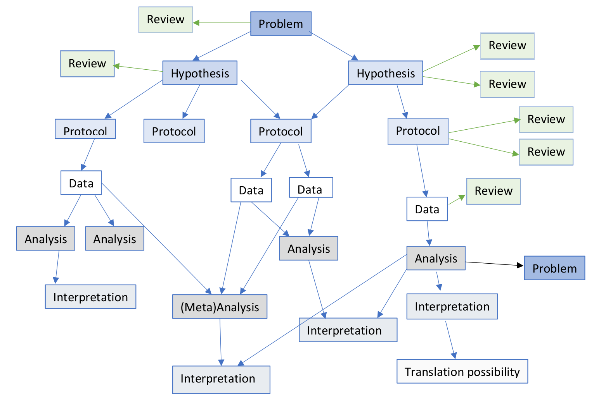
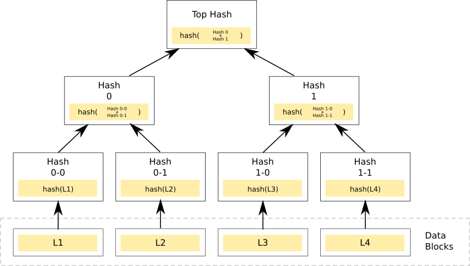
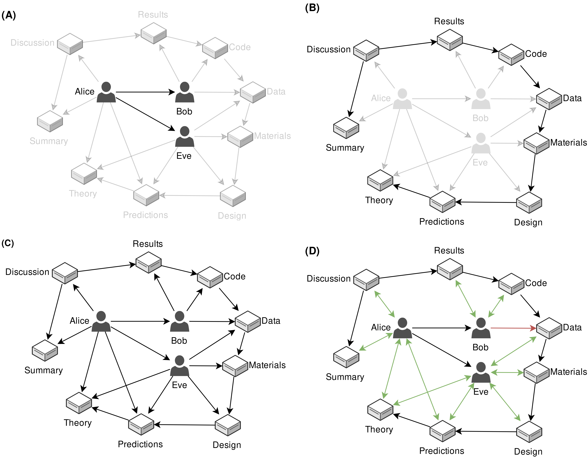

# Verified, shared, modular, and provenance based research communication with the Dat protocol

In scholarly research, communication needs to be thorough and
parsimonious in logging the order of various research steps, while at
the same time being functional in seeking- and distributing knowledge.
Roosendaal and Geurts proposed that any scholarly communication system
needs to serve as a (1) registration-, (2) certification-, (3)
awareness-, and (4) archival system [@roosendaal1998]. Sompel and
colleagues added that it also needs to serve as an (5) incentive system
[@doi:10.1045/september2004-vandesompel].

How the functions of scholarly communication are conceptualized and
implemented directly impacts (the effectiveness of) scholarly research.
For example, an incentive system might be present where number of
publications or publication outlet is more important than the quality of
the publications [@doi:10.3389/fnhum.2018.00037]. In a narrow sense,
this scholarly communication system serves the fifth function of
providing an incentive system. In a wider sense, it undermines the goal
of scholarly research, which scholarly communication is a part of, and
therefore does not serve its purpose.

Narrow conceptualizations of the functions of a scholarly communication
system can be identified throughout the current article-based system.
Registration occurs for published works, but registration is incomplete
due to selective publication [e.g., 1 out of 2 registered clinical
trials gets published; @doi:10.1016/0140-6736_91_90201-y] making
research highly inefficient [@doi:10.1371/journal.pone.0084896].
Certification occurs through peer review [@doi:10.1038/nature05008] but
peer review is confounded by a set of human biases at the reporting- and
evaluation stages [e.g., methods are evaluated as of higher quality when
they result in statistically significant results than when in
statistically nonsignificant results; @doi:10.1007/bf01173636], leading
to the 'natural selection of bad science' [@doi:10.1098/rsos.160384].
Awareness occurs, but increasingly only for those researchers with the
financial means to access or make accessible [@doi:10.18352/lq.10280].
Restrictions on the sharing of scholarly information hampers discovery
and widespread dissemination. Content is archived, but is centralized
(i.e., failure prone), separated from the main dissemination
infrastructure, and not available until an arbitrary trigger event
occurs [i.e., a dark archive; @doi:10.1629/uksg.215].

The scholarly paper seems an anachronistic form of communication in
light of how we now know it undermines the functions it is supposed to
serve. When no alternative communication form was feasible (i.e.,
before the Internet and the Web), the scholarly paper seemed a
reasonable and balanced form for communication. However, already in
1998, seven years after the first Web browser was released,
researchers associated with the scholarly publisher Elsevier suggested
to make changes to the way scholars communicate scholarly research
[@doi:10.1108/eum0000000007185].  More specifically, they suggested to
change the communication to a more modular form, which would help
iterate research more frequently and increase feedback moments [high
speed of feedback was essential to for example Nature's rise during
the early twentieth century; @isbn:9780226261454]. Throughout the
years, others also suggested various perspectives on modularity
[@doi:10.3389/fncom.2012.00019; @doi:10.7717/peerj-cs.78] and
suggested micro- and nanopublications [@doi:10.7717/peerj-cs.78;
@doi:10.1186/2041-1480-5-28]. One example of modular, stepwise
research communication is depicted in Figure \@ref(fig:octopi).

```{r octopi, echo=FALSE, fig.cap = "An example of modular, stepwise research communication, from the Octopus project (see also https://perma.cc/TA79-YPH9).", out.width="100%"}

```

Modular scholarly outputs, each a separate step in the research process,
could supplement the scholarly article [as detailed in
@doi:10.3390/publications6020021]. Scholarly textbooks and monographs
[i.e., vademecum science; @isbn:9780226253251] communicate findings with
few details and a high degree of certainty; scholarly articles present
relatively more details and less certainty than textbooks, but still
lack the detail to reproduce results. This lack of detail is multiplied
by the increasingly complex research pipelines due to technological
changes and the size of data processed. Moreover, textbooks and articles
construct narratives across findings because they report far after
events have happened and it is what editors expect. Scholarly modules
could serve as the base for scholarly articles, reporting more details,
less certainty of findings, and where events are reported closer to
their occurrence. Granular reporting may help facilitate a shift from
authorship to contributorship [@doi:10.31234/osf.io/dt6e8], could
facilitate reproducibility (i.e., it is easier to reproduce one action
with more details than multiple actions with fewer details per action);
earlier reporting could facilitate discussion by making it practical for
the research process [extending the idea of Registered Reports;
@doi:10.1016/j.cortex.2012.12.016] and making content easier to find and
reuse. As findings become replicated and more consensus about a finding
starts to arise, findings could move up the 'chain' and be integrated
into scholarly articles and textbooks. Articles and books would then
provide overviews and larger narratives to understand historical
developments within scholarly research. Figure \@ref(fig:datcom-fig1)
provides a conceptual depiction of how these different forms of
documenting findings relate to each other.

```{r datcom-fig1, echo = FALSE, , fig.align="center", out.width="80%", fig.cap="Conceptual depiction of how different forms of scholarly communication relate to each other in both detail and certainty."}
knitr::include_graphics('assets/figures/datcom-fig1.png')
```

Below I extend on technical details for a modular scholarly
communication infrastructure that facilitates (more) continuous
communication and builds on recent advances in Web infrastructures. The
premise of this scholarly infrastructure is a wider interpretation of
the five functions of a scholarly communication system, where (1)
registration is (more) complete, (2) certification by peer review is
supplemented by embedding chronology to prevent misrepresentation and by
increased potential for verification and peer discussion, (3)
unrestricted awareness (i.e., access) is embedded in the underlying
peer-to-peer protocol that locks it open-by-design, (4) archival is
facilitated by simplified copying, and (5) making more specific
scholarly evaluation possible to improve incentives [for an initial
proposal of such evaluation systems see
@doi:10.3390/publications6020021]. First, I expand on the functionality
of the Internet protocol [Dat](https://datproject.org) and how it
facilitates improved dissemination and archival. Second, I illustrate an
initial design of modular scholarly communication using this protocol to
facilitate better registration and certification.

## Dat protocol

The Dat protocol (`dat://`) is a peer-to-peer protocol, with persistent
public keys per filesystem [see also <https://perma.cc/FX7M-H85Y>;
@doi:10.31219/osf.io/nsv2c; @doi:10.1038/sdata.2018.221]. Each
filesystem is a folder that lives on the Dat network. Upon creation,
each Dat filesystem receives a unique 64 character hash address, which
provides read-only access to anyone who has knowledge of the hash. Below
an example filesystem is presented. Each Dat filesystem has a persistent
public key, which is unaffected by bit-level changes within it (e.g.,
when a file is modified or created). Other peer-to-peer protocols, such
as BitTorrent or the Inter Planetary File System (IPFS), receive new
public keys upon bit-level changes in the filesystem and require
re-sharing those keys after each change (at the protocol level).

```bash
0c6...613/
|--- file1
|--- file2
|--- file3
|--- file4
```

Bit-level changes within a Dat filesystem are verified with
cryptographically signed hashes of the changes in a Merkle Tree. In
effect, using a Merkle Tree creates a verified append-only register. In
a Merkle Tree, contents are decomposed into chunks that are subsequently
hashed in a tree (as illustrated in Figure \@ref(fig:datcom-fig2)), adding
each new action to the tree at the lowest level. These hashes are
cryptographically signed with the permitted users' private keys. The Dat
protocol regards all actions in its filesystem as `put` or `del`
commands to the filesystem, allowing all operations on the filesystem to
be regarded as actions to append to a register (i.e., log). For example,
if an empty `file5` was added to the Dat filesystem presented above, the
register would include `[put] /file5 0 B (0 blocks)`; if we delete the
file, it would log `[del] /file5`. The complete register for this Dat
filesystem is as follows

```bash
dat://0c6...613

1 [put] /file1 0 B (0 blocks)
2 [put] /file2 0 B (0 blocks)
3 [put] /file3 0 B (0 blocks)
4 [put] /file4 0 B (0 blocks)
5 [put] /file5 0 B (0 blocks)
6 [del] /file5
```

The persistent public key combined with the append-only register,
results in persistent versioned addresses for filesystems that also
ensure content integrity. For example, based on the register presented
above, we see that version 5 includes `file5` whereas version 6 does
not. By appending `+5` to the public key (`dat://0c66...613+5`) we can
view the Dat filesystem as it existed at version 5 and be ensured that
the contents we receive are the exact contents at that version. If the
specific Dat filesystem is available from at least one peer on the
network, it means that both 'link rot' and 'content drift'
[@doi:10.1371/journal.pone.0115253; @doi:10.1371/journal.pone.0167475]
could become superfluous.

```{r datcom-fig2, echo = FALSE, , fig.align="center", out.width='100%', fig.cap='A diagram depicting how a Merkle Tree hashes initial chunks of information into one top hash, with which the content can be verified.'}

```

Any content posted to the Dat protocol is as publicly available as the
public key of that Dat filesystem is shared. More specifically, the Dat
protocol is inherently open. As such, if that key is widely shared, the
content will also be harder or impossible to remove from the network
because other peers (can) have copied it. Conversely, if that key is
shared among just few people that content can more easily disappear from
the network but remains more private. This is important in light of
privacy issues, because researchers cannot unshare personal data after
they have widely broadcasted it. However, because the Dat protocol is a
peer-to-peer protocol and users connect directly to each other,
information is not mediated. The protocol uses package encryption by
default which can also help improve secure and private transfers of
(sensitive) data. Users would (most likely) also remain personally
responsible for the information they (wrongly) disclose on the network.

## Verified modular scholarly communication

Here I propose an initial technical design of verified modular scholarly
communication using the Dat protocol. Scholarly modules are instantiated
as separate Dat filesystems for each researcher or for each module of
scholarly content. Scholarly content could entail virtually anything the
researcher wants or needs to communicate in order to verify findings
[see also @doi:10.3390/publications6020021]. Hence, there is no
restriction to text as it is in the current article-based scholarly
communication system; it may also include photographs, data files,
scripts, etc. Note that all presented hypothetical scenarios next
include shortened Dat links and the unshortened links can be found in
the Supporting Information.


### Scholarly profiles

Before communicating research modules, a researcher would need to have a
place to broadcast that information. Increasingly, researchers are
acquiring centralized scholarly profiles to identify the work they do,
such as ORCIDs, ResearcherIDs, Google Scholar profiles, or ResearchGate
profiles. A decentralized scholarly profile in a Dat filesystem is
similar and provides a unique ID (i.e., public key) for each researcher.
However, researchers can modify their profiles freely because they
retain full ownership and control of their data (as opposed to
centralized profiles) and are not tied to one platform. As such, with
decentralized scholarly profiles on the Dat network, the researcher
permits others access to their profile instead of a service permitting
them to have a profile.

Each Dat filesystem is initialized with a `dat.json` with some initial
metadata, including its own Dat public key, the title (i.e., name) of
the filesystem and a description. For example, Alice wants to create a
scholarly profile and initializes her Dat filesystem, resulting in:

```json
{
  "title": "Alice",
  "description": "I am a physicist at CERN-LHC. As a fan of the decentralized Web, I 
  look forward to communicating my research in a digital native manner and in a way that
  is not limited to just text.",
  "url": "dat://b49...551"
}
```

Because `dat.json` is a generic container for metadata across the Dat
network, I propose adding `scholarly-metadata.json` with some more
specific metadata (i.e., data about the profile) for a scholarly
context. As the bare minimum, we initialize a scholarly profile metadata
file as

```json
{
  "type": "scholarly-profile",
  "url": "dat://b49...551",
  "parents": [],
  "roots": [],
  "main": "/cv.pdf",
  "follows": [],
  "modules": []
}
```

where the `type` property indicates it is a scholarly profile. The `url`
property provides a reference to the public key of Alice herself (i.e.,
self-referencing). The `parents` property is where Alice can indicate
her "scholarly parents" (e.g., supervisors, mentors); the `roots`
property is inherited from her scholarly parents and links back to the
root(s) of her scholarly genealogy. The `main` property indicates the
main file for Alice's profile. The `follows` property links to other
decentralized scholarly profiles or decentralized scholarly modules that
Alice wants to watch for updates. Finally, the `modules` property refers
to versioned scholarly modules, which serves as Alice's public
registrations. These metadata files may be joined in a later
specification.

Assuming Alice is the first person in her research program to use a
decentralized scholarly profile, she is unable to indicate `parents` or
inherit `roots`. However, Bob and Eve are her PhD students and she helps
them set up a decentralized scholarly profile. As such, their profiles
do contain a parent: Alice's profile. Based on this genealogy, we would
be able to automatically construct self-reported genealogical trees for
scholarly profiles. Bob's `scholarly-metadata.json` subsequently looks
as follows

```json
{
  "type": "scholarly-profile",
  "url": "dat://c3a...a1b",
  "parents": [ "dat://b49...551" ],
  "roots": [ "dat://b49...551" ],
  "main": null,
  "follows": [],
  "modules": []
}
```

Alice wants to stay up to date with the work from Bob and Eve and adds
their profiles to the `follows` property. By adding the unique Dat links
to their scholarly profiles to her `follows` property, the profiles can
be watched in order to build a chronological feed that continuously
updates. Whenever Bob (or Eve) changes something in their profile, Alice
gets a post in her chronological feed. For example, when Bob follows
someone, when Eve posts a new scholarly module, or when Bob updates his
`main` property. In contrast to existing social media, Alice can either
fully unfollow Bob, which removes all of Bob's updates from her feed, or
"freeze follow" where she simply does not get any future updates. A
"freeze follow" follows a static and specific version of the profile by
adding a version number to the followed link (e.g., `dat://...+12`).

```{r datcom-fig3, echo = FALSE, , fig.align="center", out.width='70%', fig.cap='Conceptual diagram of scholarly profiles and following others. Network propagation to rank N can be used to facilitate discovery of researchers and to build networks of researchers.'}
knitr::include_graphics('assets/figures/datcom-fig3.png')
```

Using the `follows` property, Alice can propagate her feed deeper into
her network, as depicted in Figure \@ref(fig:datcom-fig3). More
specifically, Alice's personal profile, rank zero in the network,
extends to the people she follows (i.e., Bob and Eve are rank one).
Subsequently, the profiles Bob and Eve follow are of rank three. By
using recursive functions to crawl the extended network to rank $N$,
edges in the network are easily discovered despite the (potential) lack
of direct connections [@doi:10.2307/2786545].

The `main` property can be used by a researcher to build a personalized
profile beyond the metadata. For example, Alice wants to make sure that
people who know the Dat link to her scholarly profile can access her
Curriculum Vitae, so she adds `/cv.pdf` as the `main` to her scholarly
profile. Whenever she submits a job application, she can link to her
versioned scholarly profile (e.g., `dat://b49...551+13`). Afterwards,
she can keep updating her profile whatever way she likes. She could even
choose to host her website on the decentralized Web by attaching a
personal webpage with `/index.html`. Because of the versioned link and
the properties of the Dat protocol, she can rest assured that the
version she submitted is the version the reviewing committee sees. Vice
versa, whenever she receives a versioned link to a scholarly profile,
she can rest assured it is what the researcher wanted her to see.

The `modules` property contains an array of versioned Dat links to
scholarly modules. What these scholarly modules are and how they are
shaped is explained in the next section. The `modules` property differs
from the `follows` property in that it can only contain versioned Dat
links, which serve as registrations of the outputs of the researcher.
Where a versioned link in the `follows` property is regarded as a
"freeze follow," a versioned link in the `modules` property is the
registration and public communication of the output. The versioned links
also prevent duplicate entries of outputs that are repeatedly updated.
For example, a scholarly module containing a theory could be registered
repeatedly over the timespan of several days or years. If the researcher
would register non-versioned links of the scholarly module, registration
would not be specific and the scholarly profile could contain
duplicates. By including only versioned links the registrations are
specific and unique.

### Scholarly modules

Scholarly research is composed of time-dependent pieces of information
(i.e., modules) that chronologically follow each other. For example,
predictions precede data and results, otherwise they become
postdictions. In a typical theory-testing research study, which adheres
to the framework of a modern empirical research cycle
[@isbn:9789023228912], we can identify at least eight chronological
modules of research outputs: (1) theory, (2) predictions, (3) study
design, (4) study materials, (5) data, (6) code for analysis, (7)
results, (8) discussion, and (9) summary [these are examples and modules
should not be limited to these to prevent homogenization of scholarly
outputs; @doi:10.1111/j.1467-954x.1990.tb03347.x]. Sometimes we might
iterate between steps, such as adjusting a theory due to insights
gathered when formulating the predictions. Continuously communicating
these in the form of modules as they are produced, by registering
versioned references to Dat filesystems in a scholarly profile as
explained before, could fulfill the five functions of a scholarly
communication system and is unconstrained by the current article-based
system [see also @doi:10.3390/publications6020021].

These scholarly modules each live in their own filesystem, first on the
researcher's computer and when synchronized, on the Dat network. Hence,
researchers can interact with files on their own machine as they are
used to. The Dat network registers changes in the filesystem as soon as
it is activated. As such, researchers can initialize a Dat filesystem on
their computer and, for example, copy private information into the
filesystem, anonymize it and only then activate and synchronize it with
the Dat network (note: this does not require connection to the Internet,
but initialization of the protocol). The private information will then
not be available in the version history of the Dat filesystem.

Metadata for scholarly modules also consists of a generic `dat.json` and
a more specific `scholarly-metadata.json`. The `dat.json` contains the
title of the module, the description, and its own Dat link. For example,
Alice communicates the first module on the network, where she proposes a
theory; the `dat.json` file for this module is

```json
{
  "title": "Mock Theory",
  "description": "This is a mock theory but it could just as well be a real one.",
  "url": "dat://dbf...d82"
}
```

Again, more specific metadata about the decentralized scholarly module is added in `scholarly-metadata.json`. As the bare minimum, the metadata for a scholarly module is initialized as

```json
{
  "type": "scholarly-module",
  "url": "dat://dbf...d82",
  "authors": [
    "dat://b49...551",
    "dat://167...a26"
  ],
  "parents": [],
  "roots": [],
  "main": "/theory.md"
}
```

These metadata indicate aspects that are essential in determining
contents and provenance of the module. First, we specify that it is a
scholarly module in the `type` property. Second, we specify its own Dat
`url` for reference purposes. Third, an array of Dat links in the
`authors` property links to scholarly profiles for authorship.
Subsequently, if the module is the following step of a previous
registered module, we specify the Dat link of the preceding module(s) in
the `parents` property in the form of a versioned Dat link. Tracing the
parents' parents forms a chronology of findings, leading ultimately to
the `roots` property. In practice, the `roots` property is inherited
from the immediate parents. Because the presented hypothetical module
above is the first on the network, it has no parents or roots. The
`main` property specifies a single landing page/file of the scholarly
module. For a text based scholarly module, `main` might be `/index.html`
(or `/theory.md` as it is here), whereas for a data module that could be
`/data.csv`. For more complex modules, a guidebook to navigate the
module could be included. The researcher can also store other relevant
assets in the Dat filesystem, such as converted files or supporting
files. For text based scholarly module, assets could include figures;
for data based scholarly modules assets could include codebooks.

To register a module into the researcher's profile, the versioned Dat
link is included in the `modules` array on the profile. More
specifically, when the registration process is initiated, the Dat
filesystem is inspected for the latest version number, which is appended
to the Dat link before it is put in the `modules` property. Specifically
for Alice's theory, she was at version 19 when she wanted to register
it. This means that `dat://dbf...d82+19` is appended to the `modules`
array in her scholarly profile. All the users who follow Alice get an
update that she registered her theory, with a versioned link that is
unique and persistent, referring to exactly the content Alice
registered. Alice can keep updating her theory locally, without it
affecting what the people who follow her see, because it does not affect
version 19. When the module is registered, others can view the most
recent version of the Dat filesystem (e.g., theory) by removing the
version from the Dat link (or view any other synchronized version if
available from the network).

Figure \@ref(fig:datcom-fig4) depicts how the scholarly modules relate to
each other (Panel B). The versioned, registered scholarly modules become
the parent and root links in subsequent child modules. For example, a
set of predictions link back to the theory they are distilled from; a
study design links back to the predictions it is planned to test and by
extension to the theory it is based on. Panel B in Figure \@ref(fig:datcom-fig4) conceptually depicts one contained empirical
research cycle registered in this way. The links between versioned
scholarly modules embeds the chronological nature of the research
process in its communication.

```{r datcom-fig4, echo = FALSE, fig.align="center", out.width='100%', fig.cap='Conceptual representations of how scholarly profiles relate to each other (Panel A), how scholarly modules relate to each other (Panel B), how scholarly profiles and modules create a network of scholarly activity in both researchers and research (Panel C), and how claims of authorship are verified if two-way or unverified if one-way (Panel D).'}

```

### Verification

In order to detect whether scholarly modules that a researcher claims to
have authored are indeed (partly) theirs, the scholarly module needs to
also assign the profile as author. For example, Alice and Eve claim to
have authored version 19 of the "Theory" module in their profiles
(Figure \@ref(fig:datcom-fig4), Panel C). Because a module can only be
edited by its author, we can inspect the scholarly module to corroborate
this. For verified authorship, the module should ascribe authorship to
Alice and Eve. To do this, we inspect `scholarly-metadata.json` of the
"Theory" module at the registered version (i.e., version 19). If the
versioned theory module also ascribes authorship to Alice or Eve, we
have two-way verification of authorship (Figure \@ref(fig:datcom-fig4),
Panel D). In other words, registered scholarly modules must corroborate
the authorship claims of the scholarly profiles in order to become
verified.

Unverified authorship can happen when a researcher incorrectly claims
authorship over a module or when a module ascribes authorship to a
researcher who does not claim it. In Figure \@ref(fig:datcom-fig4) Panel D,
for example, Bob has claimed authorship of the data module, which is not
corroborated by the scholarly module. Unverified authorship of this kind
(i.e., where a researcher incorrectly claims authorship) is helpful in
preventing misrepresentation of previous work by that researcher.
Unverified authorship where a researcher is incorrectly ascribed
authorship can have various origins. A researcher might remove a
versioned module from their profile, effectively distancing themselves
from the module (similar to retracting the work but on a more individual
level). In a similar vein, it might also be that the author registered a
later version of the module in their profile and deleted the old version
(similar to a corrigendum). Note that the registration will still be
available in the history of the profile, because the history of a Dat
filesystem is append-only.

### Prototype

In order to show that decentralized, modular scholarly communication is
not just a hypothetical exercise, I developed a minimal working
prototype. The prototype code supplied below currently only functions
within Beaker Browser because specific Application Programmatic
Interfaces (APIs) that directly interface with the Dat protocol are not
yet available in the most commonly used Web browsers (e.g., Mozilla
Firefox, Google Chrome).

The minimal working prototype ingests a network of decentralized
scholarly modules and profiles. More specifically, it ingests all
content to rank $N$ of the network, using
[`webdb`](https://github.com/beakerbrowser/webdb). `webdb` collects the
scholarly metadata from each scholarly module and scholarly profile and
consolidates these disparate pieces of information into a local
database. This database can be considered temporary; the original
information still has its primary origin in the disparate scholarly
modules and scholarly profiles that live on the Dat network. As such,
the same database can be reconstructed at any time without any issues,
assuming the modules are still available. Figure \@ref(fig:datcom-fig5)
presents a screenshot of the prototype, which looks like any other
webpage to the user but does not have a centralized server providing the
content. Note also the link at the bottom showcasing the versioned link
to the analysis file.

```{r datcom-fig5, echo = FALSE, fig.align="center", out.width='100%', fig.cap='Screencap of the minimal prototype of decentralized scholarly communication. The prototype resembles a regular webpage on the userside, but on the backend it runs entirely on Dat filesystems that live on a decentralized network.'}
knitr::include_graphics('assets/figures/datcom-fig5.png')
```

Procedurally, the prototype takes Alice's scholarly profile as starting
point, subsequently ingesting the network presented in Figure
\@ref(fig:datcom-fig4). By doing so, we get a one-on-one replication of
Alice's perspective (regardless of whether we are Alice or not). As
such, Alice's Dat link serves as the starting point (rank zero). The
metadata contained in her profile is ingested into our local database.
Subsequently, the links in her profile to other scholarly modules (or
profiles) are ingested into the database (rank one), and the links they
have (rank two), and so on (to rank $N$). The following JavaScript code
produces this local database for Alice specifically (`dat://b49...551`)
but can be replaced with Bob's, Eve's, or anyone else's scholarly
profile to receive their personal network.

```js
// npm install -g @beaker/webdb
const WebDB = require('@beaker/webdb')

let webdb = new WebDB('view')

webdb.define('modules', {
    filePattern: [  '/scholarly-metadata.json'  ],
    index: [ 'type', 'authors', 'parents', 'root',
     'main', 'follows', 'modules' ]
})

async function ingestPortal (url) {
  await webdb.open()

  let archive = new DatArchive(url)
  await webdb.indexArchive(url)
  
  let scholRaw = await archive.readFile(
    '/scholarly-metadata.json')
  
  let scholParsed = await JSON.parse(
    scholRaw)
  
  if (scholParsed.type === 'scholarly-profile') {
    console.log(scholParsed)
    scholParsed.follows.concat(
      scholParsed.modules).forEach((val) => {
      ingestPortal(val)
    })
  }
}

ingestPortal("dat://b49...551")
```

The presented prototype provides a portal to the information contained
in the modules, but is not the sole portal to access that information.
Because the modules live on a decentralized network and are
open-by-design, anyone may build a portal to view that information
(Figure \@ref(fig:datcom-fig6) presents a mockup of an additional
interface). As such, this is not a proposal for a platform but for
infrastructure. The difference between platforms and infrastructure is
vital in light of ownership and responsibility of communicated content
and the moderation of that content. As opposed to centralized services
that carry the legal burden and therefore moderate its platform, this
type of infrastructure does not take such a role and merely aims to
facilitate the individual. As a consequence, the legal burden remains
with the individual. Moreover, platforms require people to go to one
place (e.g., you cannot view content of ResearchGate on Academia.edu or
Elsevier's content on Wiley's webpage); this infrastructure would give
the potential for various types of usage to take place on the same type
of infrastructure.

```{r datcom-fig6, echo = FALSE, fig.cap = 'Mockup design of an additional interface for the proposed scholarly communication infrastructure. Made by Rebecca Lam, reused under CC-BY 4.0 license.'}
# knitr::include_graphics('assets/mockup-1.png')
knitr::include_graphics('assets/figures/datcom-mockup.png')
```

## Discussion

The proposed design for decentralized, verified, provenance based
modular communication on the Dat protocol fulfills a wide
conceptualization of the functions of a scholarly communications system
from library and information sciences
[@roosendaal1998; @doi:10.1045/september2004-vandesompel]. Due to more
modular and continuous communication, it is more difficult to
selectively register results when the preceding steps have publicly been
registered already. Moreover, time of communication is decided by the
researcher, making it more feasible for researchers to communicate their
research efforts without biases introduced at the journal stage.
Certification of results is improved by embedding the chronology of the
empirical research cycle in the communication process itself, making
peer-to-peer discussion constructive and less obstructed by hindsight
bias [@doi:10.1037/1089-2680.2.2.175]. Unfettered awareness of research
is facilitated by using an open-by-design infrastructure that is the
peer-to-peer Dat protocol. Moreover, because all content is
open-by-design and independent of service platforms, text- and
data-mining may be applied freely without technical restrictions by
service providers. The removal of these technical and service
restrictions may facilitate innovations in discovery of content and the
potential for new business models to come into existence. Based on the
links between scholarly modules, the arising network structure can be
used to help evaluate networks of research(ers) instead of counting
publications and citations [@doi:10.3390/publications6020021]. Archival
is facilitated by making it trivially easy to create local copies of
large sets of content, facilitating the Lots Of Copies Keeps Stuff Safe
[LOCKSS; @doi:10.1045/june2001-reich; @doi:10.1103/physreve.95.022313]
principle to be more widely used than just approved organizations.
Moreover, with append-only registers, the provenance of content can also
be archived more readily than it is now. These functions also apply to
non-empirical research that requires provenance of information (e.g.,
qualitative studies).

By producing scholarly content on a decentralized infrastructure,
diversity of how research is consumed and discovered can be facilitated.
Currently, content lives on the webserver of the publisher and is often
solely served at the publisher's webpage due to copyright restrictions
[except for open access articles; @doi:10.7717/peerj.4375]. If the
design of the publisher's webpage does not suit the user's needs [e.g.,
due to red color blindness affecting approximately 1 in 20 males and 1
in 100 females; @doi:10.1016/j.gendis.2015.02.006], there is relatively
little a user can do. Moreover, service providers that are not the
rightsholder (i.e., publisher) now cannot fulfill that need for users.
By making all content open by default, building on content becomes
easier. For example, someone can build a portal that automatically shows
content with color shifting for people who have red (or other types of)
color blindness. Building and upgrading automated translation services
are another way of improving accessibility (e.g.,
[translexy.com/](http://translexy.com/)), which is currently restricted
due to copyright. Other examples of diverse ways of consuming or
discovering research might include text-based comparisons of modules to
build recommender algorithms that provide contrasting and corroborating
views to users [e.g., @doi:10.1038/nature.2017.22163]. Stimulating
diversity in how to consume and discover content is key to making
scholarly research accessible to as many people as possible and in order
to attempt to keep some pace with the tremendous amount of information
published each year ([&gt;3 million articles in
2017](https://api.crossref.org/works?filter=type:journal-article,from-pub-date:2017,until-pub-date:2017&rows=0)).
As such, we have collectively passed the point of being able to
comprehend the relevant information and should no longer strive to
eliminate all uncertainty in knowing but find ways to deal with that
uncertainty better [@isbn:9781786635471]. As such, alternatives in
consuming, discovering, and learning about knowledge are a necessity.
Open Knowledge Maps is an existing example of an innovative discovery
mechanism based on openly licensed and machine-readable content
[@doi:10.12685/027.7-4-2-157]. There would be more smaller pieces of
information in the scholarly modules approach than in the scholarly
article approach, which is counterbalanced by the network structure and
lack of technical restrictions to build tools to digest that information
— this may make those larger amounts of smaller units (i.e., modules)
more digestible than the smaller volume of larger units (i.e.,
articles), mitigating information onslaught
[@doi:10.1080/1047840X.2012.701161].

The proposed design is only the first in a multi-layer infrastructure
that would need to be developed moving forward. Currently, I only
provide a model on the container format for how to store metadata for
modules — not how the data is stored in the module itself or how the
individual could go about doing so. Moreover, how could reviews be
structured to fit in such modules? As such, the next layer to the
proposed infrastructure would require further specification of how
contents are stored. For example, for text-based modules, what file
formats should be the standard or allowed? It would be unfeasible to
allow any file format due to readability into the future (e.g., Word
2003 files are likely to be problematic) and issues could exacerbate if
software becomes more proprietary and research uses more types of
software. Standards similar to current publications could prove
worthwhile for text (i.e., JATS XML), but impractical to non-technical
users. As such, does the original file need to be in JATS XML when it
can also easily be converted? [e.g., Markdown to JATS XML; @jatdown]
Other specifications for data, code, materials would also be needed
moving forward (e.g., no proprietary binary files such as SPSS data
files). In order to make those standards practical to individuals not
privy to the technical details, the next infrastructure layer would be
building user-facing applications that interface with the Dat protocol
and take the requirements into account. These would then do the heavy
lifting for the users, guiding them through potential conversion
processes and reducing friction as much as possible. An example of a
rich editing environment that takes the machine readability of scholarly
text to the next level, and makes this relatively easy to the end-user,
is Dokie.li [which writes to HTML; @dokieli]. This editing environment
provides a What You See Is What You Get (WYSIWYG) editor, while at the
same time providing semantic enrichments to the text (e.g., discerning
between positive, negative, corroborating, or other forms of citations).

New infrastructure layers could provide a much needed upgrade to the
security of scholarly communication. Many of the scholarly publisher's
websites do not use an appropriate level of security in transferring
information to and from the user. More specifically, only 26% of all
scholarly publishers use HTTPS [@https-hartgerink]. This means that any
information transferred to or from the user can be grabbed by anyone in
the physical proximity of that person (amongst other scenarios) —
including usernames and passwords. In other words, publisher's lack of
up-to-date security practices put the user at risk, but also the
publisher. Some publishers for example complained about Sci-Hub,
alleging that it illegally retrieved articles by phishing researcher's
credentials. A lack of HTTPS would facilitate the illegal retrieval of
user credentials, hence those publishers would ironically facilitate the
kinds of activities they say are illegal [@doi:10.1126/science.aaf5664].
Beyond the potential of missed revenue for pay-to-access publishers,
security negligence is worrisome because the accuracy of scholarly
content is at risk. Man-in-the-middle attacks, where a middleman inserts
themselves between the user and the server, can surreptitiously distort
content, with practical effects for scientific practice (e.g., changing
author names) and real life effects for professions using results for
their jobs (e.g., milligram dosages replaced by gram dosages). By
building a scholarly communication infrastructure on top of the Dat
protocol, all communications are encrypted in transit from one end to
the other by default. For the format of communications, scholarly
publishers may currently be unknowing distributors of malware in their
PDFs distributed to (paying) readers. More specifically, an estimated
.3-2% of scholarly PDFs contain malware
[@doi:10.3233/978-1-61499-744-3-107], although the types of malware
remain ill specified. By implementing scholarly modules that are
converted on the user's system (e.g., JATS XML, HTML, Markdown), the
attack vector on readers of the scholarly literature can be reduced by
moving away from server-side generated PDFs, which potentially contain
clandestine malware.

## Limitations

In the proposed decentralized, modular scholarly communication system
there is no requirement for scholarly profiles to be linked to their
real-world entities. This means that scholarly profiles may or may not
be identified. For comparison, a link to a identification is also not
mandatory for ORCID identifiers. Moreover, the history of anonymous (or
pseudonymous) communication has a vibrant historical context in
scholarly communication [e.g., @doi:10.1093/biomet/6.1.1] and should
therefore not be excluded by the infrastructure design. However, some
might view this as a limitation.

One of the major points of debate may be that the scholarly modules are
chronologically ordered only (both internally and externally). As such,
the temporal distance between two actions within a scholarly module or
between two scholarly modules is unknown. Within a scholarly module and
Dat filesystem, chronological append-only actions are more reliable to
register from a technical perspective than time-based append-only
registers. This has its origin in the fact that creation-,
modification-, and last opened times can technically be altered by
willing users (see for example
[superuser.com/questions/504829](https://superuser.com/questions/504829)).
If timestamps are altered, people can fabricate records that seem
genuine and chronological, but are not — undermining the whole point of
immutable append-only registers. Hardcoded timestamps in the scholarly
metadata would be an even greater risk due to the potential for direct
modification (i.e., it would only require editing the
`scholarly-metadata.json` file in a text editor). The external ordering,
that is the chronology of scholarly modules, might be gamed as well.
Consider the scenario where a predictions module at version 12 is said
to be the parent of a design module at version 26 but does not exist yet
at the time of registration for the design module. An individual with
malicious intentions might do this and retroactively fabricate the
parent predictions. So, despite a specific, persistent, and unique
parent Dat link being provided, the chronology could be undermined,
which in turn threatens the provenance of information. It would require
some effort from said researcher to subsequently ensure that the
referenced Dat link contains the postdictions, but it might be possible
to fake predictions in this manner. Other mechanisms could be put in
place to verify the existence of parent links at the time of
registration (which is technically feasible but would require additional
bodies of trust) or to technically investigate for filler actions in a
Dat filesystems when artificially high version numbers are registered.
How to game the proposed system is an active avenue for further
research.

The immutability of the Dat protocol that is central to this proposal
only functions when information is being shared on the network
continuously. Technically, if information has not been shared yet, a
user could check out an old version and create an alternative history.
This could prove useful when accidental versions are registered, but
could also provide incorrect provenance. When already shared, the Dat
protocol rejects the content given that it is inconsistent with previous
versions. As such, as long as peers keep sharing a module once its
author shares it, it is difficult to corrupt. Ongoing implementations
that add a checksum to the Dat link (e.g.,
`dat://<hash>@<checksum>+<version>`) could help further reduce this
issue.

Despite the potential of building an open-by-design scholarly
infrastructure on top of the Dat protocol, there are also domains where
advances need to be made. Until those advances are made, widespread use
in the form of a scholarly communication system remains impractical and
premature (note that no technical limitations prevent an implementation
of the same modular structure on current technologies, for example
GitHub). These developments can occur asynchronously of the further
development of this scholarly communication infrastructure. Amongst
others, these domains include technical aspects and implementations of
the Dat protocol itself, implementations of APIs built on top of it,
legal exploration of intellectual property on a peer-to-peer network,
privacy issues due to high difficulty of removing content permanently
once communicated, the usability of the proposed scholarly
infrastructure, and how to store information in the modules that is
machine readable but also easy-to-use for individuals.

The Dat protocol is functional, but is currently limited to NodeJS and
single-user write access. Because it is currently only available in
NodeJS, portability of the protocol is currently restricted to
JavaScript environments. An experimental implementation of the Dat
protocol is currently being built [in Rust](https://github.com/datrs)
and [in C++](https://github.com/datcxx), which would greatly improve
availability of the protocol to other environments. Moreover, by being
restricted to single-user write access, Dat archives are not really
portable across machines or users, although work on multi-user write
(i.e., multiple devices or users) [has recently been
released](https://github.com/mafintosh/hyperdb). Other APIs built on top
of the Dat protocol that are essential to building a proposed
infrastructure, such as `webdb`, also need to be further refined in
order to make them worthwhile. For example, `webdb` currently does not
index versioned Dat links but simply the most recent versions. As such,
the indexing of versioned references is problematic at the moment, but
can be readily tackled with further development. If these and other
developments continue, the benefits of the protocol will mature, may
become readily available to individuals from within their standard
browser, and become more practical to collaborate on. Considering this,
the proposed design is imperfect but timely, allowing for community
driven iterations into something more refined as implementations of the
Dat protocol are also refined and may become more widely used.

Instead of logging in with passwords, the Dat protocol uses
cryptographical verification using a public-private key pair. A
public-private key pair is similar to the lock-key pair we know from
everyday life. This also means that if the (private) key is lost, a
researcher can get locked out from their profile. Similarly, if the
(private) key gets stolen, it might give access to people other than the
researcher. How to securely handle private keys in a user-friendly
manner is an important issue in further development of this scholarly
communication system. Regardless, this changes the threat model from
centralized leaks (for example of plaintext passwords by Elsevier;
<https://perma.cc/6J9D-ZPAW>) decentralized security. This would make
the researcher more in control, but also more responsible, for their
operational security.

Despite the Dat protocol's peer-to-peer nature, intellectual property
laws still ascribe copyright upon creation and do not allow copying of
content except when explicitly permitted through non-restrictive
licenses by authors [@isbn:9781400851911]. As such, intellectual
property laws could be used to hamper widespread copying when licensing
is neglected by authors. Legal uncertainty here might give rise to a
chilling effect to use the Dat protocol to share scholarly information.
Moreover, it seems virtually impossible to issue takedown notices for
(retroactively deemed) illicit content on the Dat protocol without
removing all peer copies on the network. As a result of this, social
perception of the Dat protocol might turn negative if high-profile cases
of illicit or illegal sharing occur (regardless of whether that is
scholarly information or something else). However, just as the Web
requires local copies in cache to function and which lawmakers made
legal relatively quickly when the Web was becoming widespread, the wider
implementation of peer-to-peer protocols to share content might also
require reforms to allow for more permissive copying of original content
shared on the network. Regardless, legal issues need to be thought about
beforehand and users should be made aware that they carry responsibility
for their shared content. Given its inherent open and unrestricted
sharing design, it would make sense to use non-restrictive licenses on
the scholarly modules by default to prevent these legal issues for
researchers wanting to reuse and build on scholarly modules.

Similarly, we need to take seriously the issue that information on the
network, once copied by a peer or multiple peers, is increasingly
unlikely to be uncommunicated. The implications of this in light of
privacy legislations, ethical ramifications, and general negative
effects should not be underestimated. Because a Dat filesystem has a
stable public key and stores versions, the content remains available
even if the content is deleted from the filesystem. That is, users could
go to an older version and still find the file that was deleted. The
only way to truly undo the availability of that information is to remove
all existing copies. Hence, it is worthwhile to ask the question whether
scholarly research that is based on personal data should ever be
conducted on the individual level data or whether this should be done on
higher level summaries of relations between variables (e.g., covariance
matrices). How these summaries can be verified, would remain an issue to
tackle. Conversely, the limitation with respect to privacy is also a
benefit with regards to censorship, where information would also be much
harder to censure [in stark contrast to publishers that might be
pressured by governments; @guardian-cup]. Moreover, we might start
thinking about the ownership of data in research. In the case of human
subjects research, researchers now collect data and store it, but we
might consider decentralized data collection where human participants
produce their own data locally and simply permit a researcher to ingest
that into an analysis process (creating throwaway databases themselves
with `webdb` for example). This would in turn return ownership to the
participant and benefit transparency of data generated.

Bandwidth and persistent peers on the Dat protocol are highly correlated
issues that are key to a usable decentralized infrastructure. When there
are few peers on the network, information redundancy is low, content
attrition is (potentially) high, and bandwidth will be limited.
Subsequently, maximum data transfer of 40KB/s may be possible when few
peers with restricted bandwidth are available and are farther removed on
the physical network. Vice versa, in the most optimal scenario data
transfer could reach the maximum of the infrastructure between peers
(e.g., 1GB/s on peers located on an intranet). Considering that
replicating Dat filesystems is relatively easy given storage space, it
could be done by individuals, and (university) libraries seem
particularly qualified and motivated candidates for persistent hosting
of content on the Dat network. These organizations often have
substantial server infrastructure available, would facilitate high data
transfer speeds, and also have a vested interested in preserving
scholarly content. With over 400 research libraries in Europe and over
[900 academic libraries in Africa](http://db.aflia.net/list/?q=6&m=n)
alone, bandwidth and redundancy of scholarly content could be addressed
if sufficient libraries participate in rehosting content. Moreover, the
peer-to-peer nature would also allow for researchers to keep accessing
content in the same way when the content is rehosted on the intranet and
the wider connection has service interruptions.

The semi-technical proposal for verified, modular, and provenance based
scholarly infrastructure on the Dat protocol synthesizes meta-research,
technical developments of new Web protocols, real-life issues in a lack
of diversity for consuming scholarly research, and library and
information science's perspectives on the five functions scholarly
communication is supposed to fulfill. With this initial proposal a
scholarly commons seems feasible. The proposal provides a more complete
and less biased register of information than the current article-based
system. Moreover, it facilitates more constructive certification
discussions and allows anyone with access to the Internet to
participate. It also provides archival supportive of the distribution,
which anyone may meaningfully contribute to if they have the physical
means. This proposal also may provide new ways of evaluating, consuming,
and discovering research. The decentralized nature of the Dat protocol
requires less trust to be put in institutions to maintain key data
stores that are the fundament to any infrastructure and replaces it with
widespread distribution of that information. However, technological,
legal, and social developments need to occur asynchronously to make this
a reality.

## Supporting Information

S1 File. Overview of original Dat links corresponding to shortened links: [https://github.com/chartgerink/2018dat-com/raw/master/assets/mock-modules-overview.ods](https://github.com/chartgerink/2018dat-com/raw/master/assets/mock-modules-overview.ods).
